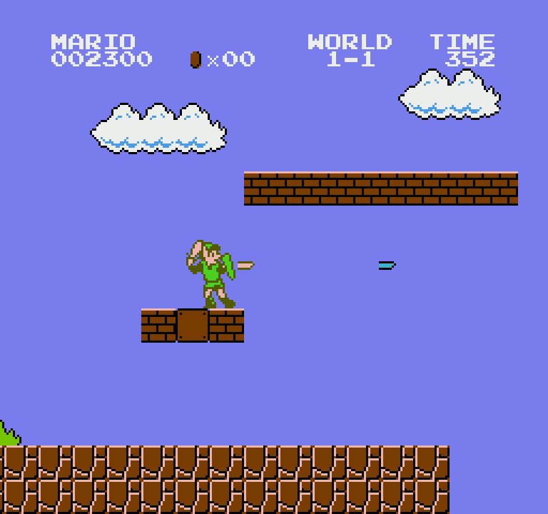
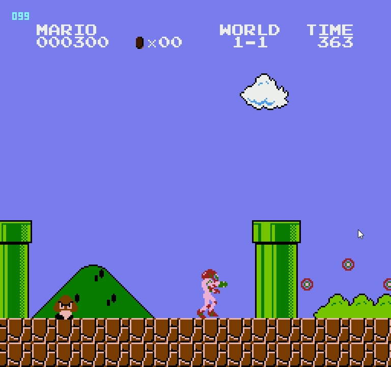
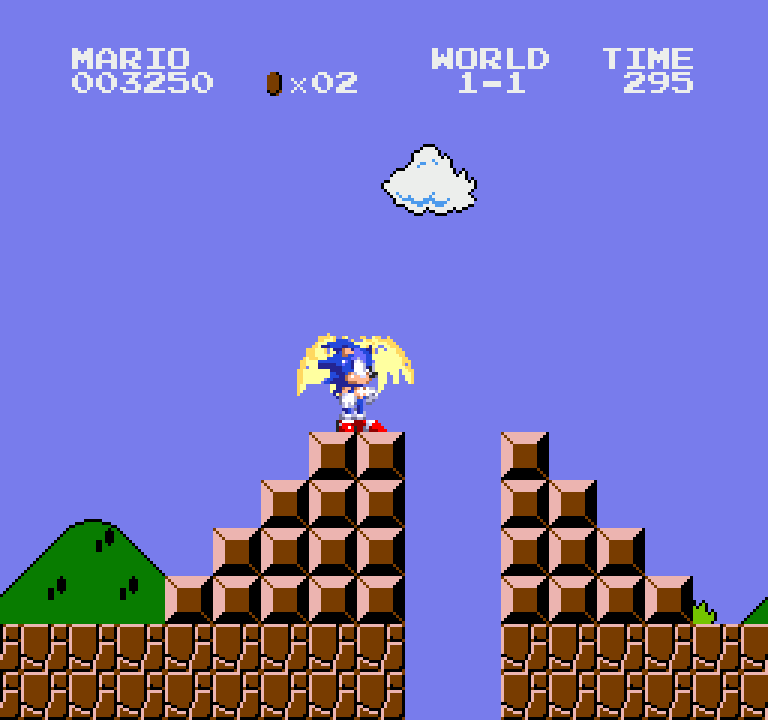

> 💡 This article is my own writing. AI was used to proof-read, but the word choice and direction of this article is my own.

Retro preservation has settled into a false dichotomy: Decomp or Recomp.

A decompilation is perceived to be something that takes painstaking amount of time, but is the only way forward if you want extensibility. And in inverse, a recomp is a faster path to a PC port, but at the sacrifice *of* extensibility.

In my months building static recompilers, and collaborating with other developers in the space, I've increasingly come to a conclusion that the path forward in game preservation and extensibility isn't one or the other....but both.

They are perceived as competing approaches. But they are complimentary. A proper **recomp** infrastructure provides a hardened foundation. A game's runtime and its decoding are strengthened by its peers (other games of the same console) built with the same utility. **decomps** produce understanding. They are more *ingestible* than a recomp's output; but they don't come coupled with a hardened infrastructure baseline and often times, have *custom* runners constructed around them. Not battle tested; little re-usability and modularity.

But often, the perception is you can only use one or the other, and that isn't true.

## What each one produces

A decomp tells you the byte at `$0709` is the MarioJump, the routine at `$B5CC` is SonicSpinDashBegin. That knowledge is expensive to acquire and genuinely irreplaceable for molding a game from its origins.

A recomp gives you the game running outside an emulator, on a runtime you own: renderer, audio, input, saves, frame loop. If that runtime serves many games, it also hands you everything the other games needed. Furthermore, it also means you can typically carry forward some of the supplemental *features* that were implemented for those games. In the case of [psxrecomp](https://github.com/mstan/psxrecomp/tree/master), a Playstation recompilation can now ship out of the box with [save states and rewind](https://www.youtube.com/watch?v=L36ppNkuJG0), features rarely seen in decomps or recomps historically.

Understanding without infrastructure means rebuilding a runner per game, forever. Infrastructure without understanding means you can run the game but cannot meaningfully modify what is inside it.

## Decomp-Annotated-Recomps in Action

Super Mario World is no stranger to ROM hacks. Between all the kaizo, the new re-imaginging of the games, mish-mashes with its sequel and more, I anticipate it may be one of the most rom hacked games out there.

Of course, the obvious limitation, one so obvious, that it may sound stupid to even say, is that all the ROM hacks are still within the confines of the SNES. In recent years, I know certain emulators have undertaken overclocking the interprerted CPU to get better performance, but that can be risky and cause issues depending on the game, and is not itself foolproof. A good example is the heavy segments in Megaman X that cause slowdown. (Slowdown that is completely eliminated in the [snesrecomp variant of Megaman X](https://github.com/mstan/megamanxsnesrecomp), by the way)

But, when we take a step back, and consider the possibility of what it means to decouple from the hardware entirely, it opens up a new paradigm. I'll let the below video speak for itself:

*[Super Mario World with a character replacement mod loaded via snesrecomp](https://www.youtube.com/watch?v=Owuku0zj4As)*

Above is a tech demo demonstrating the value of three major items.

1. Super Mario World, built as a **recompilation** (not decompilation) via snesrecomp, borrowing the runtime of a system that can build over a dozen SNES titles
2. Super Mario World, **fully decompiled**, annotating said recompilation
3. Super Smash Bros 64, **fully decompiled**, giving a very good basis to **port from**

The model and audio here come straight from Smash Bros 64. And *arguably*, real hardware would not be able to manage to store all of the assets and render all of the particles, audio, animations, and models on such hardware. Although, the SNES is relatively capable, and between all of it's various chips, like the SuperFX, perhaps it could. So to perhaps *better* demonstrate the point, we could go back a generation to the NES.

*[Super Mario Bros with a character replacement mod loaded via nesrecomp](https://www.youtube.com/watch?v=9AxKR_u-yu4)*

Here, we see a different ecosystem, also capable of over a dozen titles, with both the target (Super Mario Bros) and the source (Smash Bros 64 again) once again being fully decompiled.

The outcome, as you can see, is full 3D models and animations running on what was once an 8-bit console chugging along on a 6502.

Both scenarios showcase Smash Bros character replacements, but N64 isn't the only resource. In fact, any game with a decompilation is a good candidate to borrow from. Super Mario Bros own best donor is its fellow NES titles. These demonstrate less the decoupling of hardware constraints, but the raw capacity of what these annotated recompilations allow for.







> 💡 While all these showcases show porting assets from one game to another; the ecosystem is not limited to asset borrowing. Nothing prevents "ground up" modifications from being implemented just the same.

It doesn't stop at character swaps either. These made for great time-to-value demos. But truly, the sky is the limit.

*[Super Mario Bros NES ROM in Voxel 3D + First Person](https://www.youtube.com/watch?v=_sW-m-HaSVE)*

In the above video, we are seeing the Super Mario Bros engine in action on a stock, unmodified ROM. the Voxel 3D and first person are both artifacts of the modding engine placed on top of the recompilation itself.

Extensibility isn't added to asset replacement. Take for example, a rudimentary demo introduced into a recompilation of mine for Legend of Zelda: The Minish Cap for GBA.


Here, we can see what could effectively be seen as akin to DLC. A new warp portal is added to the overworld, and it itself travels to a brand new (or in this case, very *old*) overworld. Modifications are made to Link's sprite to accommodate the old grid. Much is unimplemented at this stage, but this is the gateway to bridging the gaps of DLC, or in a sense, "mega games" that can blend assets across generations.

## Where Decomps & Recomps join

Recompiling Super Mario World turns its 65816 code into real C functions. 1,937 of the 2,074 carry their actual names: `PollJoypadInputs`, `LoadStripeImage`, `SetMode7PPUPointersAndLayer1Scroll`, pulled from a Super Mario World disassembly as a symbol table and applied to the generated output. Only 137 are still bare addresses.

Super Mario Bros. gets the same from a pinned public disassembly: names and addresses only, no ROM bytes, no instruction text.

That is a decomp-annotated recomp. The recompiler produces the executable, the disassembly produces the meaning, and a symbol file joins them. The generated code stops being a wall of `func_8000_b0` and becomes a map.

Here is the entire generated-code change needed to take over Mario's horizontal movement:

```toml
[[mod_function_hook]]
addr = 0xB5CC           # ImposeFriction
```

One line, and only because the disassembly already said `$B5CC` is the horizontal integrator, is player-only, and is called from exactly two places. Without that, the address is meaningless.

A decompilation is close to all-or-nothing: you generally need everything understood, translated, and matching before you can build at all. That is why these projects take teams years. A recomp already runs the whole game. Understanding is something you spend **only where you intend to change something**.

## Where the Limits Are (& Aren't)

Falcon and Pikachu in Super Mario Bros. are not sprites. They are skeletal 3D models with real animation data, drawn by a software mesh renderer into a supersampled layer and composited over the frame while every NES pixel underneath stays sharp. The NES drew sixty-four 8×8 sprites, eight per scanline, in four colors.

Falcon's audio is eleven distinct clips, including his voice, mixed at 44.1 kHz. The NES's sample channel is a one-bit delta stream capped around four kilobytes. "FALCON PUNCH" was never coming out of that hardware. In fact, when I first implemented these mods, they broke save states because the audio sounds alone were bigger than the entire previously allocated buffers to manage save states, since the sounds along exceeded the entire system's snapshot size.

It's worth noting that these are experimental showcases, not finished products. None of these characters have been exhaustively ported. There are bugs, but that's due to intent, not limitations. Much of my focus is still on maintaining ecosystems from others to contribute to and build on. Suffice it to say that while I find Pikachu roaming around Super Mario Bros, thundering out Goombas on his way, it was certainly no means my end goal in this journey of mine.

## Why Both?

Every game I stand up exposes an assumption hiding in the framework, and fixing it improves every other game on it. Every generic capability lands once and reaches every title that framework will ever run. On the SNES side that has meant the SA-1, the Cx4, the Super FX, and the DSP-1 are modeled in a shared runtime; the games that need them get them without asking once that first game is stood up.

A decomp does not compound that way; its value is bounded to the game it describes. A recomp compounds infrastructure but says nothing about meaning. Put a disassembly on a hardened multi-game runtime and you get both curves at once.

> 💡 Every game can make the framework better. Every improvement to the framework can make every game better.

Keeping the original bytes runnable is solved; emulators solved it. The open question is whether these games can keep growing, and whether the understanding a community spends years accumulating has anywhere to go besides another build of the same game.

## Closing

None of this is finished: the frameworks are in active development, these mods are experiments. But a recomp is not a sealed box. It is a foundation. And a decomp is a key to its exponential takeoff.

---

Related: [Super Mario World](/games/super-mario-world) on [Super Nintendo](/hardware/super-nintendo).
