To date, many of my articles have been about getting games to boot within the confines of their ecosystem. The wins celebrated correctness, but not what the underlying ecosystems sought to enable. For a number of those ecosystems, standing up a new title has gotten to diminishing returns. As community adoption has begun on these, I have already started to see reports of users of snesrecomp and psxrecomp suggesting that it's able to one shot, or nearly one shot titles that being fed in. While this doesn't hold true universally across their libraries, it still is a mark of success towards such a goal.

Asserting a game's correctness isn't the end goal. If anything, it's the floor for the real jumping off point: enhancements. By default, a *correct* recomp at most is gaining the benefit of faster load times.

The real benefit is going to be increased extensibility. static recompilation enables faster load times, but also more overhead, which decouples from the limitations of emulation. It allows you to do more in the game without risk of slowdown or hardware limitations.

Below is a showcase of my various projects and ecosystems towards this goal. It is worth noting that this is a mixture of more mature ecosystems receiving enhancements as well as ecossytems being stood up for the first time. While I'd normally split my attention to either one or the other due to usage credit constraints, I personally have Tibo to thank for this packed update with all of his Codex usage credit resets this month.

## Modding

*A reusable framework*

The biggest structural change is that PSXRecomp, SNESRecomp, GBARecomp, and SegaGenesisRecomp now share a common idea: an opt-in mod loader. The rule that makes it work is simple: **the stock ROM or disc image is never modified.** You point the launcher at a verified, untouched copy of the game, and mods layer their behavior over it at runtime. Turn a mod off and you're back to the authentic game, byte for byte. There's no patching step, no second copy of the ROM, nothing to undo.

Mods ship as small packages with a manifest: what game they target (down to the hash), what features they expose, and what they're allowed to touch. The packages themselves can't carry native code: the actual behavior is compiled into the game's executable ahead of time and merely switched on. It's a deliberately boring, trust-first design, and it's what lets one format serve a debug menu on PS1 and a widescreen toggle on SNES without either one being a special case.

The flagship for this is *Mega Man X6*. I recently released Megaman X6 Tweaks support for MegamanX6Recomp: nearly the full set of acediez's well-known Tweaks patch, integrated with his permission. All patches were derived from Megaman X6 Tweaks itself, but it does not require the user to modify their ISO with Megaman X6 tweaks to apply.

A special thank you to acediez for granting his permission for his work to be adapted to the Megaman X6 Recompiled project

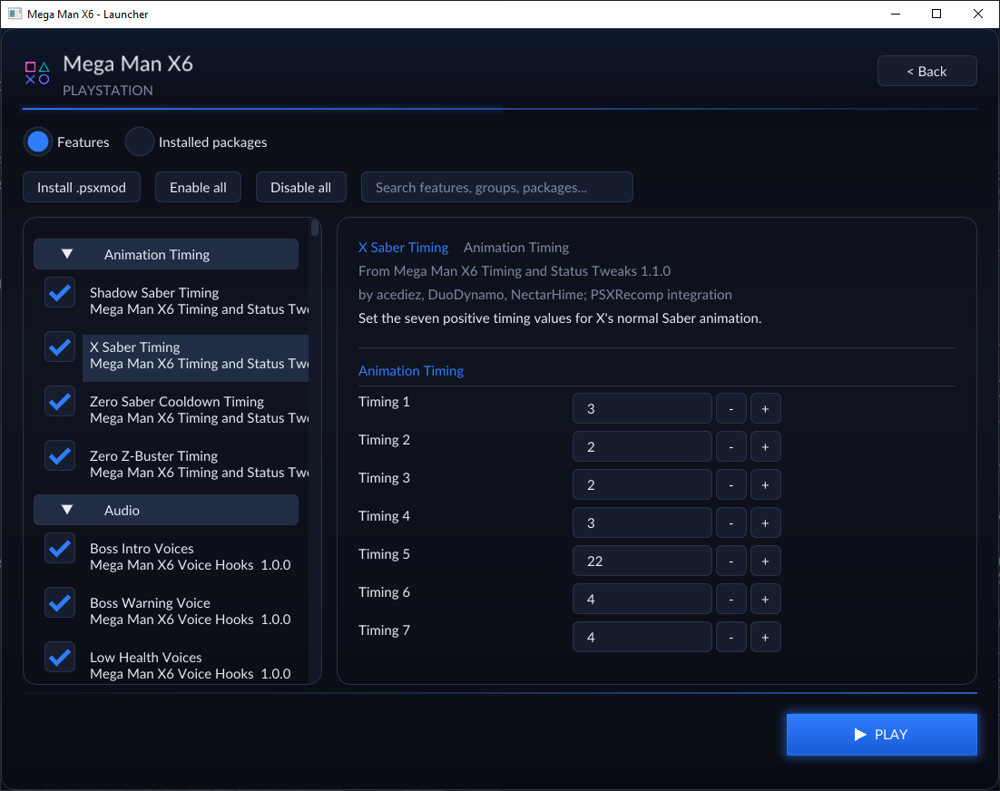

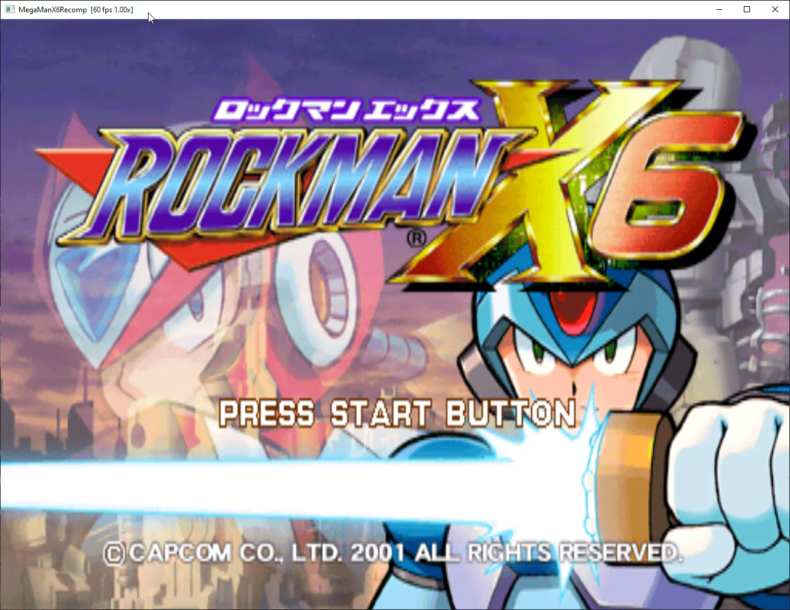

Megaman X6 Tweaks was a rich ground floor of many various tweaks to apply to the game. It helped me quickly assert the best way to apply value tweaks, asset swaps, and more. The exercise of implementing Megaman X6 was worth more than the sum of it parts. It helped me pave a way to apply a general purpose mod loader across PSXRecomp as a whole, and a system to follow for NES, SNES, Sega Genesis, and even GBA.

The modding framework was deliberately built for broad strokes. After porting over Megaman X6 Tweaks, I sought to see how I could use it for other games. A special thank you to the Tomba Club and their rom hacking community (special thanks to T4g1 in particular) for sharing a tidbit of information about the original Tomba! game, where in if you set a specific scratchpad byte on startup, you can re-enable a debug warp menu in the game.

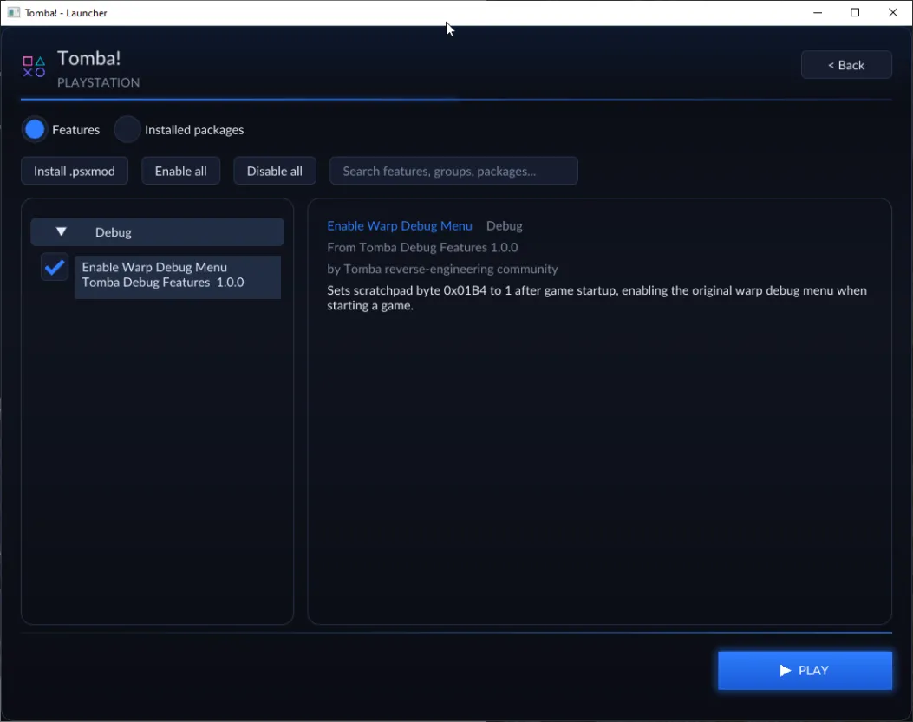

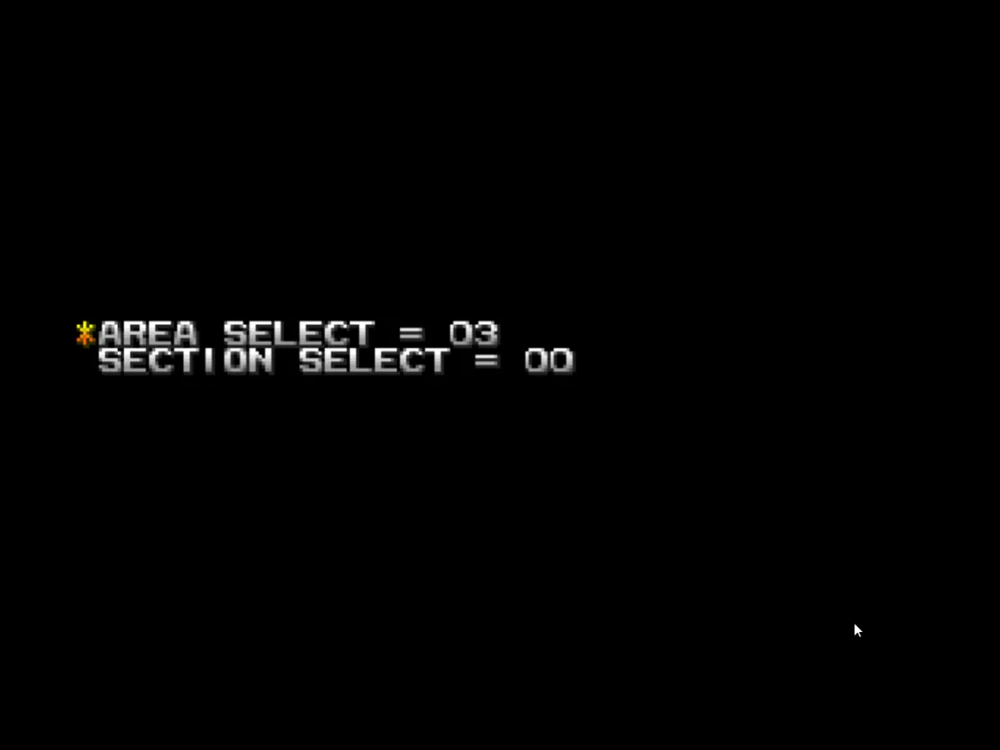

## PSXRecomp Improvements

In addition to mod loading, PSXRecomp has also seen some material improvements. Since my last update, a significant overhaul to the ecosystem's performance has been made. While the aspirational goal is 100% AOT coverage, Playstation still has a fallback interpreter for when gaps arise. Previously, this interpreter would struggle to stay at 100% frame rate when fallen back to. Performance has significantly improved on this and fallbacks should be much less noticeable. Furthermore, falling back *itself* should now occur less frequently, as PSXRecomp has improved its static analysis of discs, and is now able to discover overlays more readily, meaning less discovery and compile-at-runtime efforts when overlays are found.

\<tomba 2 21:9 here>

## GBARecomp

*Title Support & Extensibility*

## GBARecomp: a second life for a small screen

Since my last update, GBARecomp is probably the ecosystem that has seen the most growth. Previously, the ecosystem only spanned 6 games. Pokemon FireRed, LeafGreen, Ruby, Sapphire, and Emerald. The last and only non-Pokemon game was Minish Cap.

As with most of my ecossytems, the celebration was in their ability to run at all, and focus was not much on how they could be enhanced. Since then, both the breadth of titles *and* their ability to be enhancned has grown considerably.

Today, the title set has expanded to include

- Dragonball Z Legacy of Goku I, II, & Buu's Fury
- Mario Kart: Super Circuit
- WarioWare: Twisted!
- Megaman Zero 1-4
- Super Mario Advance 2: Super Mario World
- Super Mario Advance 4: Super Mario Bros 3

And most importantly of them all:

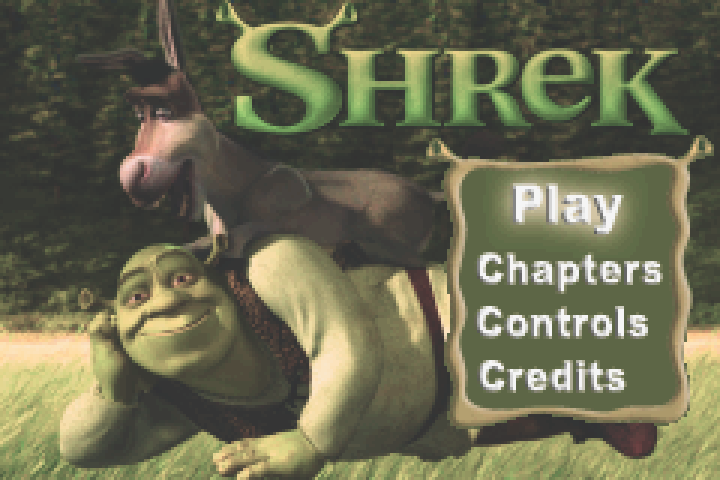

[GitHub - mstan/ShrekGBAVideoRecomp: Static recompilation of the Shrek GBA Video Movie Pak using gbarecomp](https://github.com/mstan/ShrekGBAVideoRecomp)

## Adaptive Widescreen

Of all the ways to enhance GBARecompiled games, by far the most meaningful, from my experience, is **adaptive widescreen**. Amongst all systems here that benefit from recompilation, GBA is likely positioned to be one of the best for easy and meaningful wins.

Unlike older systems that have to do a lot of culling for performance reasons, GBA titles often load much of their maps and overworld into memory all at once. The limitation of seeing it all was most often the size of the screen itself.

Attempting to expose these wider viewports and the extra spawns in emulators would be tedious by nature of trying to modify the runners/code, but also the risk of slowdown if a wider viewport spawned more actors. Fortunately, one of the gained benefits of a static recompilation is being able to handle those performance hits.

With increased performance headroom and the ability to decouple the game from faithful hardware emulation, it opens up a world of experiencing these games in a brand new way.

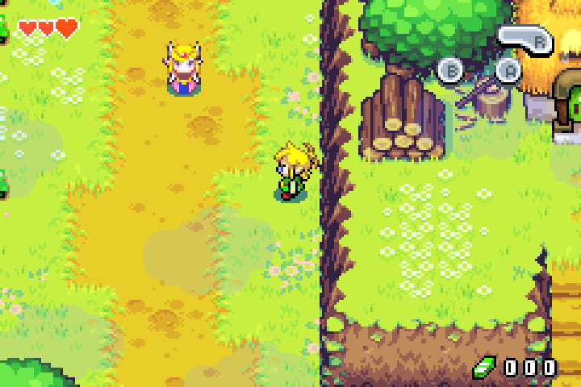

Every game takes a special effort to stand up. Realigning HUDs, extending decompression routines, handling actor spawning/culling, and more. Though it isn't a universal switch to flip, it is a high value proposition for all of the games it enables.

As an example, the Megaman Zero games, while beloved, are notoriously known for being extremely difficult by virtue of the fact that you have little response time to enemies on the stage given the short 3:2 aspect ratio they face. Under GBARecomp, this is something readily solved .

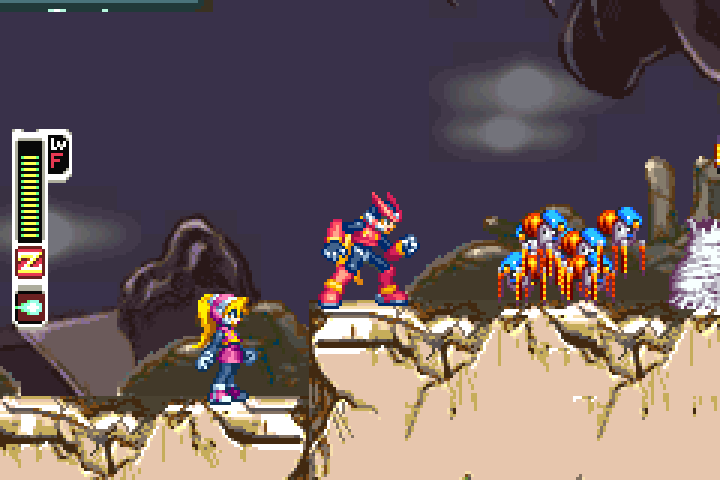

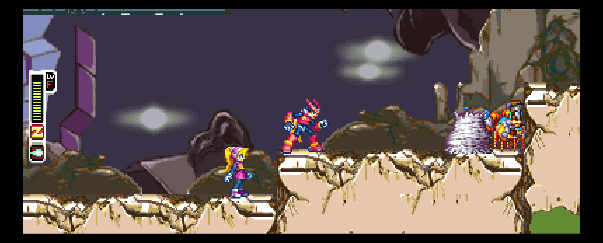

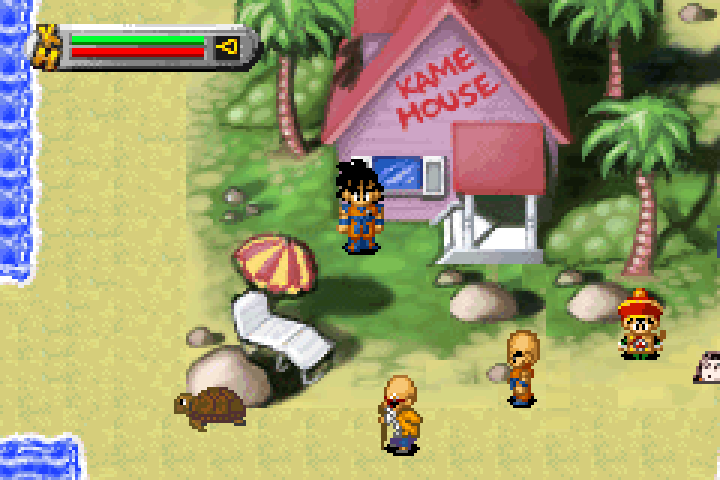

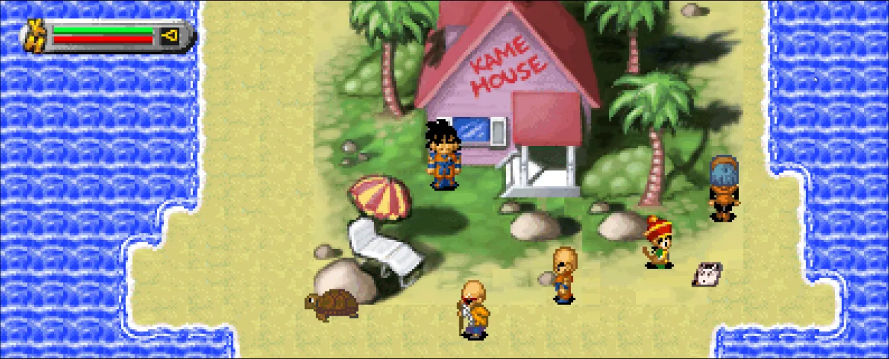

I was exceptionally happy with the outcome of Mario Kart: Super Circuit. Below is an early showcase of widening in-game to adaptive widescreen, drastically increasing the field of view for the player while racing on track. In addition, the 60 FPS has been applied to the game, a discovered behavior that is within the game's code but was never enabled by the original developers.

*[gbarecomp showcase | mario kart super circuit | 60 fps + adaptive widescreen](https://www.youtube.com/watch?v=wm6L7joMSM0)*

## More than just widescreen

### Warioware Twisted & Gyro

The Game Boy Advance had a number of novel games and hardware peripherals. Amongst them were gyroscopes and light sensors.

Eager to see how well I could adapt these to offer these games a new life, I took an attempt at Warioware Twisted. Recompiling Warioware was the easy part. The real challenge came in gyroscope integration.

I wanted to tackle this from two angles. One was finding a novel way to play it on PC with its motion controls. The other was moving it to a mobile device, the way it was really meant to be played.

In the end, I was able to settle on two approaches. The first was to add support for the PS5 Dualshock controller and its gyro centers, allowing the game to be played from PC by twisting and turning your PS5 controller.

The second was making an attempt at a native android APK, leveraging the built in gyro on my S22 Ultra. With a bit of luck, the game integrated nicely into the system. I was even able to add a long press menu to allow the user to modify their gyro sensitivity.

### Boktai & Light Sensor

In the same vein was a community contribution for the light sensor on Boktai. A community member who goes by the name of Shy began standing up this game, and submitted a PR to add light sensor support for Boktai. To my understanding, he is looking to expand mod support to actually have the sensor values change based on geolocation data provided at load time in the mod loader. With that said, the sensor can be read from multiple ways, and could very easily be plumbed up to a real light meter or host sensor to drive it making it another prime candidate for an Android port.

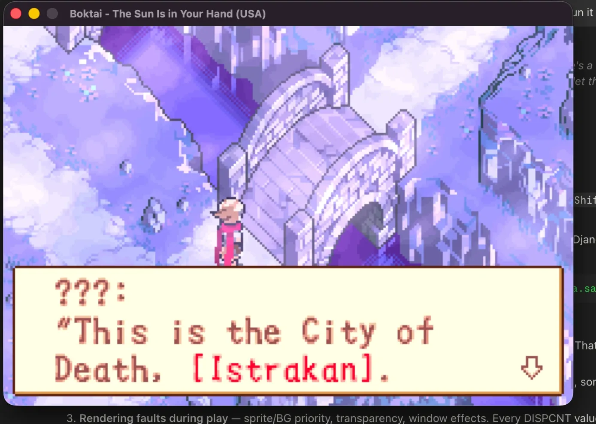

## SNESRecomp

*Improvements & Support*

SNESRecomp has seen its own fair share of improvements. The obvious one has been doing widescreen.

Contrary to the GBA, this one has taken considerably more effort. Given that the SNES has multiple BG layers and more aggressive culling, it takes aligning the BG layer extended spawning and layers to all cooperate for a fuller experience.

Each game takes a lot of love. Some games take more than others, particulary those that lack a corrseponding decomp.

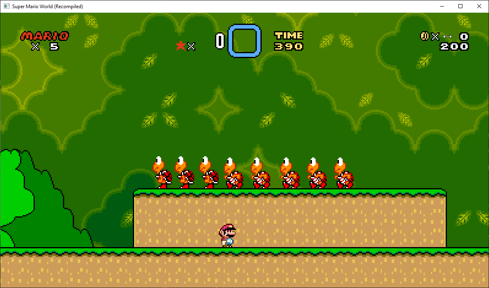

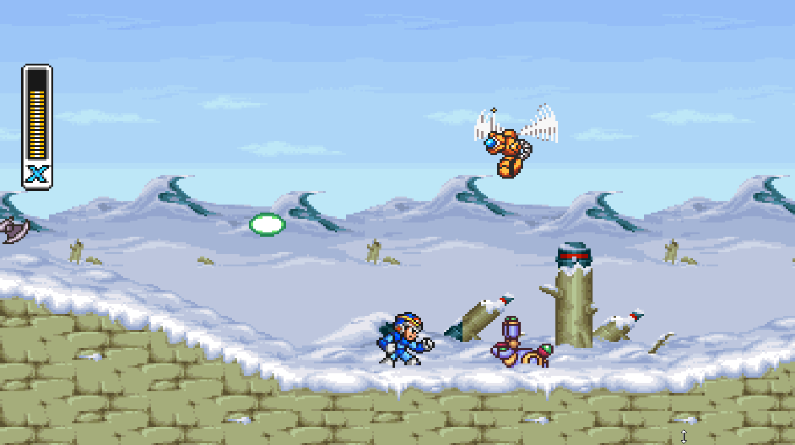

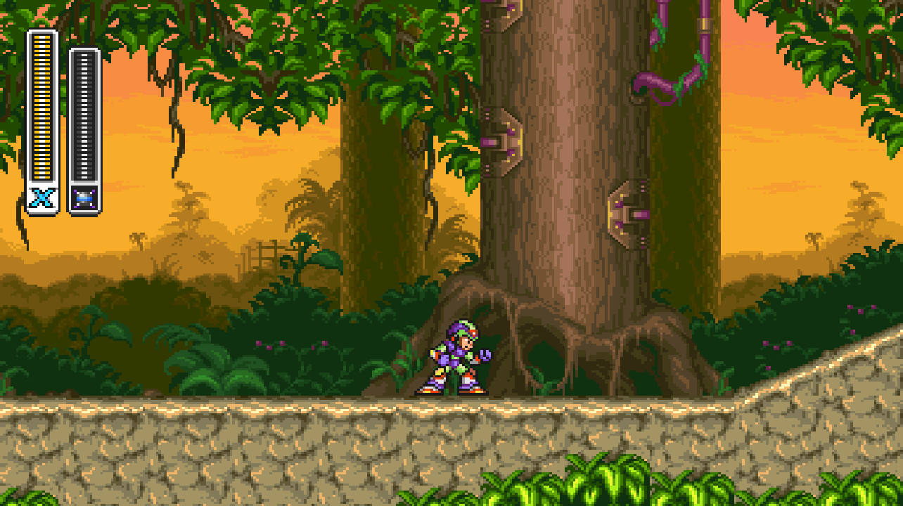

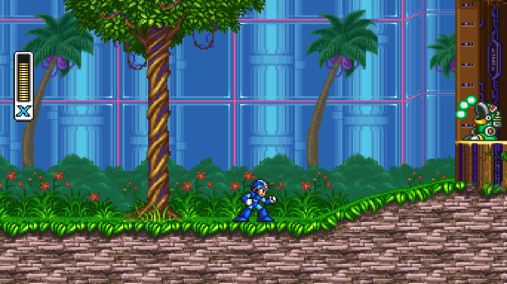

For the most part, the focus is less on adaptive widescreen and more on a flat push to 16:9. However, there has been one exception to tend. Legend of Zelda: A Link to the Past lends itself well to the same adaptive widescreen approach found on the GBA.

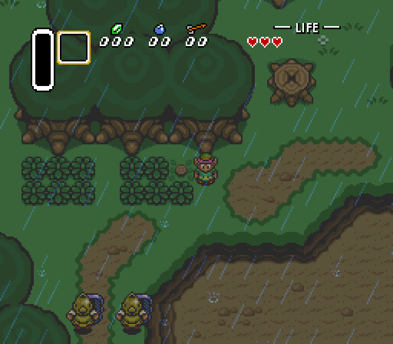

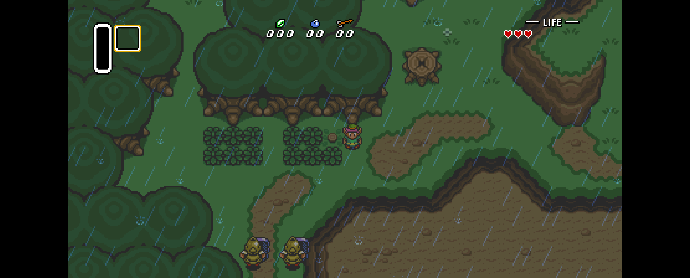

A curious experiment that went reasonably well is not just limiting myself to simple 16:9 enhancements. I took a stab at a very special case: Super Mario Kart. Normally, the game has a split a 2:3 / 2:3 view, with the normal racetrack on top, and teh bottom featuring either a mini-map or a rearview mirror. Because the resource limitation of the interpreted CPU is gone, I was able to experiment by breaking each of the 2:3 viewports out into their own dedicated 16:9 each.

Because the game was never expected to run this way, the sprites definitely came out crunched, and is a future improvement to focus on before making this production ready.

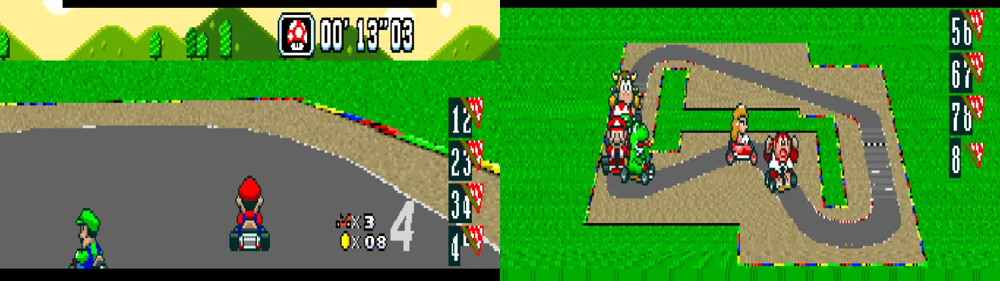

As a closing special teaser, I am also happy to showcase off community work just the same. While the above work has been experiments on my own to improve the ecosystem, a community member by the name of Nick has taken up snesrecomp on his own to bring up a personal favorite, Donkey Kong Country 2, where he is working on active 16:9 support.

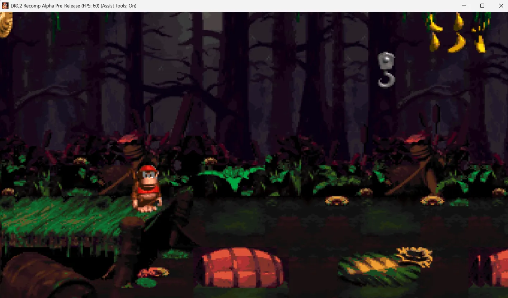

## Technical Enhancements

Focusing more on the technical and less on the visual, Snesrecomp has continued to expand it's support of various chips used in the SNES ecosystem.

SNESrecomp, much like my other ecosystems, has adopted an LLE first approach, meaning it implements a faithful floor to the original hardware rather than taking HLE shortcuts. HLE is an opt-in for efficiency or expansion, but it is a choice, and this ensures a faithful foundation that doesn't rely on hacks to execute.

- Cx4 (usedd above in Megaman X2 and X3)
- DSP-1 (used above in Super Mario Kart)
- SuperFX (used below in Star Fox)
- SA-1 (used below in Super Mario RPG)

Each of the above were implemented using a binary dump of the chip, and later HLE-ed out so that a user would not have to provide the binary, but ensuring 1:1 comparison.

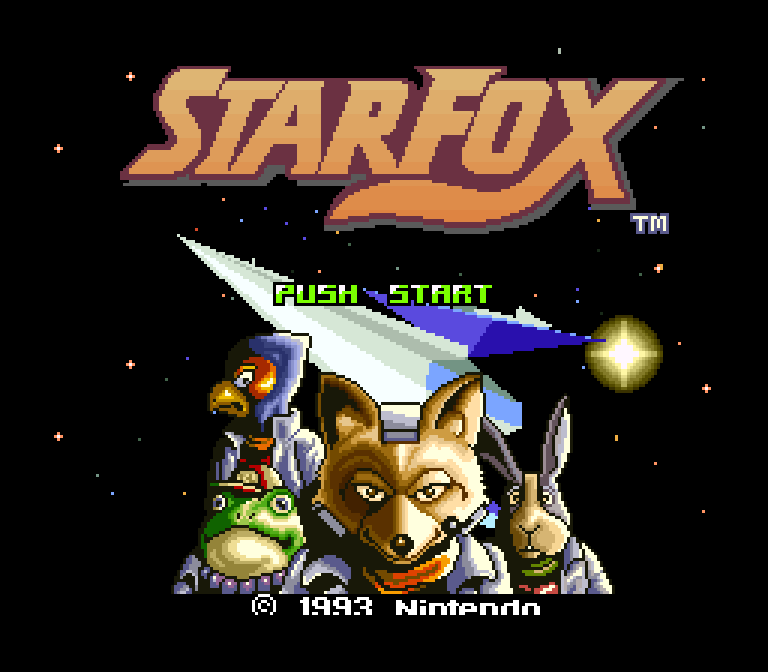

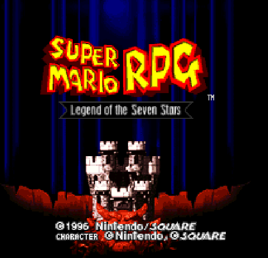

## NESRecomp

*Taking the NES 3D*

## NESRecomp: a voxel experiment

Recently, I have been seeing some articles pop up about Pokemon Gen 1 getting a full 3D experience. To date, NESrecomp has been mostly about faithful porting. Looking for an opportunity to expand it, I took the opportunity to see how well this would translate to the NES.

Having modding support already in NESRecomp, I was able to quickly go from 0 to 100 on this.

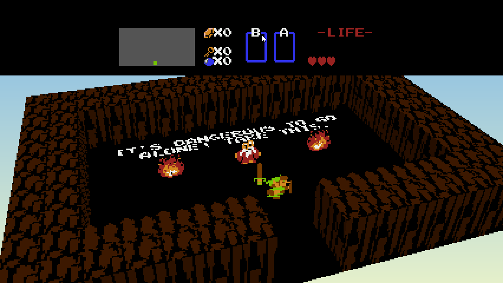

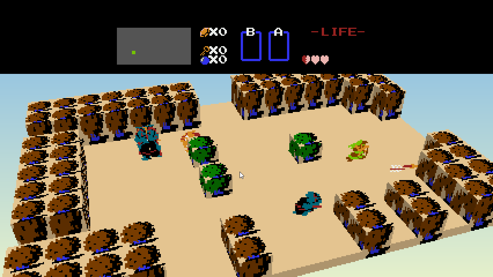

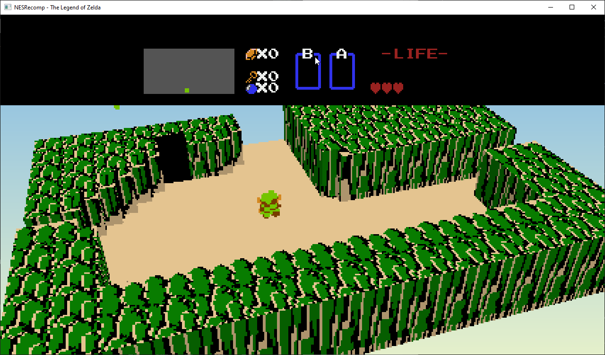

Being up front, this was a one shot experiment after only 30 minutes of work. There is plenty be refined, but it is a strong start.

This is an experimental renderer taht reads the live NES tile grid and projects it in 3D. Tiles become prisms, sprites are camera facing cards. Most importantly, the game underneath is unmodified.

I'd like to recognize the Pokemon Gen1Recomp team for their inspiration for this idea. I'm excited to see where this goes next and how it might be applied to other NES games in general.

## Nintendo DS

*Hitting the ground running*

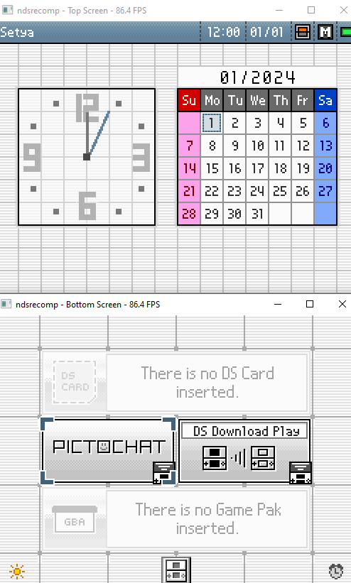

## Emergence of NDSRecomp

The Nintendo DS is an organic follow up from the GBA. So much so, I was able to reuse some of the GBA ARM architecture to start the ecosystem out.

GBA and NDS's ARM architecture lend themselves to fast standups. I was surprised how quickly I was able to go from 0 to the NDS menu. Unlike GBA, NDS did take many rounds of performance optimization to get to acceptable speeds.

As noted before, I find LLE as the most organic approach. It has allowed a quick bounce off from title to first game. Although my games are still in internal development only, I've been able to make reasonable progress with them, both in terms of correctness, speed, and even enhancements.

The DS, being similar to the GBA in terms of confines, also has the same upsides when it comes to recompilation. As a fast follow to getting games up and running, I took to experimentation in adaptive widescreen.

To experiment, I pivoted quickly to decoupling the top and bottom screens, once done, I added adaptive widescreen to the upper screen and applied it to two titles:

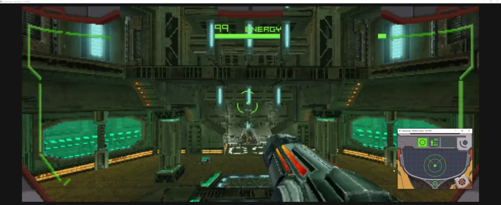

Like the GBA titles, this requires care per title. And even with these showcases, there is plenty of QA and enhancements to be done. Neither game is publicly released yet, and there's still a fair amount I'd like to work on that I think would benefit these titles. For example, mouse aiming for Metroid Prime Hunters.

When I'll find to time to do these remains TBD, although I am hopeful I can attract community interest to collaborate on moving these forward.

## Burning down the backlog

With Tibo's generous and frequent Codex resets, I've been needing to find places to burndown extra token usage. Standing up a new ecosystem is by far one of the most expensive tasks, but with usage to burn, I was able to make some gains across multiple aspirational platforms.

## Phillips CD-i

Continuing in the spirit of LLE first, the CD-i began with its BIOS. At this stage, the BIOS is functional, complete even with Windows host matching RTC sync on boot.

The BIOS is usable at this point, and even capable of booting into a game. Only one title has been attempted so far. However, it isn't able to get far. Some menus load, but background screens are wrong and most any interactive itself leads to crashes at this time.

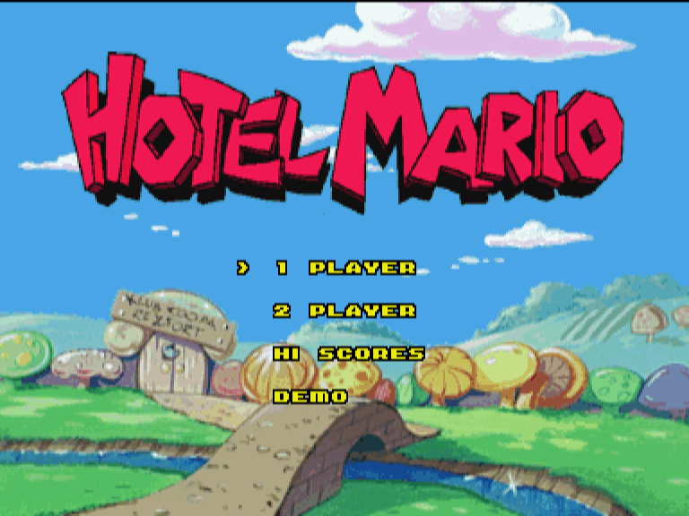

## PSP

The PSP is still early LLE recompilation research and has not gotten close to rendering yet. The PSP itself is a uniquely difficult system, and it lacks a good hardware-faithful emulator. Therefore, I chose a similar approach to probing the PSP by using a *real* PSP.

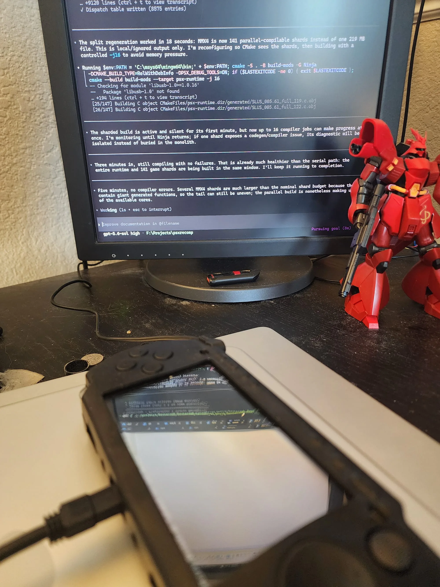

## Closing

A pattern I keep coming back to in these posts: the games are the byproduct, the ecosystem is the product. This update is what that looks like in practice. The mod loader isn't a Mega Man X6 feature: it's an ecosystem feature that Mega Man X6 happens to showcase. Adaptive widescreen isn't a Minish Cap hack: it's a framework capability that each game opts into with its own integration. Even the voxel experiment rides the same rails as everything else: never touch the ROM, ship as an opt-in layer, fall back to the authentic game.

Every new recompiler stood up is unique to the constraints of that system, but the ecosystem itself is modeled after what I've learned in previous recompilers. Each system is more architecturally sound from the get-go. Elements, such as a shared UI ecosystem, is repurposed and adapted.

I'm very grateful to everyone who has been using my ecosystems and submitting PRs so far to help round them out. I hope to see more of it, and believe these will only be successful as community efforts, not me working in a silo. I've made a lot of ground so far, and am excited to see how much further this can all be taken.

---

Related: [The Minish Cap](/games/minish-cap) and [Mega Man Zero](/games/mega-man-zero) on [Game Boy Advance](/hardware/game-boy-advance).
