> 💡 This article heavily discusses AI. However, I wanted to express it in my own words. As such, this article has been authored by me the old-fashioned way. AI was used to help proof-read the article; but did not author what is written here.

Around five months ago, I experimented outside my area of expertise: building a static recompiler for the original PlayStation and other consoles with the help of AI. While I have experience with software in the web and databases space, and have a high-level understanding of static recompilation and decompilation, it was never something I actually participated in as a developer.

My successful prototypes started in February of this year. Shortly thereafter, I wrote an article about using Claude Opus 4.6, Ghidra, and a large amount of iteration to get *Tomba!* running as a native PC application, which you can read [here](/blog/ps1-recompiler-claude-code).

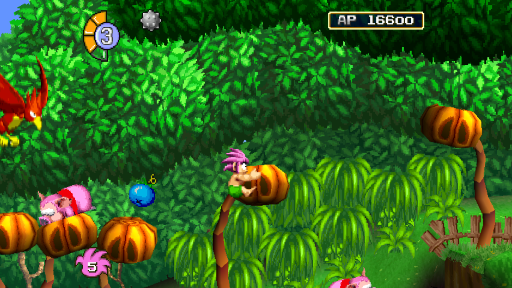

At the time, the most interesting result was that it worked at all.

I had never built a static recompiler before. The first version was shaped heavily around *Tomba!*, contained hardcoded assumptions specific to that game, and made compromises intended to get something running. It proved that the idea was possible, but it did not yet prove that I could build an agnostic ecosystem.

Five months later, the experiment has expanded well beyond that original PlayStation prototype, with significant iteration along the way. PlayStation remains the primary focus of this article because PSXRecomp is my most active ecosystem. It has also presented some of the more complex problems amongst all of my ecosystems, especially when it comes to overlays and the system BIOS. But my story extends to all of my ecosystems; not just PSX.

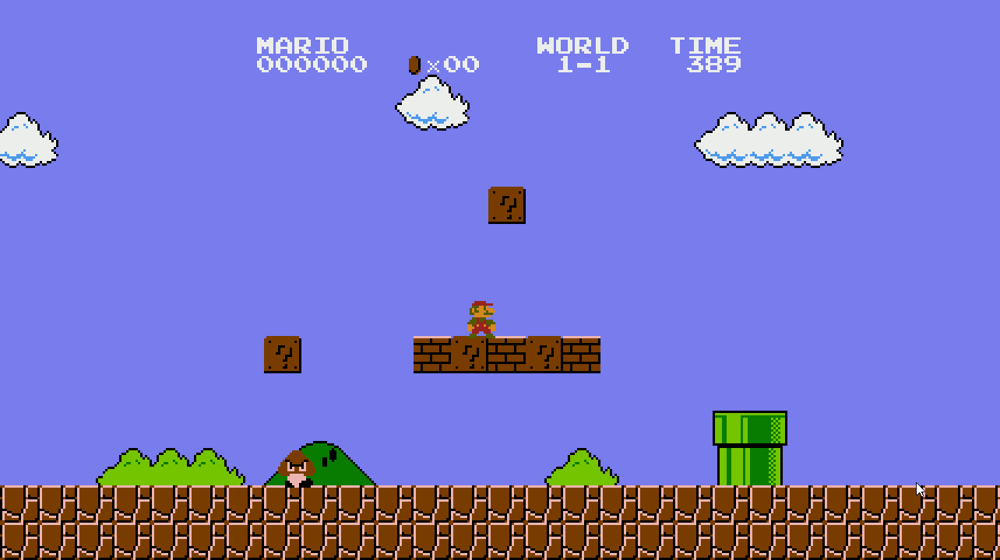

Today, I have repositories for NES, SNES, Sega Genesis, PlayStation, Game Boy Advance, Virtual Boy, Sega Master System, and Game Gear with at least one commercial title running.

## Games are the byproduct; not my goal

In my experimentation, I found a curious emerging pattern. Most reverse engineering projects focus on the individual game. My work focuses on the ecosystem.

Disassembly or not, the first game running is not actually a mark of ecosystem maturity. It's simply a milestone along the path of the ecosystem becoming consumable. Quite often, assumptions about game number one get encoded into the ecosystem, making re-usability difficult for the broader game list. As one would expect, games number 2 and 3 are still much faster to get going. The first game can often take weeks to months, but the second, third, and fourth ones will be closer to days to weeks.

From my experience, if you pick a good set of games from different publishers, using different engines, and from different times in the console's lifecycle, usually between 5 and 7 is the sweet spot where you begin to find diminishing returns. Games are often able to be stood up more readily, sometimes in just hours from the game's ROM/ISO to functional gameplay with minor to no bugs.

> 💡 Even with the assistance of AI, this work takes both time (and money) for a single individual. My goal has been to lay an ecosystem's foundation; reducing my time to give each individual game as much polish as I would like to date.

Since my personal goal is the ecosystem's development more than it is the game, my focus is on the highest-value work for furthering the ecosystem:

- Get the game to boot
- Run through its attract demo without any bugs or crashes
- Ensure saving and loading work

In the case of PSX, I often like to ensure saving and loading work, as these areas are by far the most brittle and most likely to have issues.

I think in some ways, AI has changed the dynamic of how one might approach standing up such projects. Before the era of AI, the approach has always been vertical and understandably so. Stand up an ecosystem thoroughly for one game. Get acclimated to its context and see it end to end, then try to build the next game from that. The process is slower, and often ends up with ecosystems heavily tailored to one game that are more difficult to adapt to games that don't share a developer or engine.

The basic feedback loop looks like this:

1. Stand up a game.
2. Get it booting and into meaningful gameplay.
3. Exercise and measure the attract demo.
4. Verify controller behavior.
5. Test save and load when the platform supports it.
6. Begin standing up another game.
7. Discover what the new game breaks or exposes.
8. Return to the older games and regression test them.
9. Reconcile the differences until everything works from the same framework commit.

A framework change is not complete simply because the newest game starts working. The older games must continue working as well. This is my north star. Each game is an integration test for the framework.

Code that looks abstract may not have been, and this is most readily exposed when you target another game. Anything from memory layout, to timing, to controller input is an assumption that can be invalidated when a new game is introduced.

My SNESRecomp work has used *Super Mario World*, *Mega Man X*, and *The Legend of Zelda: A Link to the Past* as distinct framework consumers. Each title exposed different gaps in 65816 analysis, memory mapping, dispatch behavior, or runtime scheduling. The same holds true for NES, Game Boy Advance, and Sega Genesis.

### The Value of the Attract Demo

One of my most useful validation tools has been game attract demos.

Most old games play prerecorded input when the screen is left idle. Often it cycles through the game's various levels. This is a sort of "spot check" for the game; but more importantly, it is deterministic. This makes comparison to emulators far easier as there's no fighting input, input timing, or lack of determinism. Relying on this helps exercise the core engine and iterate on a game far faster as it reduces the human in the loop.

## From Opus 4.6 to Fable and Sol

Another fascinating dynamic is how AI models themselves have changed since I started.

When I originally began with Opus 4.6, I had to babysit the model far more. It took a considerable amount of harness work to force Opus to prove accuracy. It would often draw unreasonable conclusions or iterate on speculation. Its iteration was also very short. Getting Opus to work beyond 2-5 minutes was a challenge. With Opus, you had to be task oriented and spot check every fine detail.

With Fable, once you have an ecosystem in place, your focus moves from tasks to goals. Challenges go from "find the specific function being missed by dispatch when Tomba jumps in the attract demo sequence at 35 seconds" to "Ensure the attract demo for Tomba runs end to end without any function dispatch misses, softlocks, crashes, visual artifacting, or frame loss".

Despite Opus's limitations, it was a powerful tool to help me work outside my technical field of expertise. But a dangerous one. I think the pitfall many users find when attempting to reverse engineer a game is that Opus likes to solve the problem in front of it without considering the broader ecosystem implications. The user-visible result is correct, but with architectural consequences that are hard to unfurl later.

In the era of Fable and Sol, investigations rely more on the tooling and ecosystem provided to them. Without as explicit direction, Fable and Sol now cross the recompiler, generated C, runtime, recompiled BIOS, game-specific repository, and a reference emulator all on their own, so long as it's available to them. The newer agents are better at maintaining context across those layers, conducting long investigations, comparing traces, revisiting earlier conclusions, and recognizing when a game-specific fix should instead become a shared abstraction.

Fable and Sol write better code while participating more effectively in the engineering process as a whole.

Half-jokingly, I see remarks where people say prompting is nothing more than "here's a ROM/ISO. Recompile this game. Don't make mistakes". As much as I wish it were that simple, there is a lot of thought and management that goes into it. Done right early, it pays dividends.

## PlayStation as the Primary Case Study

PSXRecomp remains the most developed and widely followed of my recompilation ecosystems.

The original prototype began with just *Tomba!* and a stubbed BIOS. Today, it supports multiple games through the same shared framework, recompiles the real PlayStation BIOS, models the surrounding hardware, and handles dynamically loaded code overlays through a layered native-compilation and fallback system.

The early games that fleshed out the ecosystem were *Tomba!*, *Tomba! 2*, *Mega Man X6*, *Tsumu*, and *Ape Escape*.

*Tomba!* came first and remains the most refined. It is playable, but I still avoid claiming that it has been exhaustively validated all the way through to the end. A game booting and reaching gameplay is not the same as verifying every level, boss, save point, optional path, and uncommon state. *Tomba!* has the greatest development depth because it came first, and I was also very fortunate to get some wonderful feedback from one of its speedrunners who took a liking to the project in its early stages.

*Mega Man X6* came next. Being a 2D game itself, it was an easier second pass but was still fraught with its own issues in overlays, disc load behavior, memory cards, etc. Next came both *Tomba! 2* and *Ape Escape*. These were chosen targets due to their heavier use of 3D.

They are the byproduct. PSXRecomp is the product.

## Faithfulness as a Starting Point

Static recompilations are a stepping stone to not just preserving games, but enhancing them. As these games become decoupled from emulation, the limitations that come with emulation are removed as well.

For each ecosystem, I also like to exercise at least one feature beyond authentic reproduction. Most frequently, that's widescreen. The value is obvious. The user can easily see it and it often materially improves the game experience. It is also something that emulators often struggle to implement without stretching the UI or introducing slowdown, something static recompilation gets us over.

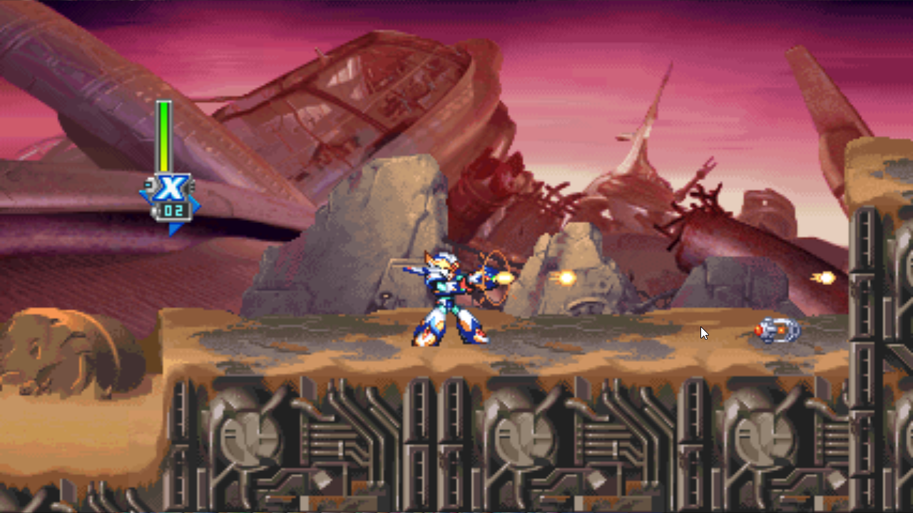

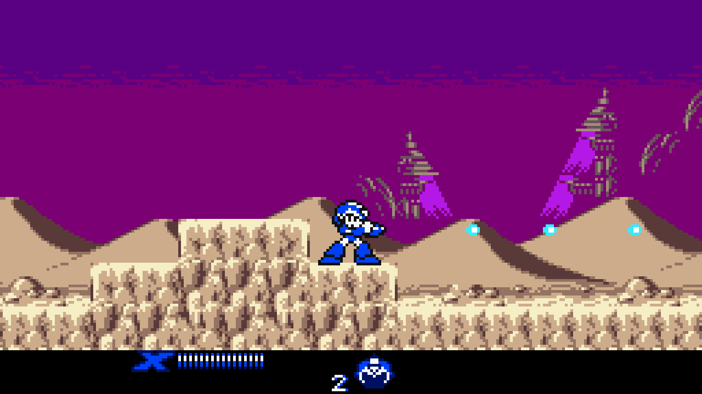

This is trickier in 2D games. Sidescrollers can sometimes work a little better, but the real benefit is in 3D games, especially for the PSX. The easiest are games that don't have culling logic, and it's as simple as just expanding the viewport, in effect. For some games, you have to go hunt down the functions that cull enemies, abilities, and terrain in 4:3 and ensure they meet the wider viewport.

Of course, some parts simply can't be extended. Menus and FMVs are a great example, and can take away from the experience a bit. For those, it would likely take modifying the game with patches prior to recompilation to smooth out the experience.

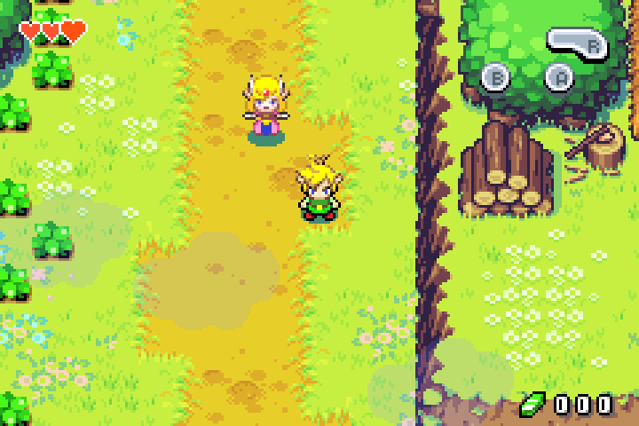

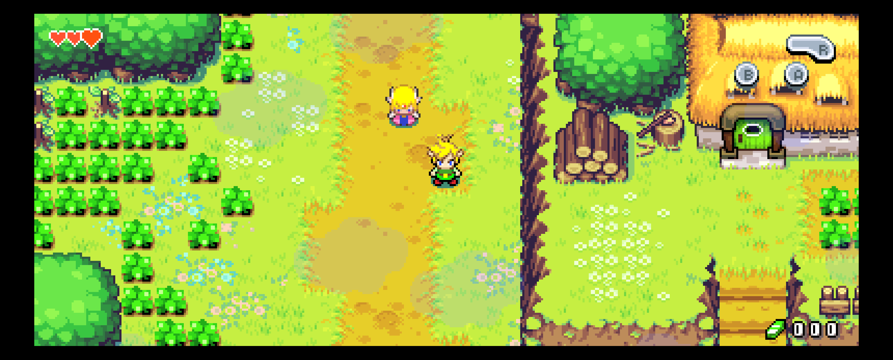

## Making the ecosystem easier to enter

One benefit I did not fully appreciate at the beginning is that AI also helps other people understand and contribute to these ecosystems.

Instead, I find my value is more as the project maintainer. When users stand up a new game on a branch or fork of the ecosystem, I'm able to act as an arbiter before intaking their code, ensuring the pitfalls of improper abstraction, hardcoding, etc. don't pollute the ecosystem. Most often, I use the games I stood up as a QA regression test against new contributions before merging them.

This kind of reuse is being done with the SNES ecosystem in a creative way, wherein another developer is using SNESRecomp as the basis for bringing the recompiled version of *Mega Man X* to Xbox.

My goal is to enable others to use these tools as a foundation for their own projects

## A Polarized Reaction

The reaction to this work has been polarized. I'm disappointed in some ways, but not entirely surprised.

Many people have been grateful, curious, engaged, and genuinely excited by the progress. Others have reacted with visceral negativity because AI was involved. Responses range anywhere from technical criticism to ad hominems. I have seen attacks directed at the projects, at me personally, and at others who merely use the builds or discuss them positively.

I think it's important to differentiate between genuine criticism and bad faith arguments meant to undermine. Questioning the accuracy of a runtime is useful. Finding a bad architectural decision is useful. Those discussions can improve the work. That was my primary motive in socializing my work.

The project being dismissed because I didn't personally write the code misses the value proposition in my eyes. The value is in the output: the product. A huge value proposition of using AI is to accelerate development because I didn't write the code. Much of the discourse feels like painters screaming at photographers for using a camera. AI is a tool. It is a catalyst to the person wielding it.

The related criticism is that I lack expertise in this field. I see what I do today as akin to a European vehicle mechanic being ostracized for not knowing the intricacies of working on a Toyota vehicle. I am a software engineer by trade, and I previously worked in quality assurance. I also have reverse-engineering experience without the use of AI, although my earlier work was not focused on retro games.

I spent more than 3 months reverse engineering a prototype for a live service game's API. Every step of it, from research to implementation, was done by hand by me using my knowledge and expertise in a time where AI agents simply weren't capable enough to reason or write code.

Having a QA background assists as well. In my time as QA, it was my job to audit code I didn't produce. I find that I exercise many of those same strengths operating with AI. This is especially relevant in an environment like reverse engineering where there is a very strict correctness criterion.

I know what the game I'm playing should look like, how it should sound, and how it should feel. I can compare behavior against original hardware and established emulators. I can compare framebuffer output, execution traces, memory state, attract demos, save files, timing, and repeatable gameplay sequences. What the AI generates has to meet an expected output. The expertise remains, but it is applied differently.

## This is something to celebrate

These types of projects have historically taken teams of developers years to accomplish. Even still, these efforts are often volunteer efforts, and these confines could force compromises to move the project along. This has severely limited the types of games that could get this type of second life.

We are now in an era where AI tooling can redefine and expand the scope of preservation, recompilation, and enhancements of these old, long-forgotten games. This new leverage must be paired with strong validation, transparent limitations, and respect for the work that came before it.

## The Next Phase (for me)

In short, I think that I've proven the concept and people are on board. For me to continue to support this vision, it is no longer meaningful for me to continue standing up new games. Instead, I want to support others who are beginning to consume these frameworks to stand up their own games, as well as focus on rounding out the games I have managed to stand up so far.

Taking PlayStation as the north star, now that we have more games running, we can find recurring trends to help discover things like how to trace overlays from games earlier in the process, not requiring a playthrough to seed them.

> This is the foundation, with the finished result still ahead.
>
> These projects are still early. AI has compressed an enormous amount of engineering effort, but it has not removed the need for testing, iteration, or time. The current alphas are the result of a breadth-first approach: I have focused on proving and hardening the ecosystems before deeply polishing each individual game. The foundation is working, and the next phase is depth. That will still take months, if not years, especially as a volunteer effort. The progress is exciting, but patience is still warranted.

## Closing

Just five months ago, the question was: could AI help build a static recompiler for a game? Today, the question has become whether or not it can help build a re-usable ecosystem. We are still early yet; but I think the answer that is emerging is yes.

The trope that AI usage is analogous to low quality I believe is a dishonest one. AI is a tool like any other. Despite their capabilities, the tools are early yet. What is being shown even now used to be years of engineering effort compressed, while a great deal of work still remains. We are still early in the research and discovery phase. But at the end of the day, the end result is up to the person at the helm. It's up to the person to give attention to detail and focus on the finer details. Below are a few images from a a developer making use of the PSXRecomp platform: Endymion, who showcased games that he stood up and began spending time on to focus on the finer details:

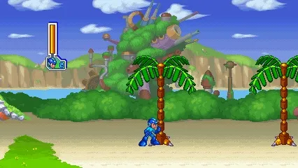

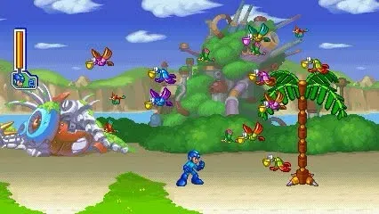

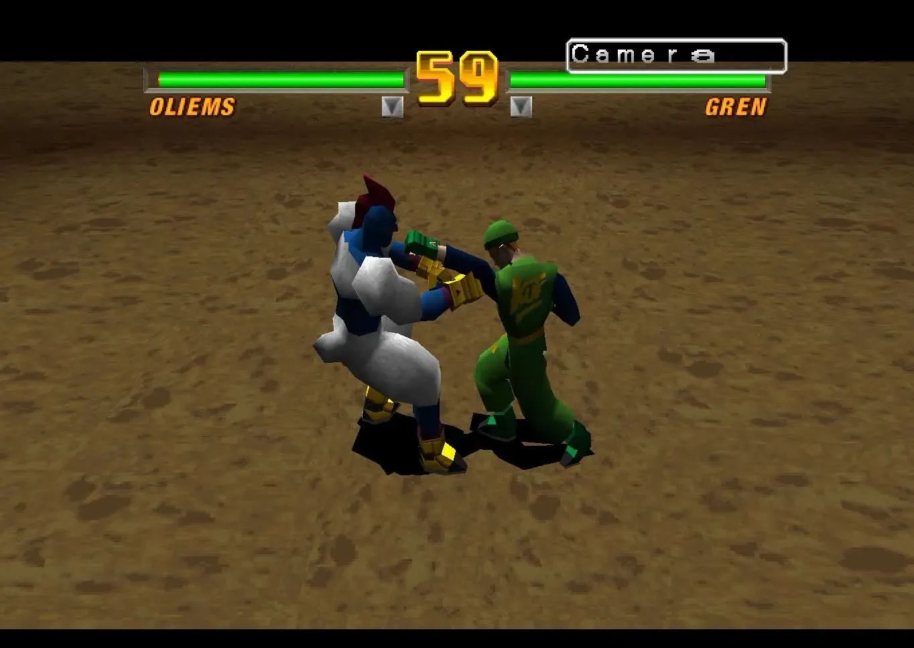

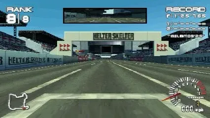

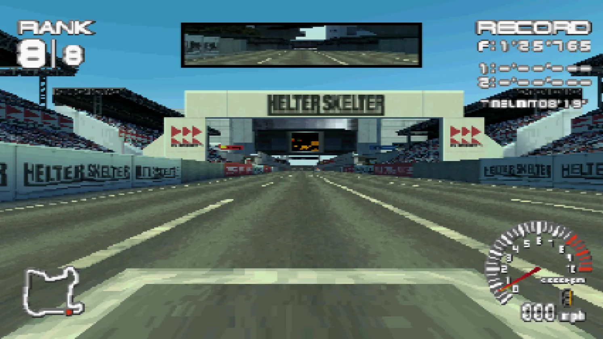

There is still a great deal of work ahead of us to see this through. The results will be exciting, but it's important to be patient. And anyone willing to learn is also able to do their own small part with AI to see it forward, too.

---

Related: [Tomba!](/games/tomba), [Mega Man X6](/games/mega-man-x6), and [Ape Escape](/games/ape-escape) on [PlayStation](/hardware/playstation); [Super Mario World](/games/super-mario-world) on [Super Nintendo](/hardware/super-nintendo).
