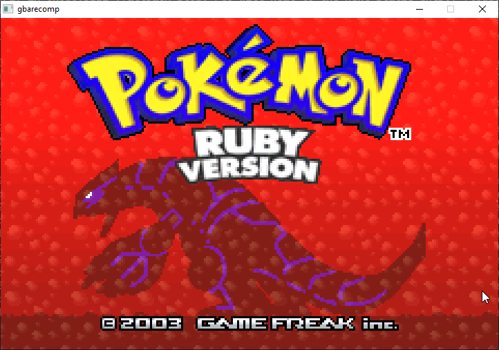
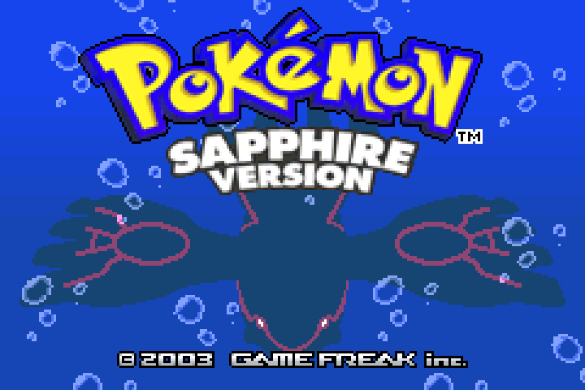
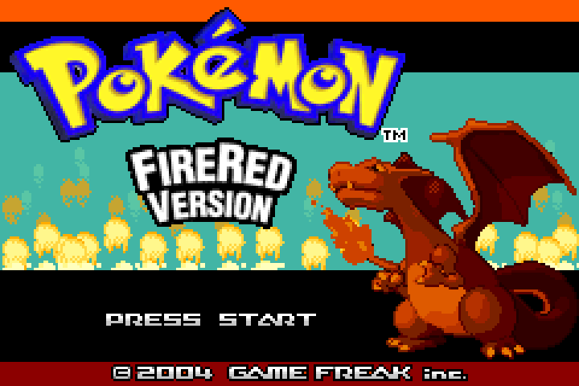
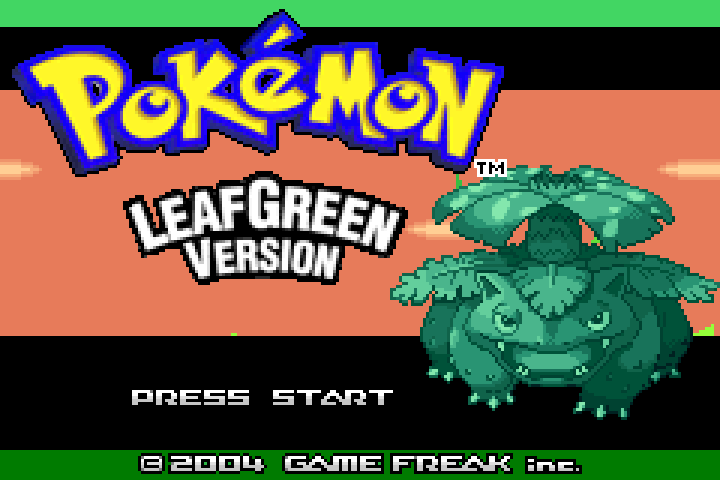
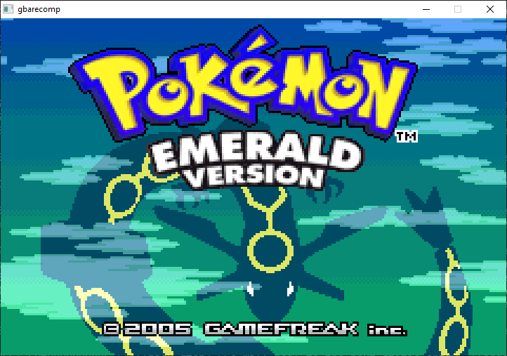
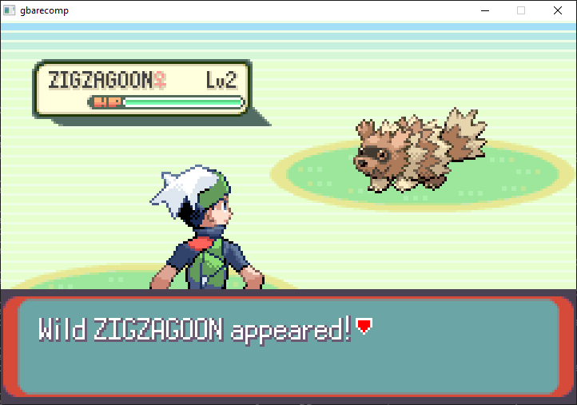

My long term goal is to plant the seed for all legacy systems to have static recompilers, in hopes to blossom various types of ports and extensibility.

Game Boy Advance was always an obvious target, and with the [recent news of the decompilation of The Minish Cap](https://github.com/zeldaret/tmc) getting an early PC port, it felt like it was a good jumping off point, since standing up these ecosystems is always easier with an accompanied decompilation for the first few games.

Following the same philosophy I set forth with Playstation, this was done to be all encompassing. The first bootable binary I stood up was not a game, but the BIOS itself.

While underwhelming on its own, it sets a foundation for correctness for all games to build on. The GBA BIOS isn't as interactive as say, even the Playstation, but it is a foundation towards completeness.

While too early to tell, I'm also curious to see if someday we'll see creative uses of the Game Boy Advance "download mode", where it can be sent game data from another system over a link cable.

> 💡 This is my first **32-bit** target. The GBA freely *interworks* two different instruction sets, 32-bit ARM and 16-bit THUMB, switching between them mid-execution. The recompiler has to decode and translate both, and handle every switch correctly. The **GBA BIOS** is statically recompiled and runs through the same native dispatch path as the game code (you supply your own BIOS dump). The hardware, the PPU, DMA, timers, interrupts, audio FIFOs, and cartridge save chips, is modeled faithfully rather than faked.

I decided to launch this game after getting it to work with 6 games. The first target was The Legend of Zelda: The Minish Cap. The following five targets are the Generation 3 Pokémon games: **Ruby, Sapphire, FireRed, LeafGreen, and Emerald**.

In actuality, given how Ruby/Sapphire and FireRed/LeafGreen are designed, the efforts to get each's counterpart booting was nominal at best. Each pairing shares a repo.

Where it stands: **very early, and very experimental.** All five Pokémon games boot to their title screens and can get into gaemplay, wild encounters and all, and The Minish Cap is into early gameplay too.

## Self healing coverage

Because the ecosystem is still very early, the games lack exhaustive static coverage end to end. **However**, the gbarecomp ecosystem includes a couple of tricks to keep development and experimenting at early builds in the game.

### Fallback interpreter (emulation)

The gbarecomp ecosystem includes a fallback interpreter (emulator) for when static coverage is missing. The consequence of this is paths not yet identified in the recompiler will be as slow as emulation. At least, on their *first* run

### Native sharding

While not *static* recompilation, anytime interpreted code is encountered at runtime, an embedded jit compiler is baked into gbarecomp that will kick off a thread to create a **shard** on disk of native code. This code is not as efficient as fully gcc statically recompiled code *but* it is still measurably faster than fully interpreted.

> 💡 As players continue playing these, or any future games with limited coverage, the ecosystem does self-improve and make the game faster.

Furthermore, players who play games that are yet incomplete will also generate manifest files that can be provided back to the project developer. This manifest *is* the identified coverage gaps and can be fed back into the project to provider proper static coverage in those missed areas.

This is bleeding-edge: The games are not tested end to end. I would expect crashes, glitches, and plenty that simply doesn't work yet. Right now it's less a finished product than a proof that static recompilation of GBA games is tractable at all: ARM/THUMB interworking, recompiled BIOS, and a hardware-faithful runtime included.

As always, you bring your own legally-dumped GBA BIOS and game ROMs: none are included. Repos:

- **gbarecomp** (the engine): [github.com/mstan/gbarecomp](https://github.com/mstan/gbarecomp)
- **Pokémon Ruby & Sapphire**: [github.com/mstan/RubySapphireRecomp](https://github.com/mstan/RubySapphireRecomp)
- **Pokémon FireRed & LeafGreen**: [github.com/mstan/FireRedLeafGreenRecomp](https://github.com/mstan/FireRedLeafGreenRecomp)
- **Pokémon Emerald**: [github.com/mstan/EmeraldRecomp](https://github.com/mstan/EmeraldRecomp)
- **The Legend of Zelda: The Minish Cap**: [github.com/mstan/MinishCapRecomp](https://github.com/mstan/MinishCapRecomp)

---

Related: [Game Boy Advance](/hardware/game-boy-advance), including [The Minish Cap](/games/minish-cap) and [Mega Man Zero](/games/mega-man-zero).
