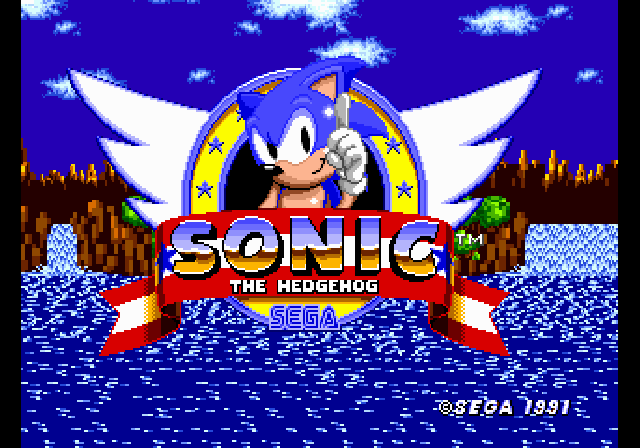
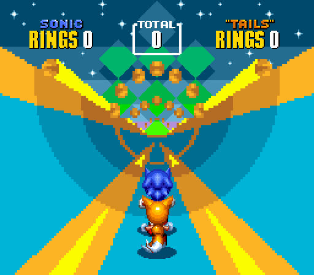
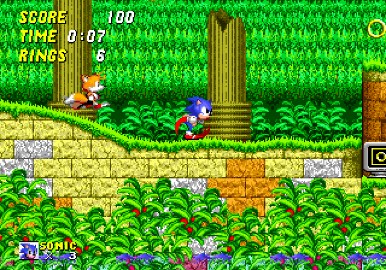
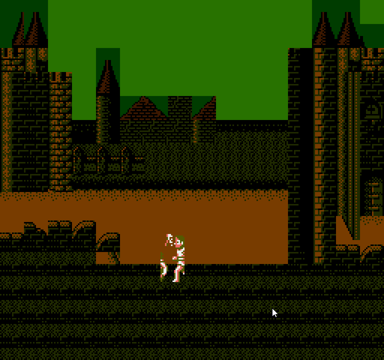
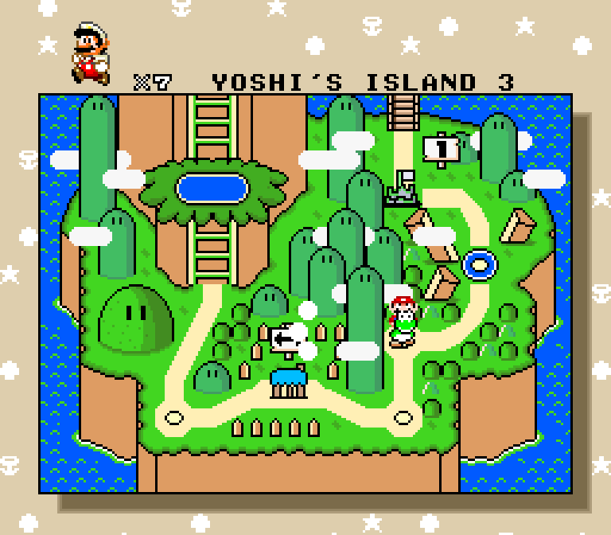
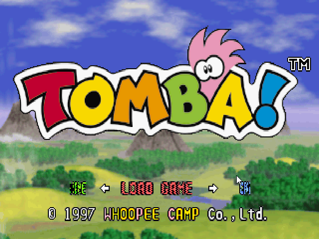
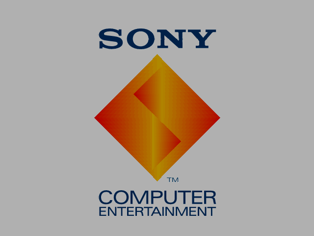
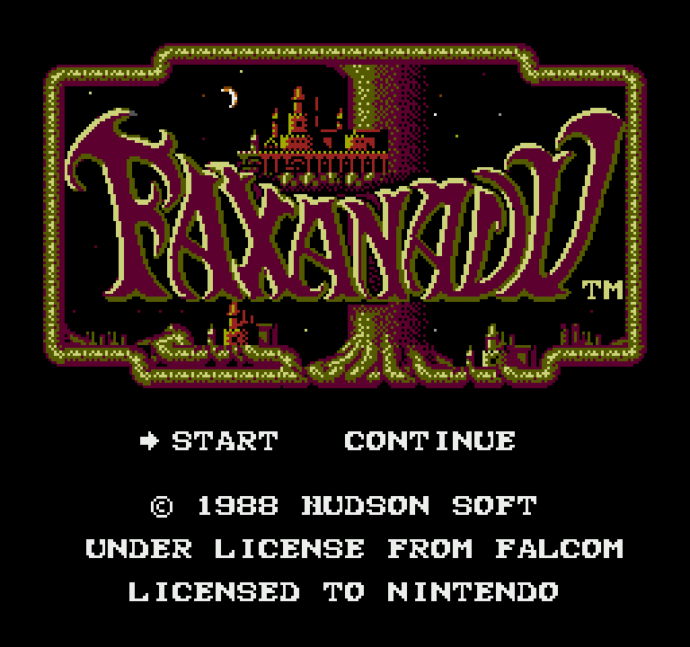
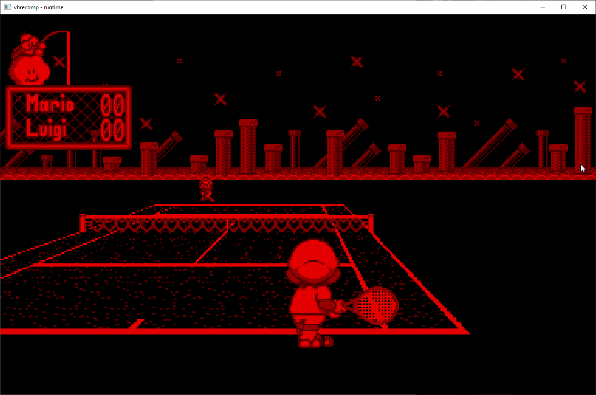

> 💡 This article discusses heavy use of AI, but the article itself was **not** written using AI. The words in this article are my own. I wished to communicate my intents and story myself, grammatical errors and all, of the **why** and **how** I am using AI

> 📝 Each of the 6 systems have at least one commercially playable game. The games are expected to be mostly playable (if not playable end to end). There are likely going to still be subtle bugs.
>
> If you encounter any, do file an issue!

Over the past 4 months, I have managed to build static recompilers for five different game systems, each capable of running at least one commercial game for its target platform, all with the assistance of AI.

[Watch: 2026 05 21 Recompilation Showcase (YouTube)](https://www.youtube.com/watch?v=lKXy3GeBUnE)

*Montage of 5 Static Recompilers in Action*

## Introduction

I have been an early experimenter with modern LLM AI tooling. My first introductions to it were actually with OpenAI around June of 2022, in the early ChatGPT era. The models at the time were...underwhelming. They struggled to catch basic grammar issues and often could not reason through even simple copy/pasted functions. But it still fascinated me, as someone who works in software, seeing this rough semblance of reasoning and output that felt more human-like than structured data like JSON. At the time, it seemed little more than a novelty.

A few months later, Stable Diffusion made an appearance online. This one was similarly interesting to me. Though the images were frequent in having malformities, it again scratched that itch in the back of my mind about what was *emerging*, rather than what was capable. I tinkered with it for a while, which helped me to start appreciating the idea of trigger words, tokenization, and the other aspects that come with LLMs.

It wasn't until closer to March 2024 that I once again returned to ChatGPT to experiment with it and its ability to reason. I was rushing to push out a chat bot for an April Fools gag on my community Discord and had it help me with a randomness reply function in the server using discord.js.

Copying & pasting in and out of a chat window was useful for complex single functions, like above, but it was untenable for truly complex projects that required parsing binaries, or trying to explain the entire ecosystem end-to-end in a chat window. But nonetheless, ChatGPT became a helpful assistant in helping me bang out logic errors or fast-tracking complex SQL queries for my day-to-day.

Then in October 2025, Claude Code came out. My manager at work had recommended we all give it a try. I was a bit skeptical at first, the idea of giving an LLM access to my CLI, but there was an allure to how much more it could enable and be holistic in having access to a codebase, so I gave it a whirl.

It took me a while to get it down, but once I did, I started to see just how empowering this could be towards more ambitious projects, especially those beyond my expertise...like decompilations, recompilations, and PC Ports of old retro games.

## Why Static Recompilation?

My day job consists of working with backend web services and databases. I have never been a game developer, neither as a professional nor a hobbyist. Though I have tinkered with modding games for years, with my first major discovery being a "[million dollar exploit](https://www.youtube.com/watch?v=ShsoED-goDg)" in Valve's Team Fortress 2 economy. In the years following, I ended up picking up most of the sysadmin work for my gaming community Team Fortress 2, Minecraft, Killing Floor, etc. game servers. Later on, I would go on to build a prototype (*without* AI) and found a fan-made private server for a live service game, [GUNDAM EVOLUTION](https://1379.tech/the-making-of-side-7-gundam-evolution-private-server-project/), that saw an abrupt shutdown only a year after its release.

I have always been an avid enthusiast of retro games. I had a slew of hand-me-down systems from my older brothers, and I eventually bought my first own game console many years ago.

I follow the emulation and modding scenes closely, too. Despite having the systems, I did tinker with emulation at a young age, if not for fascination more than any other reason.

In more recent years, I have enjoyed seeing all the various decompilations, recompilations, mods, and fan showcases that make older games feel active again.

Not too long after that came the emergence of recompilations. Similar to decompilations, but not exactly the same, recompilations offered another way to bring games to other systems. Modding and extensibility were far less approachable, but they still served as a foundation that one could build off of.

Even though decompilation and recompilation were not my areas of expertise, I had a high-level understanding and appreciation of what those communities were doing. Enough to appreciate the work, but not enough to meaningfully contribute to it.

That gap is part of what made this so interesting to me: could AI-assisted tooling help someone like me build enough of a foundation that people with deeper expertise could take it further?

## Earliest experiments

Around late October of 2025, my first attempt in this area to port a game was an NES title. I chose the NES given that it seemed approachable and simpler of an ecosystem than same of the other later consoles, especially compared to its immediate successor, the SNES and its register width tracking.

I chose Faxanadu as a first target. Perhaps a bit contrarian, and not the wisest of choices, as choosing something that had actual disassembly and documentation would have reduced unknowns.

Perhaps unsurprisingly, my first experiments were ultimately a failure. Despite access to the ROM, decoding tools, and more, the models at the time (Sonnet and Haiku 4.5) were not capable enough to keep up with the complexity required. Anyone familiar with LLMs know how confidently they'll lie to you about finding a solution that isn't real. And while I didn't have enough expertise in this *particular* area, I did have a background in QA, and I can most certainly validate whether a software or tool is doing what the developer (or in this case, the LLM) *claims* what it should do.

## First success

While it wasn't cut out at the time, I did occasionally circle back to Claude every now and again to re-attempt my experiment. And in February of 2026, I had a breakthrough!

After trying to setup an ecosystem for a static recompiler, Claude was able to spit out something that was far from perfect, but began to *resemble* the target goal of reproducing the game from *outside* an emulator.

This marked my first ever successful render of a game: littered with bugs, anywhere from the sky palette being wrong, the overworld wrapping when it shouldn't, David's sprites being garbled, and various terrain sprites being reversed. While it was a mess, it was still a foundation that the LLMs ability to integrate and reason was *improving*.

Through attrition, I began trying various validation methods to anchor Claude and give it ways to self-validate. I tried multiple experiments, ranging from lua scripts in existing emulators to have Claude build debug tooling into emulator sources as well as our own recompilations.

My methodologies began to mature around the idea of having a time-series ring buffer in both emulators and native applications, exposing ram, registers, and more. Commonly, I would supplement with Ghidra via MCP integrations, as well as disassembly of the game itself (if available).

## The second system: Playstation

Once I was able to get Faxanadu built, I wanted to pivot to see how approachable this was for other systems. I set my sights on the Playstation. Though it may have seemed like a complicated second choice, many PlayStation games were compiler-generated rather than entirely handwritten assembly. That made the system feel more approachable than it looked at first.

In the end, I was able to get a clunky prototype to load. [Tomba](/blog/ps1-recompiler-claude-code) was able to load in. Its FMVs and first area were able to load, albeit with many audio and visual glitches, but it was again proving the concept.

In the end, I had to abandon the prototype and instead rebuilt it from the ground up. While it did work, so much of it was stubbed. Those silent failures became death by a thousand cuts, making any real progress, like implementing saving, impossible. In my second implementation, I began from the BIOS *first*, and implemented a standalone, bootable version that was able to manage memory cards before diving into Tomba again.

## From Prototype to Process

My early prototypes were focused on a singular game, but my long term goal was a game-agnostic ecosystem. Proving the concept ended up causing a lot of hardcoded values that were game specific. I figured the best way to work towards decoupling was to implement more games for the ecosystem that allowed for the first. For NES, I chose The Legend of Zelda, as the game was known for having *very* well documented disassembly. I wanted to see how well this would speed up my iteration for game number 2. In the end, it helped considerably, alongside having even a rudimentary tool that was able to see Faxanadu through end to end.

It was Zelda that helped me begin to really flesh out the decoupling of making neserecomp a *general purpose tool*. Eventually this lead to the paradigm of there being a system repo (nesrecomp), and a game repo (Zelda, Faxanadu, etc). The structuring of the repos was then used as a foundation for all future systems.

## Current State

I have continued to learn and iterate from my time in working with AI and these tools. I have gotten sharper in my guidance to AI and my validation of its output.

### Which systems are available today

#### [NESRecomp](/blog/nesrecomp-10-titles)

Currently my project with the most supported commercial titles. It currently supports 10 titles across 4 mappers.

Unintuitively, the NES has been a more challenging ecosystem *because* of the various mappers. Every game's runtime is different, meaning the lift from one game to the next is rarely a small one.

#### [SNESRecomp](/blog/snesrecomp-super-mario-world)

Super NES was likely my longest time to value. The SNES has a lot of complexity as it relates to register widths, state, and more, that requires a lot of state tracking.

#### [Sega Genesis Recomp](/blog/genesis-sonic-2)

The Sega Genesis was another important system for me as a kid. We owned all of the Sonic games for it. Fortunately, Sonic's games have a lot of love, with great [**disassemblies available.**](https://info.sonicretro.org/Disassemblies)

Currently, Sonic 1 and Sonic 2 are both playable, with 2 being a fast follow given it had a similar engine and great disassembly.

#### [PSXRecomp](https://github.com/mstan/psxrecomp/tree/master/recompiler)

PSXRecomp was my first prototype to [get any sort of attention](https://www.youtube.com/watch?v=PS8KePPtlc4). As such, I wanted to go back and do this one right for anyone who was looking to help improve or fork from the ecossytem.

Currently able to boot the full system BIOS + Tomba in a playable state. For the BIOS, full memory card management is functional.

Surprisingly, Claude struggled considerably with the memory card piece. I eventually ended up using Codex's GPT 5.5, which was able to work out the kinks.

#### [**VirtualBoy Recomp**](/blog/virtualboy-mario-tennis)

As my tooling and methodology began to mature, I wanted to pivot to see what I could do in a new environment after I had commercial games booting for all the other ones.

VirtualBoy lacks any good disassembly, but is a simpler architecture than say, SNES. I decided to keep scope small by picking a simpler game, Mario Tennis, as my first title.

## Future Prospects

### Continued Development

#### Sega Genesis

Given the richness of the Sonic disassemblies, I am aiming towards trying to get all of them functional in the recompiler to give it a solid baseline

#### Super Nintendo

With Super Mario World reaching dminishing returns, I am looking to move onto The Legend of Zelda: A Link to the Past as title #2, as it also has great disassembly and a decompilation to reference.

For title #3, Super Metroid I believe is the next most reasonable candidate, though I am debating whether I go for it or pivot to Megaman X, a game I have always wanted to see get a facelift with the decompilation/recompilation scenes.

#### Playstation

Tomba is in a healthier state, but likely requires additional playtesting. I would like to try and move on to a few other staple games for the system, likely continuing to focus on games that are less complex games, meaning we probably won't see [Crash Bandicoot](https://www.youtube.com/watch?v=pSHj5UKSylk) for a while

### New Systems

#### Game Boy Advance

The Game Boy Advance is a good next target for a new system to be built. [The Minish Cap](https://gbatemp.net/threads/pc-port-for-the-legend-of-zelda-the-minish-cap-gets-its-first-playable-build.681470/) recently got 100% decompiled and got its first build. While decomps don't translate 1:1 to recomps, the decompilation will be beneficial and there's likely some runtime work in the decomp that can accelerate development.

#### Phillips CDI

The Phillips CDI was a game system I never owned, but I'm aware it has a few Nintendo licensed titles on it. I'm aware that its emulation scene is ultimately poor, and I hope this'll be an opportunity to give it more of a second life.

#### Looking to the Future

As tooling continues to mature and I'm able to set some foundations for these earlier ecosystems, I may someday consider looking at later generation consoles. I'm sure that as systems get more complex, I'll be limited in both AI tooling again (as well as token costs). Though with how fast AI is evolving, it's hard to say.

## Closing Thoughts

For those curious about my intent in doing all of this: I am not trying to replace the decompilation, recompilation, emulation, or modding communities.

If anything, this work exists because of them. The documentation, disassemblies, emulator accuracy work, preservation work, and countless weird edge cases that people have already figured out are what make any of this possible.

My hope is that these projects can act as seeds: rough but working foundations that experts, modders, and preservationists can pick up, improve, fork, or use as reference points for their own work.

Even with AI as a catalyst, I cannot do all of this myself, and I do not think I should. The best outcome would be for these early recompilers to lower the barrier just enough that more communities can start building modern tooling around the games and systems they care about.

---

Related: [NES](/hardware/nes), [Super Nintendo](/hardware/super-nintendo), [Sega Genesis](/hardware/sega-genesis), [Virtual Boy](/hardware/virtual-boy), and [PlayStation](/hardware/playstation).
