[nesrecomp](https://github.com/mstan/nesrecomp)

[Super Mario Bros](https://github.com/mstan/SuperMarioBrosNESRecomp)

[Duck Hunt](https://github.com/mstan/DuckHuntNESRecomp)

[Dr Mario](https://github.com/mstan/DrMarioNesRecomp)

[Legend of Zelda](https://github.com/mstan/LegendOfZeldaNESRecomp)

[Metroid](https://github.com/mstan/MetroidNESRecomp)

[Faxanadu](https://github.com/mstan/FaxanaduRecomp)

[Yoshi](https://github.com/mstan/YoshiNESRecomp)

[Megaman 3](https://github.com/mstan/Megaman3NESRecomp)

[Gumshoe](https://github.com/mstan/GumshoeNESRecomp)

## The Significance of Ten Titles

The NES is a small system compared to later consoles, but commercial NES games are not all built the same way. Many of them rely on different cartridge hardware, known as mappers, to extend what the base console can do.

Early NESRecomp games mostly proved that the basic idea was possible: translate 6502 code into C ahead of time, compile that into a native executable, and simulate the NES hardware through a shared runner.

The newer work has been less about proving that the CPU translation can work and more about making the surrounding ecosystem resilient enough to handle real games.

When NESRecomp only supported one or two games, it was hard to know whether progress came from a general system or from lucky game-specific fixes. With ten projects, patterns become clearer. Repeated problems can be moved into the framework. One-off assumptions become easier to spot. The runner, mapper layer, configuration format, and debugging workflow all become more reusable.

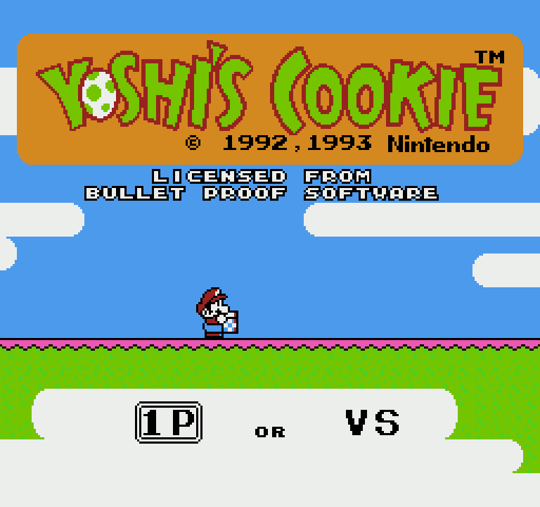

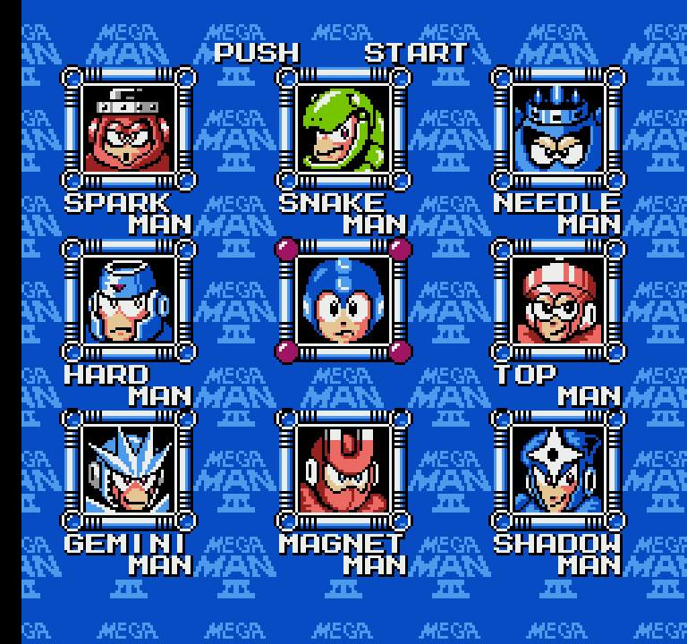

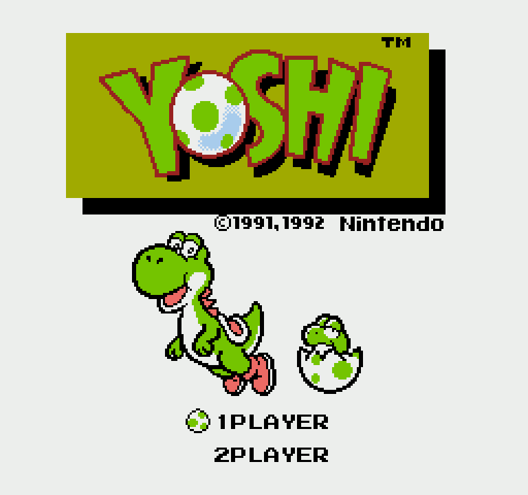

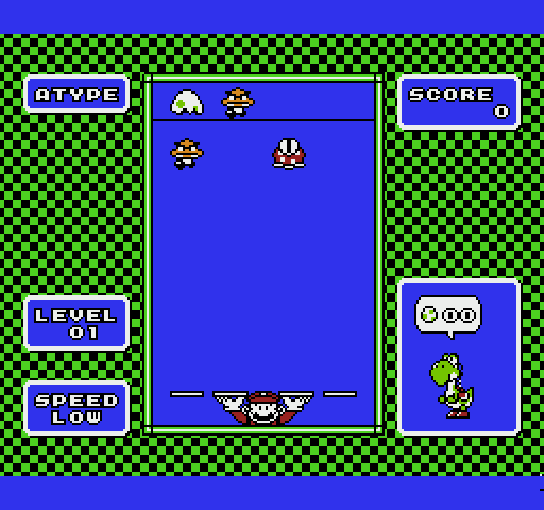

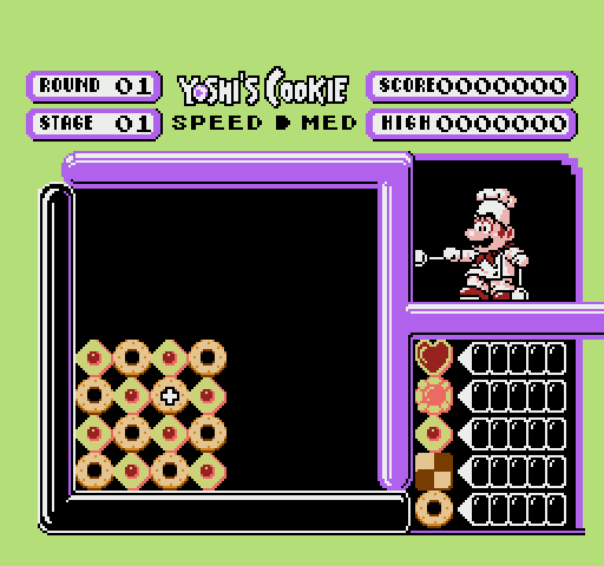

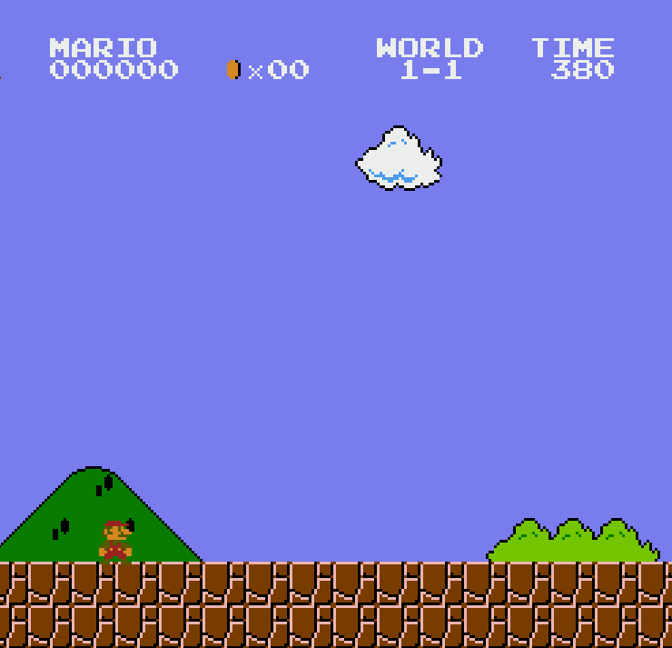

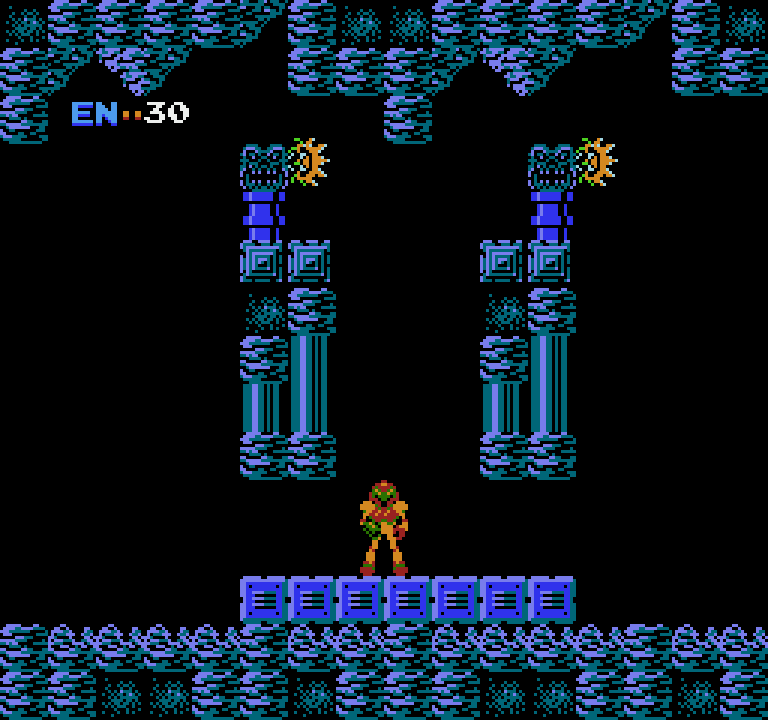

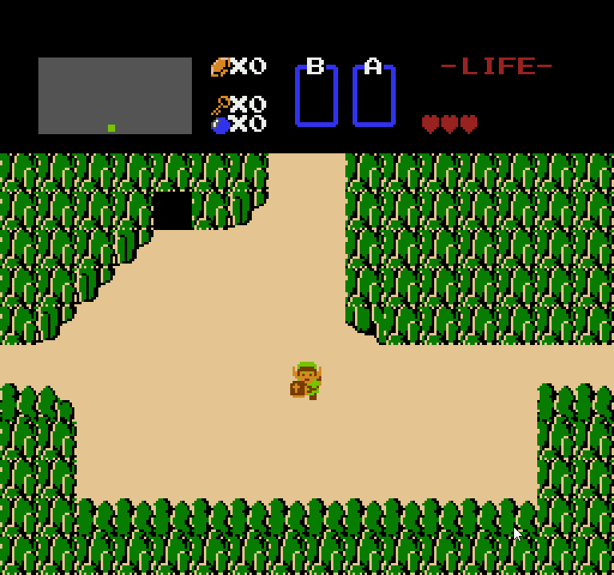

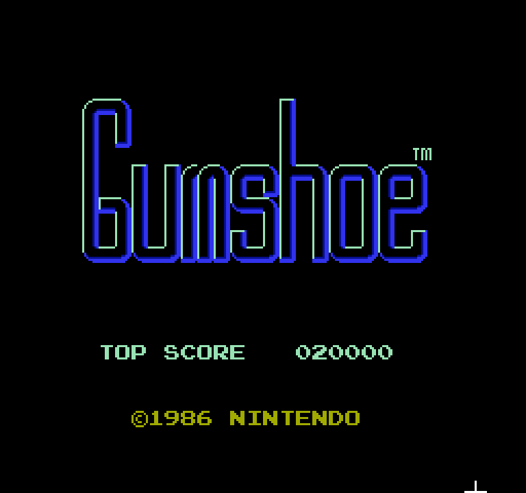

My last NESRecomp update covered four supported commercial NES titles. At the time, this was the most I'd gotten any of my recomp projects to support. It was supposed to be a game agnostic tool to actually support multiple games. This helped me in starting to understand how to coerce reusable patterns rather than hardcoding a game for the sake of getting it running.

As I continued along this line, I continued to experiment with different games, all with different agendas as to why I pursued them.

1. **Games with online disassembly and annotations**

I tried to tackle games like Legend of Zelda, Metroid, and Super Mario Bros, and Megaman 3 because they had very comprehensive disassembly online. Despite being a recomp, this disassembly still aids considerably in the development of the ecosystem, as it helps define what we expect functions to do or act on, but more importantly, it helps define data regions in the ROM. Static recompilation is is reading bytes to pull out instructions, and there isn't a sure-fire way to interpret this. Heuristics exist, but those heuristics are educated guesswork, and it's still very common that they find themselves trying to decode data as code, and in the early states of a recompilation framework, it's death by 1000 cuts with all the unknowns (trying to build runners, decoders, etc) and getting *something* to work. Therefore, I've begun to gravitate heavily towards the first 2-3 games of any recomp project to be ones with disasm.

2. **Simple Games**

Given the nature of the NES, I'm fortunate that a number of games have very simple gameplay loops. Despite these games not having online disassembly, they were still approachable once the tooling had gotten a bit more mature. Without disassembly, these games were more tedious given I was more frequently in the loop, trying to flag bad behaviors and iterate over trying to determine and flag out data regions to not be interpreted. Furthermore, with absence of proper disassembly, hitting dispatch misses (missing functions where the heuristics did not identify their existence). For games like Metroid, there are hundreds of these, and in sequence, that can be painful to find. But for simpler games like Yoshi, dispatch misses are only in the dozens. This made them approachable and gave the rewards of supporting their mappers, quirks, and more as part of NESrecomp.

As such, Yoshi, DrMario, and Yoshi's Cookie became targets for this second phase.

Duck Hunt and Gumshoe were also good targets given their simplicity as well. These also were targeted because they offered the opportunity to implement zapper support into the recompiler.

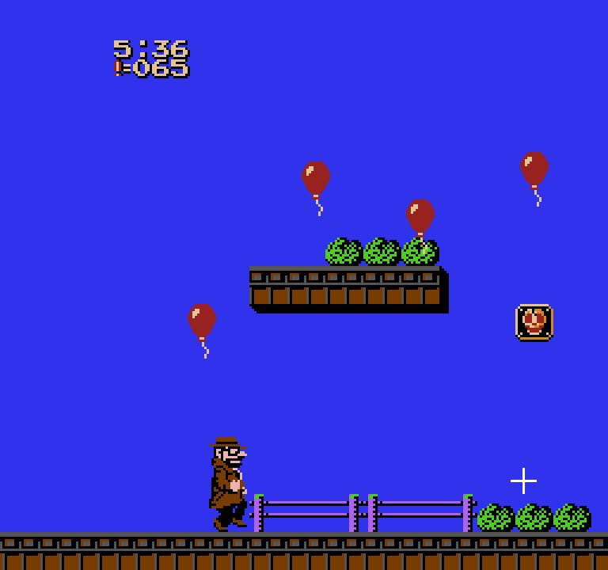

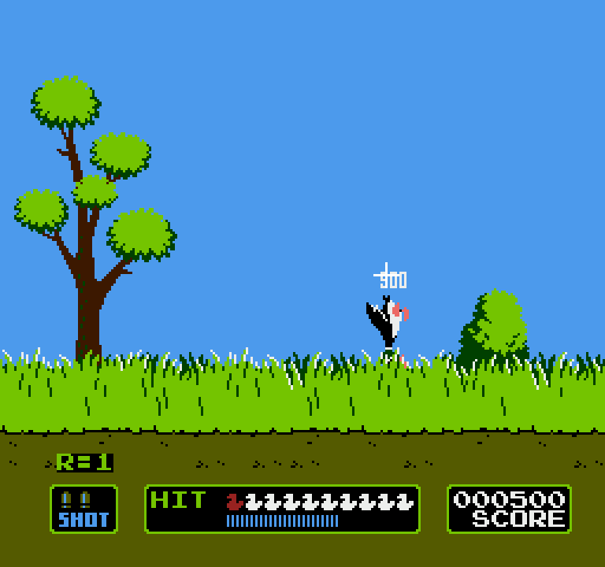

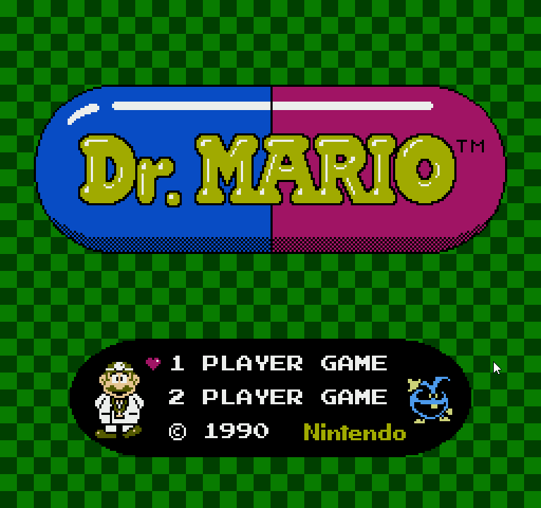

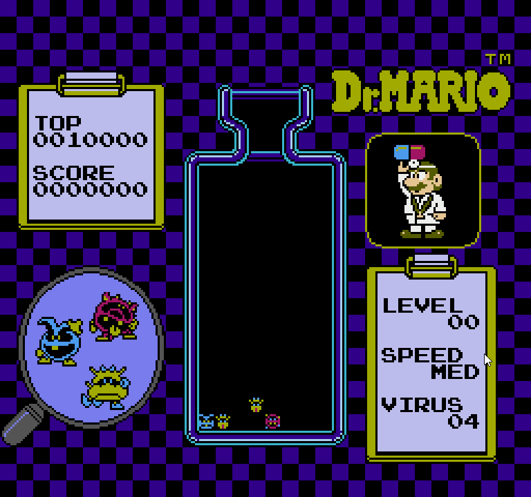

3. **Faxanadu**

Faxanadu isn't mentioned above, and that's because it didn't really fit in either bucket. It had poor disassembly available online and as an RPG, lends itself to be a bit more complex. But Faxanadu was actually my first ever successful recomp title in any capacity, driven from a desire to do a game that was unique and unlikely to already have a lot of attention in the NES ecosystem (unlike Legend of Zelda, Super Mario Bros, etc). Knowing what I know now, it definitely would not have been title #1, but it was still a good onboarding experience into trying to learn and mature this ecosystem.

## Mapper Coverage Is Becoming the Bigger Story

The biggest practical improvement is mapper support.

NESRecomp now has coverage across several important mapper families, including:

- Mapper 0 / NROM
- Mapper 1 / MMC1
- Mapper 4 / MMC3
- Mapper 66 / GxROM

Bundling these together into nesrecomp is part of what *makes* this an NES recompilation project rather than a one-off to translate a singular game. New game support is trending towards improving mapper behavior while reaping the benefit of the re-usable components that all NES games share in one package.

A simple NROM game and an MMC3 game are very different from the perspective of a static recompiler. The CPU is still a 6502, but the address space, banking rules, graphics behavior, and dispatch patterns can change substantially depending on the cartridge.

As more mapper families come online, the work required to support future games becomes less and less as we continue to mature the tool.

## Tooling Is Getting More Resilient

A lot of the recent work has also gone into making the tooling less fragile.

The project has continued moving toward a cleaner configuration-driven workflow. Instead of relying on scattered game-specific edits, each game project describes more of what makes it unique through configuration and small integration hooks.

That does not mean new games are automatic. Static recompilation still has to deal with indirect jumps, dispatch tables, bank switching, etc. For games without disassembly (which is most of them), data-as-code and other pain points will continue to exist as well.

As more games are added however, the structure of the tooling and ecosystem becomes more rigid.

When trying to work on a new game, it is less trying to get code to generate, or even getting ANYTHING to render. With any luck, a lot of games will render *something* in their first shot. Even if it isn't entirely right, it's still a great foundation to start from compared to game #1 or #2.

## What's Next

NESRecomp is likely one of those forever improving projects. Every game added moves it closer to its intended goal.

Progression within the project has overall become less chaotic and in *some* ways, more predictable.

**Recompilation-Assisted Source Ports**

As the tooling continues to soldifiy, the next thing I'm experimenting with is investigating is whether I can go from recompilation to some form of decompilation.

Although the NES was before the time of compilers, I 'm experimenting to see how far I can get in carving out the game one semantic at a time, slowly transforming the code from function object oriented to enable and accelerate modding and extensibility. At the time of this writing, I am presently experimenting in porting over Super Mario Bros, stubbing out the beginnings of a Mario class, an enemy class, and World class. If my efforts are fruitful, I hope that I can enable a new horizon for modding of these older games.

---

Related: [Super Mario Bros.](/games/super-mario-bros), [The Legend of Zelda](/games/legend-of-zelda), and [Metroid](/games/metroid) on [NES](/hardware/nes).
