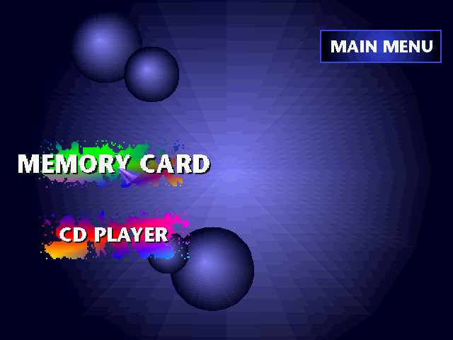
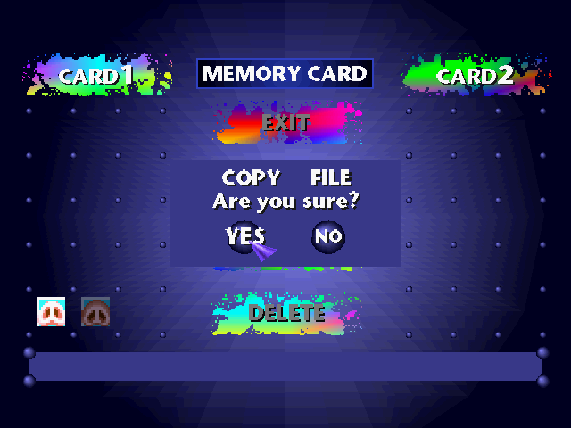
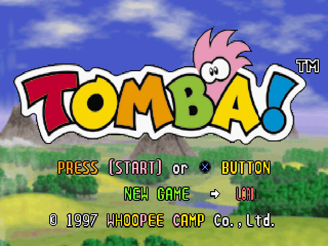
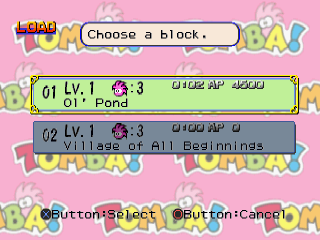
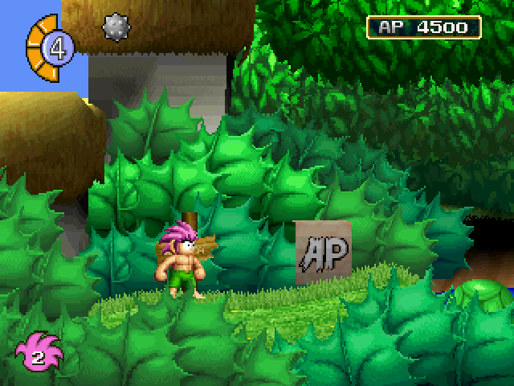
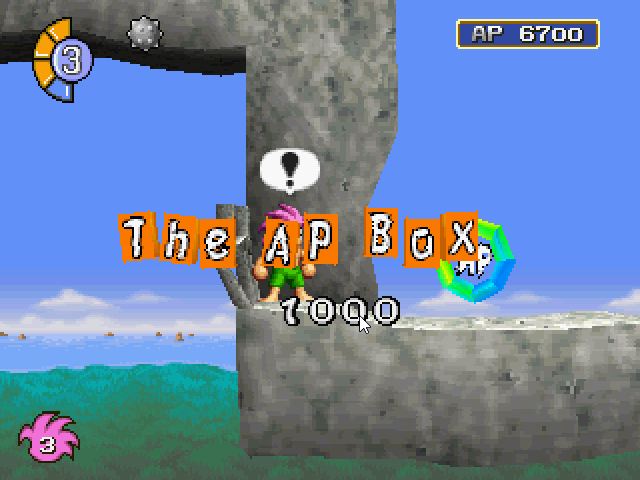
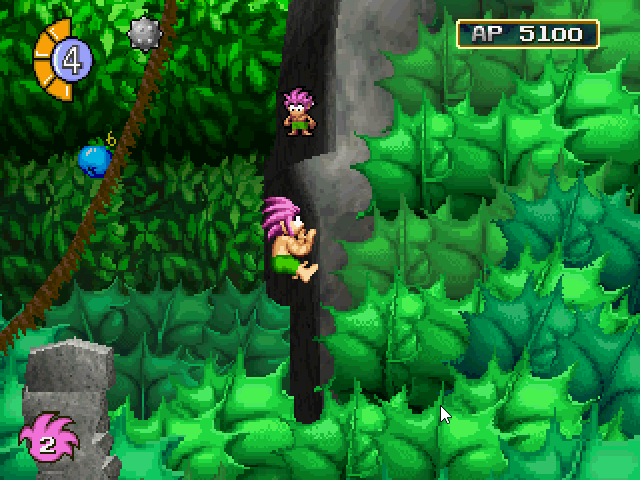

This article is a follow up to my first ever article and attempt at a static recompiler ecosystem which can be found [here](/blog/ps1-recompiler-claude-code)

When I first wrote about PSXRecomp, it was very much a tech demo that aimed to help me get into the ecosystem that is static recompilers.

It was exciting because it proved that Tomba! could run through a PlayStation 1 static recompilation pipeline at all. But under the hood, the project still had a lot of prototype-era rot. The BIOS side was heavily stubbed, the runtime was built around getting one path far enough to show a game running, and the whole thing was more of an experiment than a durable foundation. While it visually proved the concept, the moment you tried *really* getting under the hood, things fell apart.

Since then, PSXRecomp has gone through a massive overhaul.

The short version: PSXRecomp is no longer just a Tomba tech demo. It now statically recompiles the real PlayStation BIOS, and Tomba has been rebuilt on top of that cleaner foundation.

## Two Big Pieces: BIOS and Game

This update is really two milestones in one.

The first milestone is the BIOS.

The second milestone is Tomba.

Those are related, but they are not the same thing. The BIOS work is about making PSXRecomp more principled and reusable. The Tomba work is about proving that the new foundation can actually run a real commercial game path end-to-end.

That distinction matters because the original version of PSXRecomp leaned too much on game-specific progress. It could show something impressive, but it was not yet clear whether the underlying system was strong enough to grow into a real framework.

The new version is much closer to the direction I wanted the project to go.

## The BIOS Is Now Recompiled

The biggest architectural change is that PSXRecomp now recompiles the real SCPH1001 BIOS and runs it as the kernel.

That means the project is moving away from the old prototype model of stubbing BIOS behavior just to get a game path moving. The current direction is to let the original BIOS code do the work wherever possible, with the runtime simulating the PlayStation hardware around it.

That is a much harder approach, but it is also a much better foundation.

A PlayStation game does not exist in isolation. It expects BIOS services, interrupts, timers, controllers, memory cards, CD-ROM behavior, GPU behavior, MDEC video playback, and a lot of small system interactions to behave correctly enough for the game to trust them.

If those pieces are faked too aggressively, the project can get one game to boot while quietly building on unstable ground. Recompiling the BIOS makes the system more honest.

This does not mean every PlayStation hardware feature is complete. PSXRecomp is still early. But the project is now pointed in the right direction: real BIOS execution, real game execution, and hardware behavior implemented in the runtime instead of papered over with game-specific stubs.

## Tomba Rebuilt on Top

Tomba has also been rebuilt around the new PSXRecomp architecture.

The old Tomba demo proved that the idea was possible. The new TombaRecomp project is a cleaner game-specific layer that sits on top of the shared PSXRecomp framework.

That separation is important. PSXRecomp is the platform framework. TombaRecomp is the game target. Keeping those boundaries clean makes it easier to improve the framework without turning every fix into a one-off Tomba patch.

The current Tomba path has made major progress:

- BIOS boot works
- disc detection and license flow work
- FMVs stream and play
- title menu works
- OPTIONS works
- NEW GAME works
- save and load work through memory cards
- controller input works
- gameplay is believed reasonably playable

This is a much stronger milestone than the original demo. It is not just a game screen appearing after enough stubbing. It is a game running on top of a recompiled BIOS and a much more complete runtime.

## Visual and Stability Improvements

Tomba has also received a lot of practical polish compared to the earlier demo.

Several visible issues have been burned down, including problems around the BIOS logo, menu text seams, dialog and pause-panel seams, terrain shading, and shaded textured rendering. The result is a presentation that looks much closer to what the game should look like.

There have also been stability improvements. Earlier builds were more prone to hangs and prototype-era weirdness. The current version is still a work in progress and still needs more long-session testing, but it is much more credible as something that can actually be played and tested instead of merely demonstrated.

## Why This Matters

The big win here is not just that Tomba improved.

The bigger win is that PSXRecomp is becoming more principled.

A PlayStation static recompiler is a much larger problem than a single game. The system has a real operating environment, a BIOS, peripherals, disc streaming, video decode paths, memory cards, interrupts, timers, and multiple processors and subsystems that games depend on in different ways.

The old prototype was useful because it proved the concept. The new architecture is useful because it gives the project a better chance of scaling.

That has been a recurring theme across all of these recompilation projects. The first milestone is usually getting something visible. The next milestone is going back and replacing the shortcuts with architecture that can survive the next game.

That is what this PSXRecomp overhaul represents.

## Current Status

PSXRecomp is still an early work in progress. There are still untested and unimplemented mechanisms. Most notably to the user, the CD Player has not been tested and will remain a low priority for now.

*Less* notable to the user, but one important caveat, is "dirty RAM" is on element that isn't being statically recompiled yes. Functions loaded into memory at runtime aren't able to be caught and for now, are being handled as they appear. This allows functional end to end, and *mostly* statically recompiled, but not truly end to end.

Tomba is the active end-to-end target, and it is currently believed reasonably playable, with more validation still needed. Progress will remain slow given Tomba's lack of disassembly (something that is true for many Playstation era games). What game comes next after Tomba is still unclear, although I suspect I'll stick to simpler games and try to avoid the more technically complex games like [Crash Bandicoot](https://www.youtube.com/watch?v=pSHj5UKSylk) for now

## Next Steps

The most immediate obvious next step is to validate Tomba more and ensure it is playable end to end. Following that, there are many unexplored avenues in the PSX ecosystem. A short list that comes to mind as I would like to continue this project are:

- Multi-disc game support
- Supporting games that support streamed music
- Exploring widescreen and upscaling
- Finding load time improvements for certain behaviors

There are likely improvements to the BIOS as well, as it has a few visual inconsistencies here and there. However, the important bits, which are booting into a game and memory card management, have gone through rigorous testing to date.

---

Related: [Tomba!](/games/tomba) on [PlayStation](/hardware/playstation).
