[snesrecomp](https://github.com/mstan/snesrecomp)

[Super Mario World Recomp](https://github.com/mstan/SuperMarioWorldRecomp)

## The SNES: A Different Class of Problem

SNESRecomp as a project has been much harder than NESRecomp, and my other recomp projects, in ways that are not immediately visible from the outside.

The SNES CPU, the 65816, can change how wide its registers are while a game is running. The accumulator and index registers can switch between 8-bit and 16-bit modes. That means the same instruction can behave differently depending on CPU state at that moment.

For a normal emulator, this is just part of executing each instruction. For a static recompiler, it is a much harder analysis problem. The recompiler has to understand enough about the program and track state to emit correct native code ahead of time.

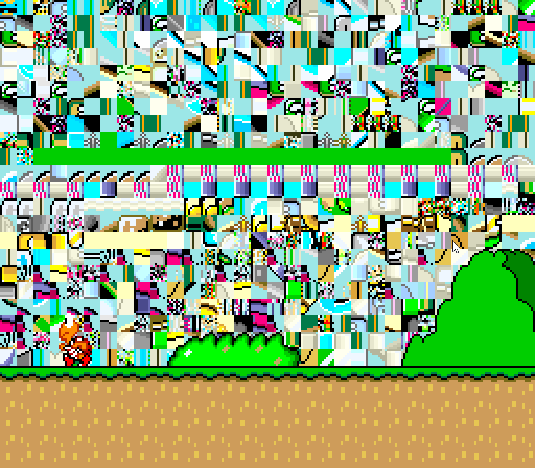

But after months of determined trial and error, snesrecomp has finally its first successful title: Super Mario World

## Why Super Mario World?

Super Mario World may seem like an odd chance to many, especially anyone aware that Super Mario World has an existing decomp, [smw-rev](https://github.com/snesrev/smw).

This recomp does not intend to supercede or replace smw-rev. For all purposes, I still expect smw-rev to be the go-to for anyone looking for a PC port of the game.

The real purpose I chose Super Mario World for snesrecomp's first project is that the game is extremely well documented. The Super Nintendo, relative to other decompilation projects, is VERY complex, given the various factors such as M/X register tracking, and I wanted to reduce discovery and unknowns as much as possible. Even still, snesrecomp was likely my longest time-to-value recompilation project.

While not deliberately chosen for it, Super Mario World also had the added benefit of its attract demo. Today, my debug tooling often includes TCP inputs that LLMs can exercise to provide input into the game, but the more that can be exercised without input, the better. Super Mario's attract demo goes through a lot, starting from stomping on enemies, grabbing and throwing a shell, hatching and riding a Yoshi, getting knocked off of Yoshi, interacting with slopes, and even interacting with other uncommon enemies like Pokeys.

Even still, every single interaction was valuable validation. Likely 80% to 90% of the development cycle was iterating on the attract demo, getting further into it and squashing and validating bugs along the way. Once the attract demo was done, the number of bugs encountered in game was surprisingly minimal.

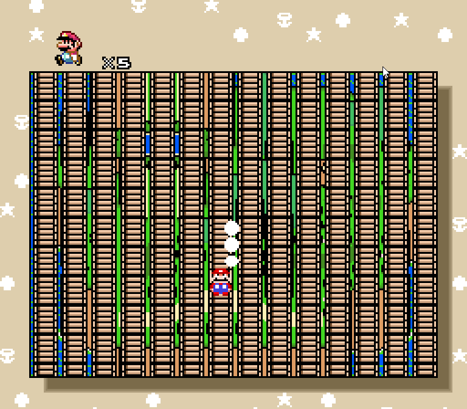

By the time the attract demo was done, I only encountered two major blockers in validation. The first was the overworld rendering being garbled. The second was loading into Iggy Koopa's boss fight. For the former, the fix was a quick and easy fix for tile rendering. The latter, however, had a number of nested issues given it was a combination of complex function calls for both Iggy himself, as well as the platform moving back and forth. Tackling that one was a multi-phase endeavor, focusing on getting the platform to render first and also to have proper physics interactions so Mario didn't slide off to his death just after landing on it.

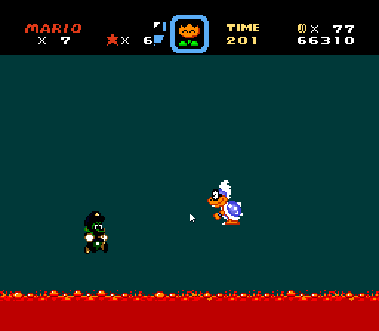

Since Iggy's Castle, the game has been surprisingly stable. Donut Plains, Vanilla Dome, and Forest of Illusion have all been playable without any noticeable bugs or issues. Star Road has also been flawless. At the writing of this article, I am still playtesting, but am hopeful for an uneventful Choco Island, Bowser's Castle, and Special stages.

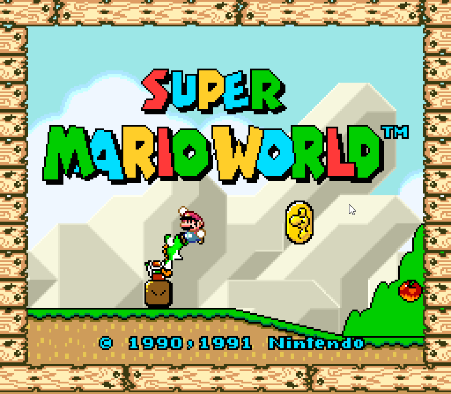

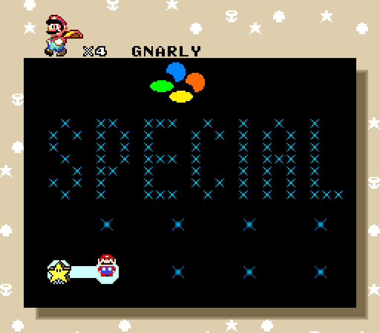

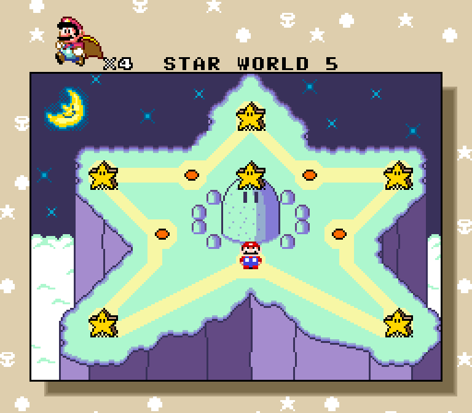

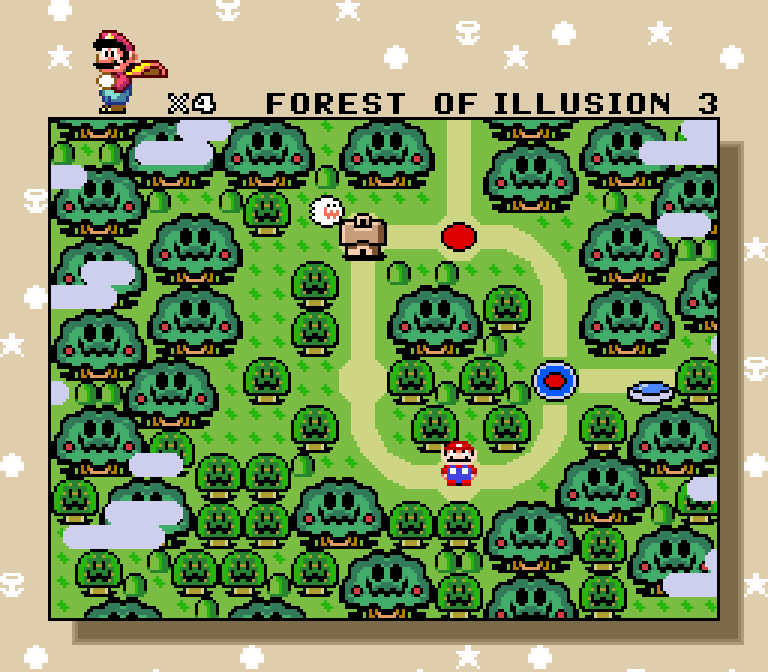

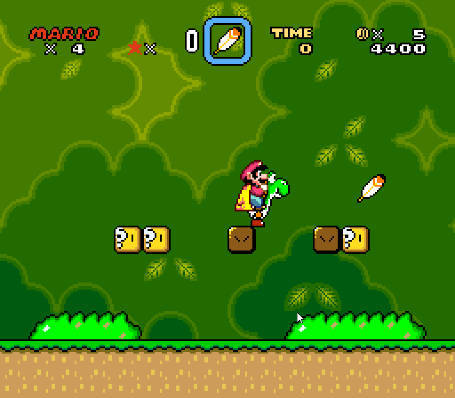

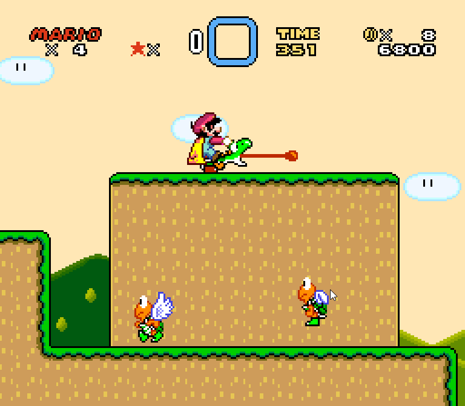

## What Comes Next?

Even with a fully commercial game under its belt, the project is far from mature. Game #1 is a milestone worth celebrating, but snesrecomp is still going to be an immature ecosystem. I intend to continue to play it safe by picking another well documented title: The Legend of Zelda: A Link to the Past.

A Link to the Past has good disassembly and a PC port from the same developers as smw-rev. Zelda, following on SMW's foundation for snesrecomp, has allowed me to quickly get it from black screen to a booting attract demo quickly. In about about two days of development, I was already able to get the game to boot through the attract demo and was able to start a new game, save, get out of Link's house and into Hyrule Castle. At the writing of this article, there are some issues with interactions when fighting enemies that are causing Link to teleport out of bounds which is my next target to resolve.

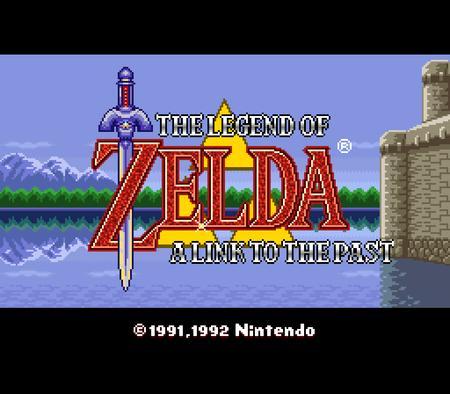

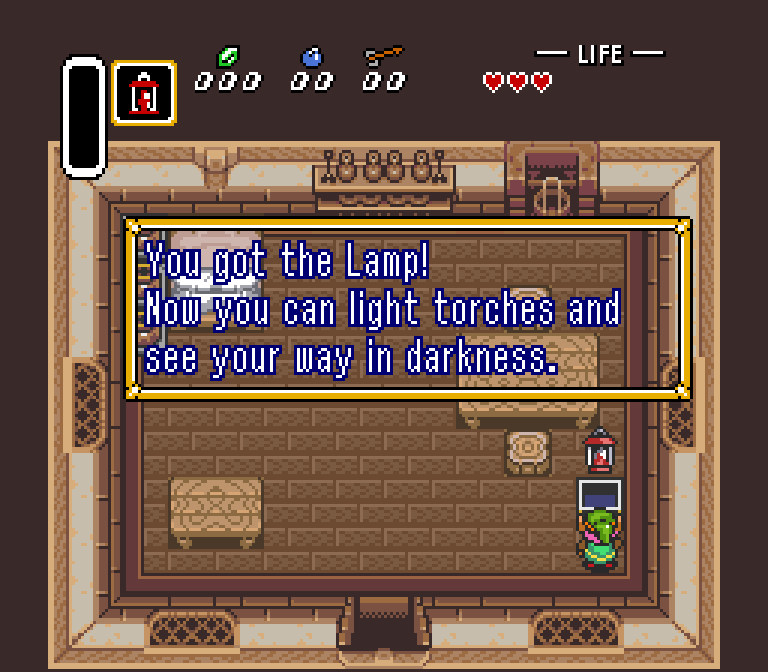

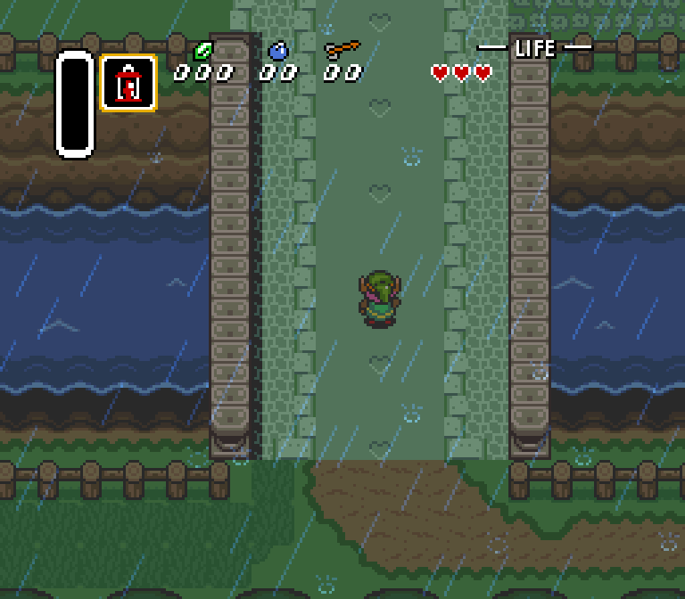

---

Related: [Super Mario World](/games/super-mario-world) on [Super Nintendo](/hardware/super-nintendo).
