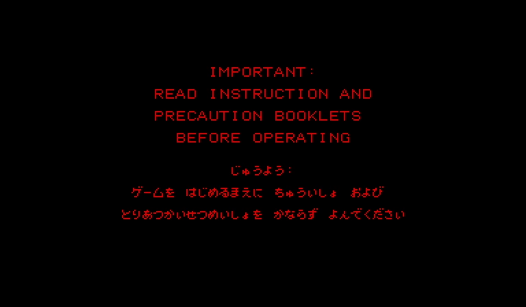
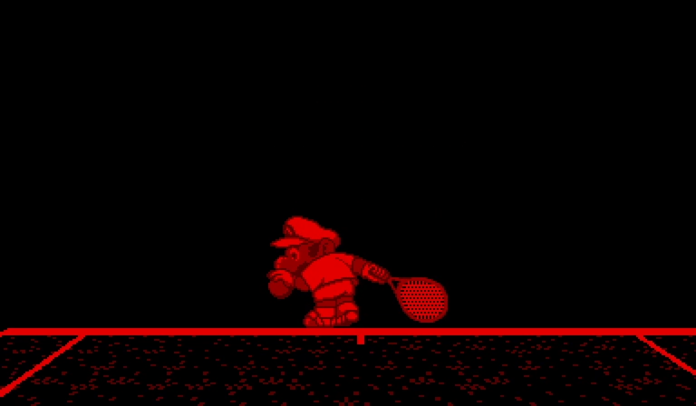
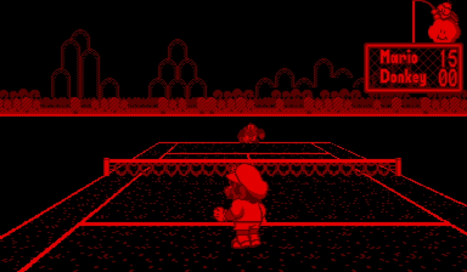

As I've become more experienced in the ecosystem that is recompilations and achieved my milestones of my other recompilation projects finally hitting their milestone of their first commercial title, I wanted to experiment with a more obscure ecosystem that was going to be less traversed. In the end, I chose the VirtualBoy, both due to novelty, but also it's relative simplicity as a system.

The pros mostly outweighed the cons for VirtualBoy. The system had very few games, none of which come with disassemblies or annotations online, but a number of them were simpler and more approachable, like Mario Tennis.

Despite the being a fast commercial failure, its novelty has led it to being reasonably well documented itself. The system also had a **much** simpler runtime than say, the Super NES with its register widths and other complexities that required tracking during static analysis.

Even still, using my other projects as a reference, I was able to quickly scaffold out an ecosystem for the VirtualBoy and trial my way quickly into a successful playable loop for Mario Tennis.

## VirtualBoy Next Steps

While I have some target titles and aspirations for other recomp ecosystems, the VirtualBoy was never a system that I owned growing up. There's novelty, but not nostalgia hidden in its short library of games. I don't anticipate I'll make an effort to bring the rest of the library along on my own time. Though, I am curious about someday exploring whether we can visually enrich some of these titles to be something other than the harsh red and blacks of the system, and give a second life to some of these titles.

---

Related: [Mario's Tennis](/games/mario-tennis) on [Virtual Boy](/hardware/virtual-boy).
