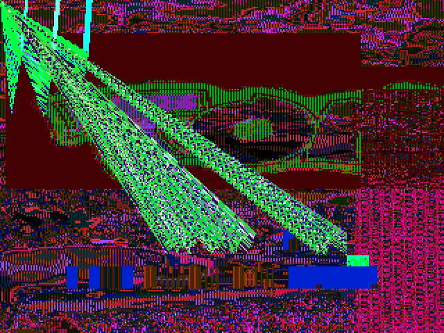
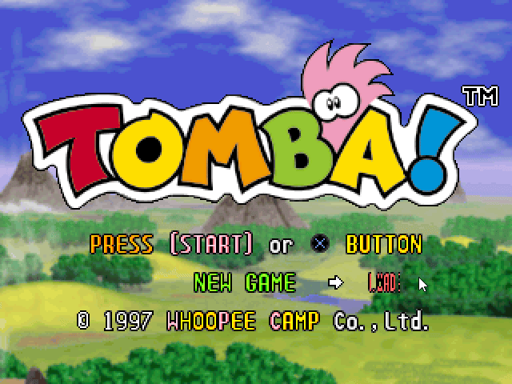
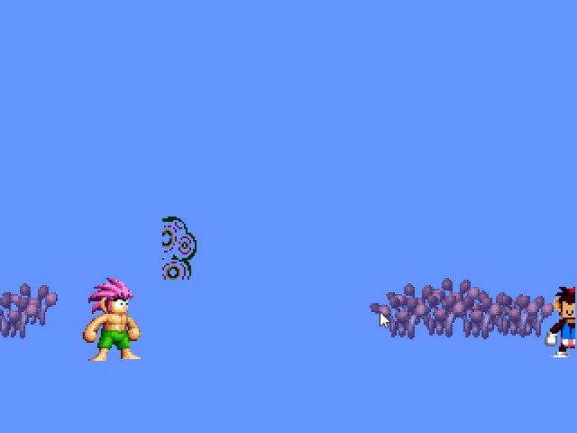
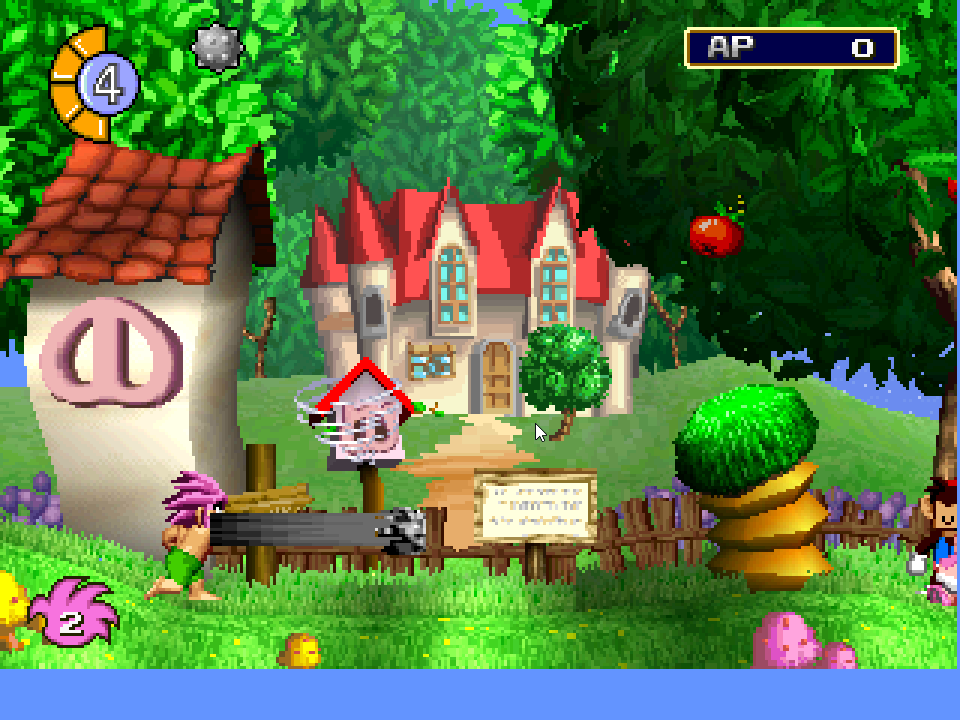

[Watch: 2026-03-11 PSXRecomp Static Decompiler Test | Tomba! (USA)](https://www.youtube.com/watch?v=CID9oVhgCyY)

*Tomba! (USA) Running as a native Windows PC application (WIP)*

[PSXRecomp](https://github.com/mstan/psxrecomp/)

## Overview

This article documents my exploration of Claude Code and its ability to assist with static analysis and static recompilation for the original PlayStation. As a technical demo, I chose the game *Tomba!*.

Given the topic, it would be ironic not to acknowledge AI assistance in writing parts of this article. However, this introduction is entirely written by me, grammatical quirks and all. I wanted to explain, in my own words, what I set out to do, what I built, and what I learned along the way.

My day job focuses on backend APIs and data warehousing. Video games have always been a hobby, but not something I’ve professionally developed. When I was younger, I tinkered with modding Source Engine games and even found bugs in titles like *Team Fortress 2*. Later, I challenged myself to see if my web and database skills could revive a dead game service.

In 2024, that experiment succeeded. I was the founding developer in the revival of the [shut-down hero shooter **Gundam Evolution**](https://1379.tech/the-making-of-side-7-gundam-evolution-private-server-project/). Ironically, my part of that project required almost no client-side reverse engineering or static analysis, skills that would have been extremely useful here.

To be transparent: I’m not trained in compilers, MIPS assembly, or GPU rendering pipelines. I do have friends in the reverse engineering space (shoutout to [TASBot](https://tas.bot/)), and I’ve followed projects like:

- **[Ship of Harkinian](https://www.shipofharkinian.com/)**
- **[Super Mario 64 PC port](https://github.com/n64decomp/sm64)**

Both projects painstakingly decompiled games by hand to run natively on PC. Later tools like [**n64recomp**](https://github.com/N64Recomp/N64Recomp) pushed the idea further by going from decompilation to recompilation.

The Nintendo 64 and the PlayStation share a useful property: their games were typically **compiler-generated**, not hand-written assembly. That makes them good candidates for static recompilation.

The N64 scene now has **[n64recomp](https://github.com/N64Recomp/N64Recomp)**, a mature general-purpose tool. The PlayStation scene, as far as I know, doesn't. The closest equivalent I found was **[PS1Recomp](https://github.com/nihirunoherr/PS1Recomp)**, which describes itself as a proof of concept. So I decided to experiment.

I wanted to see whether modern AI tooling could help accelerate this process, even though I personally lacked deep expertise in this area. After about three weeks of brute-force iteration, I produced **[psxrecomp](https://github.com/mstan/psxrecomp)**, a prototype tool that can take a retail ISO and produce a surprisingly playable demo.

---

## Why Tomba?

*Tomba!* released early in the PlayStation’s lifecycle. I grew up playing both it and its sequel, *Tomba 2*, so I know the game well enough to recognize subtle issues during testing.

I also suspected that an earlier PlayStation title would use simpler implementations than later-generation games, which might make the reverse engineering process easier.

---

## How I Actually Built It

Because I started with only surface-level knowledge, the entire process relied on trial and error. I iterated from something that barely resembled the game into something I could actually recognize.

## Tools

- Claude Code (Sonnet 4.6)
- [Ghidra](https://ghidra-sre.org/) (+ [GhidraMCP](https://github.com/LaurieWired/GhidraMCP) plugin)
- [PCSX-Redux](https://pcsx-redux.consoledev.net/) (+ a custom MCP server I implemented)

## Core Workflow

My most successful workflow looked like this:

1. Have Claude build the game with debugging tools enabled
2. Run the game
3. Observe incorrect behavior
4. Report the behavior to Claude
5. Have Claude Iterate on the incorrect behavior
6. Have Claude affirm fix
7. Validate the fix myself

This loop eventually became the backbone of development. However, I didn’t start there.

## Early Experiments (No Ghidra)

At first, I tried having Claude analyze the ISO directly without Ghidra. It was messy, but it worked.

Claude could slowly move the project forward and eventually produce extremely poor renderings of the game.

The output was ugly, but recognizable.

The process burned a huge number of tokens and required constant redirection. To speed things up, I added tools for Claude to capture screenshots and compare them with reference images.

Around this time I shared the experiment with some close friends, who suggested using **Ghidra with an MCP server** and treating it as the authoritative source for analysis. That advice terraformed the project.

## Introducing Ghidra

Once I integrated Ghidra into the workflow, progress accelerated significantly. The game began to look much more like *Tomba*, although artifacting and frame-rate problems still appeared.

I added an instruction file (`CLAUDE.md`) that forced Claude to validate every implementation decision against Ghidra.

Without that constraint, Claude liked to speculate and experiment. By forcing it to cross-check everything against Ghidra, I kept the process grounded in real analysis.

I also imposed another rule: Claude **could never edit generated code directly**. Instead, it had to modify the compiler inputs and regenerate output. This prevented the model from introducing hidden technical debt or regressions. It also preserved the long-term goal of building a **general-purpose tool** rather than a one-off hack.

## Building Autonomy Into the Loop

Another important step involved giving Claude more tools so it could operate independently.

I implemented:

- Input replay scripts
- Fast-forward tools
- Screenshot capture
- Memory and VRAM logging

Fast-forwarding allowed Claude to skip repetitive early-game sequences and iterate deeper into gameplay. Input replay scripts helped bypass dialogue sequences. The screenshot tools allowed Claude to verify rendering output. The logging tools let it inspect RAM, VRAM, and MIPS instructions.

With these tools in place, and with Ghidra available as ground truth, Claude could often work autonomously for **60-90 minutes at a time**, fixing issues without intervention.

## Emulator Integration

Some problems required understanding correct hardware behavior. To address this, I experimented with connecting Claude to an emulator. I chose **PCSX-Redux**, which provides excellent debugging tools. However, PCSX-Redux didn’t have an MCP server. Fortunately, it supports Lua scripting. I had Claude build an MCP-compatible server using Lua, which I could launch inside the emulator.

This integration worked in some cases, but it often required manual intervention. Programmatic save states and automation were unreliable. Still, it provided valuable reference behavior in difficult scenarios.

## What Debugging Actually Looked Like

I asked Claude to summarize a few representative debugging examples.

These explanations are Claude’s words, not mine, but they reflect real issues we solved together.

### Display Thread Bug

Early builds rendered exactly one frame before freezing.

The PS1 uses cooperative threading. A scheduler dispatches threads based on state flags.

On real hardware, the **VBlank interrupt** resets a thread’s state from *running* back to *ready* every frame.

Our implementation lacked a VBlank interrupt.

After the first frame rendered, the display thread stayed stuck in the *running* state forever.

The scheduler never dispatched it again.

A quick lookup in Ghidra revealed the missing state reset.

Fix: one line of code.

### Overworld Texture Corruption

Opening the equipment menu corrupted overworld textures.

Colors changed dramatically: greens became yellows and many textures broke.

The PlayStation stores palette data (CLUTs) in VRAM. When menus open, the game saves and restores CLUT data by reading VRAM through the GPU.

On real hardware, these reads go through a GPU buffer.

Our GPU implementation returned zeros instead of VRAM pixels.

The game saved an all-zero CLUT and later restored it, wiping out the color palette.

Fix: implement the GPU readback buffer correctly.

---

I’ll be honest: these problems are far outside my personal expertise. But with Ghidra, patience, and iteration, Claude and I were able to diagnose and fix them.

---

## Current State

Today the project can:

- Boot the game
- Play the FMV intro
- Reach the main menu
- Start a new game
- Navigate the world
- Jump, grab enemies, and attack
- Open menus
- Take damage
- Progress quests

However, the game still has issues:

- Softlocks occur
- Sound timing sometimes breaks
- Some sound effects trigger incorrectly
- Saving does not work
- Despite these problems, the core gameplay loop works.
- And every issue so far has proven solvable through the same iterative process.

---

## What Comes Next

My original goal was simple:

> Create a **PlayStation counterpart to n64recomp**.

I believe this project now provides a foundation for that idea. To push the tool forward, the next step is getting **one game fully functional**. *Tomba!* already runs surprisingly well, it just needs continued iteration.

Whether I personally continue development remains uncertain. Even with Claude’s autonomy, the process still requires significant human oversight. And the cost adds up quickly. I regularly hit usage limits on Claude’s $100/month plan. I applied for Claude’s open-source Max plan, but I haven’t heard back yet.

Regardless, the repository is open source. The methodology is documented both here and in the repository. If these ideas help accelerate PlayStation recompilation tools, I’ll consider the experiment a success. And if others want to build on this work, I welcome the contributions.

---

Related: [Tomba!](/games/tomba) on [PlayStation](/hardware/playstation).
