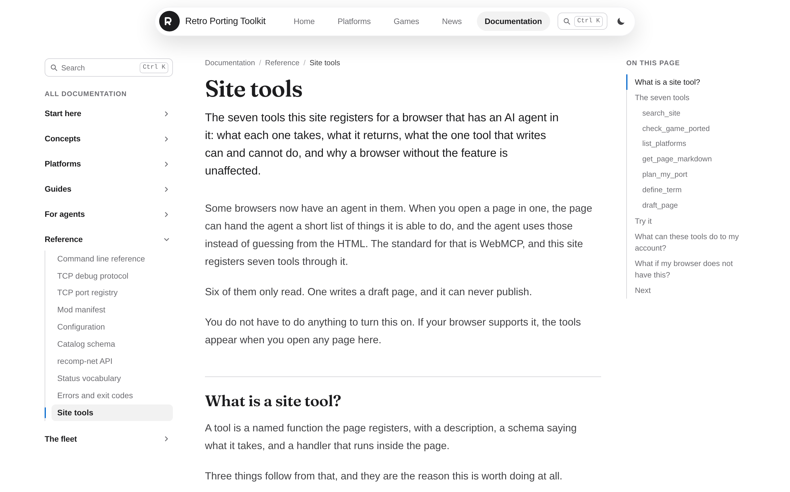
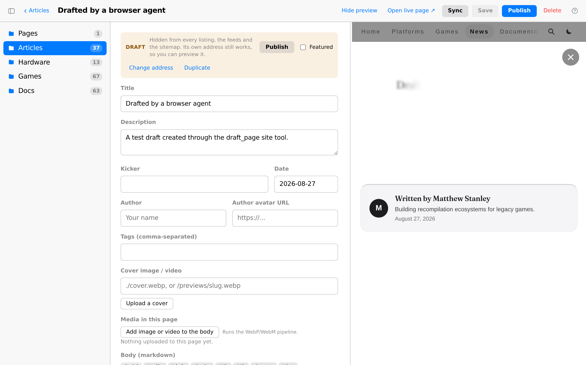

Most websites make agents behave like unusually patient users.

They read the page, infer what the interface means, click through navigation, and reconstruct structured data from whatever happens to be rendered. It works, but it is a strange way for software to talk to software.

The site already knows what it can do.

It knows how to search its own data. It knows whether a game is in the port catalogue. It knows which toolchain applies to a console, which commands scaffold a project, and whether the current user is allowed to write.

The agent should be able to ask the site directly.

Every page on Retro Porting Toolkit now registers [seven typed tools](/docs/reference/site-tools) through WebMCP. WebMCP is a proposed web standard that lets a page expose named functions, input schemas, and handlers to an agent running inside the browser.

The agent calls those functions instead of reverse-engineering the HTML.

This is not a separate API bolted onto the site. The tools expose the same application logic the site already uses, inside the browser session you already have open.

## Two kinds of agent access

This site was already built for agents that fetch URLs.

Every documentation page has a Markdown twin. `/llms.txt` maps the site. `/agent.md` documents the publishing API. Those surfaces work well for an agent approaching the site from outside the browser.

A browser agent is different.

It is operating inside the page, with the user's current session and the browser mediating what it can do. It should not need to fall back to screen reading when the page can expose a precise interface.

WebMCP adds that interface.

## Seven tools, one narrow write surface

The site now registers seven tools:

- `search_site` runs the same ranked search as the site's command palette and returns the results as structured data.
- `check_game_ported` checks whether a game is already in the port catalogue before anyone starts planning redundant work.
- `list_platforms` returns every supported console, along with an honest statement of its status and ecosystem maturity.
- `get_page_markdown` reads any documentation page as Markdown rather than making the agent extract it from the rendered page.
- `plan_my_port` takes a game you own and returns the applicable framework, its maturity, whether scaffolding exists, the exact commands where they exist, and what you still need to provide yourself.
- `define_term` looks up the site's terminology directly from [the glossary](/docs/concepts/glossary).
- `draft_page` creates a draft documentation page or blog post through the site's editor.



Every substantive result includes the page that backs it. The agent gets structured data, but the source remains inspectable by both the agent and the user.

Six of the tools only read.

One writes, and even that one can only create a draft.

## The browser session is the permission model

This is the important difference from a conventional API integration.

There is no new API key for the agent to hold. There is no separate agent account. The tools run inside the page and use the session already open in the browser.

The public tools read public data.

`draft_page` works only when you are signed in to the site's editor. Without a signed-in session, the site refuses the call. With one, the tool can create a draft, but it still cannot publish, edit an existing page, delete anything, or create a game or console entry.

Draft status is enforced by the site. It is not a preference the agent can override.

The browser also remains in the loop. It can show you which tools the site exposes, inspect individual calls, and ask for confirmation before allowing a side effect.

The agent does not decide what it is allowed to do. The site does.

## Test the registration without an agent

Open the site in Chrome 149 or newer, or Edge 147 or newer.

Open the developer tools console and enable the Verbose level, since debug messages are hidden by default. Reload the page. You should see:

```text
[webmcp] Retro Porting Toolkit site tools registered: search_site, check_game_ported, list_platforms, get_page_markdown, plan_my_port, define_term, draft_page
```

Then enter:

```text
document.modelContext
```

If it returns an object, WebMCP is active and the tools are registered.

In Chrome, the site provides the origin-trial token, so there is no setting or flag to change. Chrome 149's developer tools can also inspect the registered tools and invoke them manually.

## Test the actual behavior

Open the site in ChatGPT's browser.

The address bar should show Site tools. Under Available site tools, you should find all seven.

Then try these:

**Is Tomba already ported to PC?**

The agent should call `check_game_ported` and return the game's catalogue page and current status. It should not need to search or read the visible page.

**I own Mega Man Legends. Plan me a PlayStation port.**

The agent should call `plan_my_port` and return the applicable framework, its maturity, the scaffold commands, the rules around supplying the game file, and a source behind each claim.

**What does dispatch miss mean on this site?**

The agent should call `define_term` and answer directly from the glossary.

The important part is not merely whether the answer is correct. Watch how it gets there.

The agent should call the site's declared capability, receive structured data immediately, and give you the source. It should not visibly crawl the interface.

## Test the write path

Sign in through [/admin](/admin) in the same browser.

Then ask the agent to draft a short test post. It should call `draft_page`, and the browser should ask you to confirm the write.

The result should include two links: one to the draft and one to the editor.

Open the editor and verify that the page exists and is marked as a draft. It should appear in no listing, feed, or sitemap. Delete it when you are done.



Trying the same thing without signing in is also a valid test. The correct result is a refusal that points you to the editor, with nothing written.

## Nothing else changes

A browser without WebMCP ignores all of this.

The site continues to render and behave exactly as before. It still fetches nothing at runtime, distributes no game files, and retains every machine-readable surface that already served agents fetching the site directly.

This is not an agent-specific copy of the website.

It is the website exposing its existing capabilities through one more interface.

That seems like the right model for agentic browsing: not a second web built for agents, and not agents blindly operating interfaces built for people. Sites declare what they can do. Browsers mediate access. Agents call those capabilities under the user's control.
