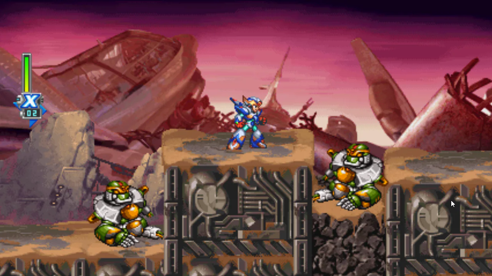
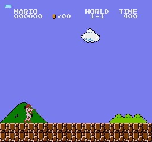

A recomp project should begin with an unmodified file from the original release.

Do not apply a bug fix, quality-of-life patch, translation, or other ROM hack and then use the patched file as the recompiler's input. Recompile the original game. Build each change as a mod that the port can apply separately.

This gives the project one clear baseline. Players can turn every mod off and get the faithful port. Developers can test one change at a time without creating a new recomp project for every combination of patches.

## One game file, one clear baseline

A recompiler works from exact bytes. A patch changes those bytes, even when it fixes only one bug or replaces one line of text.

Recompiling the patched file makes those changes part of the generated program. The port now targets a different binary. Players may need to prepare that exact patched file, and developers lose the original release as a direct comparison point.

The cleaner structure starts with a legally obtained dump from the original game. Record its region, revision, format, and hashes. Keep that file unchanged throughout the build.

The [game file contract](/docs/concepts/the-game-file-you-supply) explains why those details matter.

## Patches are references for mods

A ROM hack can still contain valuable engineering work. Study its documentation and the difference it produces. Find the code, data, text, or assets it changes. Then express that change through the port's mod system.

The [Mega Man X6](/games/mega-man-x6) port shows what this separation can offer. Its launcher expects the supported USA v1.1 game revision, while the mod layer presents more than 200 individual options from the X6 Tweaks adaptation. An English retranslation is available there too. Players can choose the changes they want instead of taking one permanent patch.

[Super Mario Bros.](/games/super-mario-bros) follows the same broad idea. The stock game remains available beside optional character replacements, widescreen, and a 3D view. These experiments extend the port without redefining its original game file.

## Keep common changes optional

Bug fixes, quality-of-life improvements, and translations belong in the mod ecosystem.

Keep each change separate when practical. Give it a clear name. Target the exact supported game revision, and check the original bytes before applying it. With the mod disabled, the stock setting should make no change.

This structure makes combinations easier too. Two useful patches can become two compatible mods instead of two separate recomp projects.

## Full custom games are different

A full custom game can be a deliberate recompilation target in its own right.

*The Legend of Zelda: The Sealed Palace* is the kind of narrow exception described in the new guidance. A project may choose to port a complete custom game as its own work. That is different from patching the original game as a shortcut for adding a small fix or enhancement.

Treat that choice explicitly. Identify the exact custom-game file, explain its provenance and patching requirements, and keep it separate from a faithful port of the original release.

For the full rationale and practical guidance, read [Recompile the original game, then let mods do the rest](/docs/concepts/start-with-the-original-game) in the Docs.
