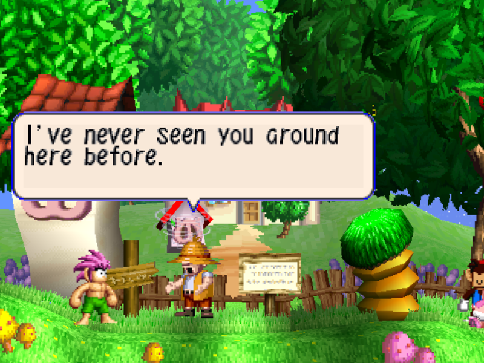

Every framework has a first game. For [PSXRecomp](/hardware/playstation) it was Tomba!, and the two have grown up together. The original three-week sprint got the game to its main menu, and months of steady releases since have made it the most lived-in project in the lineup. New tricks tend to show up here first. The latest is save states and rewind.

## Can I play it?

Yes, as a playable alpha. The current release is v0.12.0-alpha (2026-08-12), with a Windows package and an experimental Linux AppImage on the GitHub releases page. macOS is supported by building from source.

The game itself comes from a dump you provide: your Tomba! (USA) disc image, in formats from plain .cue and .bin through .chd, and even the raw disc image from the Steam release. Everything boots from a bundled open-source BIOS, so no extra files are needed, though the launcher accepts your own retail BIOS dump if you prefer it.

## What the recomp adds

Save states and rewind were shown publicly for the first time on this title. The rewind work arrived in v0.12.0 as a community contribution.

Beyond that:

- Experimental 16:9 widescreen with a genuinely wider field of view: you see more of the world at the sides, not a stretched picture. Some 2D menu and video elements can look off, and 21:9 is not ready yet.
- FMV skipping, with an optional auto-skip for the intro.
- A warp debug menu on the launcher's Mods page.
- A Fast Loading mod, off by default.
- Controller choice: analog or D-pad, plus an optional Hybrid mod that switches to digital when you touch the D-pad and back to analog when you move the stick.
- Supersampling at 2x to 4x internal resolution, with optional texture filtering.

Your in-game OPTION settings, like text speed and vibration, persist across launches.

## Technical details

Tomba's MIPS code is translated ahead of time into C and compiled into a native program for your machine. That program runs the game's own logic on a faithful simulation of the PS1 hardware (GPU, SPU, GTE, memory cards) together with a recompiled PlayStation BIOS; releases bundle the MIT-licensed OpenBIOS. Rendering goes through either a CPU software rasterizer or the default OpenGL backend, which keeps fill-heavy scenes at full speed. A self-growing cache converts areas you visit into fast native code and reuses it on later launches. Saves are standard .mcd memory-card files that emulators can also read.

## Sources

- [Project README and releases (GitHub)](https://github.com/mstan/TombaRecomp)
- [psxrecomp Overhauled. Now BIOS + Tomba (1379.tech)](https://1379.tech/psxrecomp-overhauled-now-bios-tomba/)
- [I Built a PS1 Static Recompiler With No Prior Experience (1379.tech)](https://1379.tech/i-built-a-ps1-static-recompiler-with-no-prior-experience-and-claude-code/)
- [Watch: Tomba Recomp is out now](/blog/video-tomba-out-now)
- [Watch: save states and rewind in Tomba](/blog/video-tomba-save-states-rewind)
