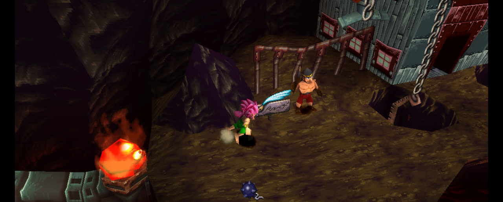

Tomba! 2 follows [Tomba!](/games/tomba) into [PSXRecomp](/hardware/playstation) territory as a core project. It has experimental widescreen work, but culling and spawning are not fully handled yet, so treat the wider view as a preview.

## Playable status

Yes, as a playable alpha. Windows and Linux packages are on the GitHub releases page. The game is built from a dump you provide: your Tomba! 2 (USA) disc image. A bundled open-source BIOS boots it out of the box. These are in-development previews, so expect rough edges.

## What the recomp adds

- Experimental widescreen. It can show more of the world instead of stretching the picture, but culling and spawning still need more game-specific work.
- FMV skipping that still runs the game's normal movie completion path.
- An experimental debug menu by unicorngoulash, opened with L3 during gameplay: warp between areas, grant items, and edit event flags. Use a separate memory card while poking at it.

## Sources

- [Project README and release notes (GitHub)](https://github.com/mstan/Tomba2Recomp)
