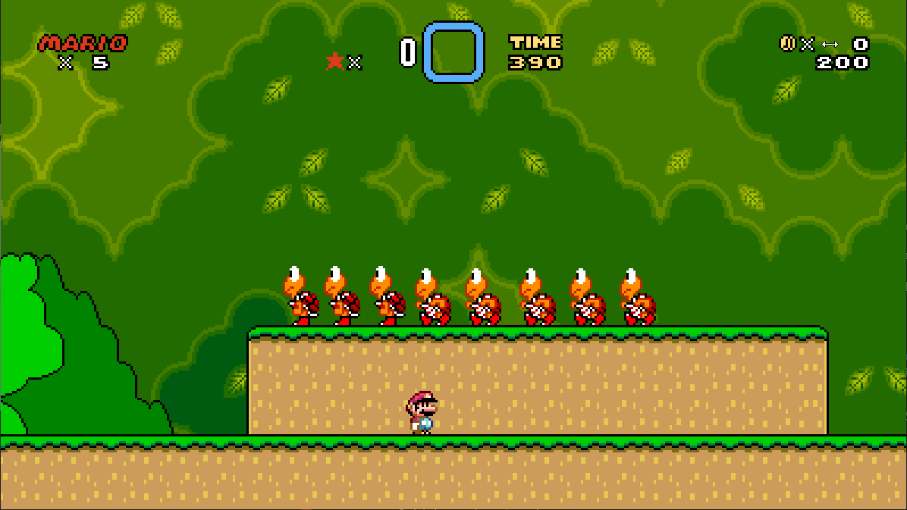

Super Mario World was the first game [SNESRecomp](/hardware/super-nintendo) ever recompiled, and it is still the flagship core project.

It runs the original game as a native program on your PC, with room for enhancements on top of the stock game.

## Playable status

Yes. It is playable end to end as a mature alpha.

Windows and Linux packages are on the GitHub releases page. It is built from a dump you provide: on first launch the game asks for your Super Mario World (USA) ROM.

## What the recomp adds

Start with the picture. There are three view modes: standard 4:3, fixed 16:9, and adaptive. Adaptive follows your window, so resizing wider reveals more of the level instead of stretching it.

The rest of what the build adds:

- MSU-1 audio: CD-quality streaming music with a music pack you supply. Without one, you get the authentic soundtrack.
- Save states and turbo.

Mods can go past settings. An experimental Smash Bros. 64 catalog includes Captain Falcon as the first playable character option. It needs your own Super Smash Bros. 64 ROM for the donor content.

A replacement is behavior-level rather than a fresh sprite pasted over Mario: movement, abilities, animation, and sound all change with the character.

## Sources

- [SuperMarioWorldRecomp README (GitHub)](https://github.com/mstan/SuperMarioWorldRecomp)
- [SMW character replacement test (Gamemaster1379)](/blog/video-smw-character-test)
- [snesrecomp's First Title: Super Mario World (1379.tech)](https://1379.tech/snesrecomps-first-title-super-mario-world/)
- [The Future of Game Preservation is Decomp-Annotated-Recomps (1379.tech)](https://1379.tech/recomp-vs-decomp-wrong-question/)
