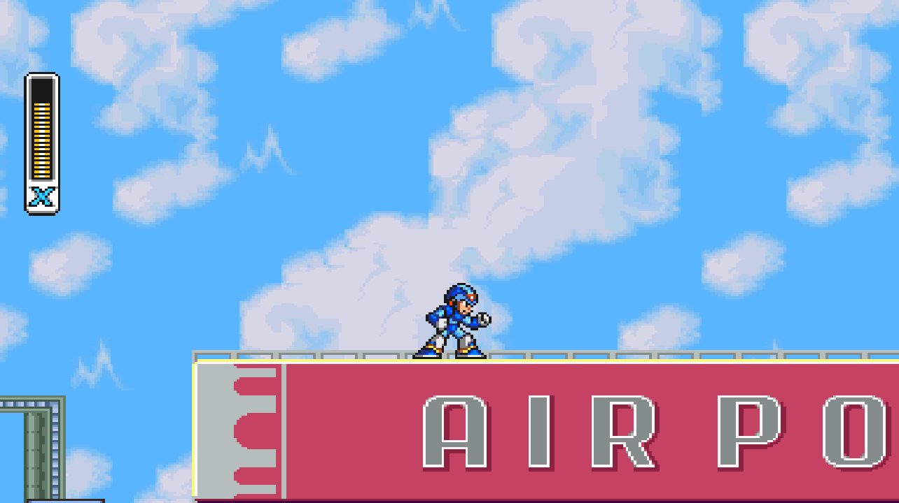
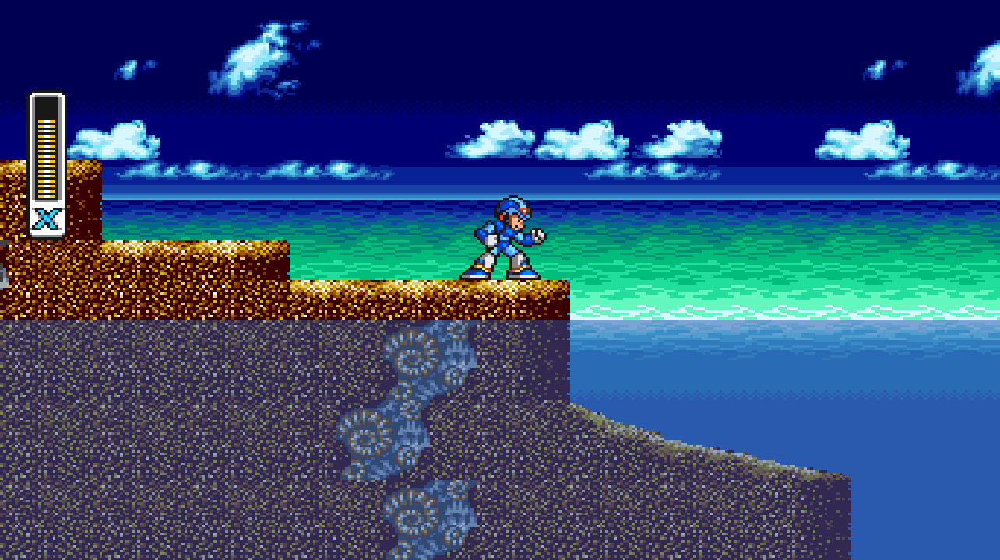

Mega Man X is [SNESRecomp](/hardware/super-nintendo)'s most mature title, a core project maintained alongside the framework itself. It is the one you can simply download and finish: from the opening highway through all eight Mavericks and Sigma, running as a native program on your PC.

## Can I play it?

Yes. The game is released and playable end to end, currently at v1.4.3 (2026-08-16). Windows gets packaged releases, macOS and Linux build from source, and a tester has completed the full game on a Steam Deck.

It is built from a dump you provide: on first launch the game asks for your Mega Man X (USA, Rev 1) ROM and verifies it by checksum. An experimental Rockman X (Japan) variant also exists.

## What the recomp adds

The headline is experimental true widescreen. The renderer draws real additional gameplay at the sides instead of stretching the picture, so the extra space is level, not a smear.

It works out to about one third more horizontal area, roughly 16:9 from the 4:3 presentation, or 32:21 from square pixels. It is off by default and enabled from the launcher's Mods page.

The rest of what the build adds:

- A mod loader, added in v1.3.0, including an MSU-1 mod that streams CD-quality music in place of the original soundtrack.
- Password saves: v1.4.0 added SRAM password saves.
- Three display presentations: 4:3 (CRT), 8:7 (square pixels), and 1:1.
- Save states, turbo, fullscreen, and auto-detected Xbox, PlayStation, and Switch Pro controllers.
- Built-in crash reporting that writes diagnostics you can attach to an issue.

## Technical details

This was the first game recompiled without an explicit disassembly as reference, a milestone for the toolchain. Execution is LLE-first: an authoritative 65816 interpreter is the correctness floor, statically compiled function bodies are exact, proven materializations on top of it, and anything the static pass cannot prove keeps running through the interpreter.

Hardware outside the main CPU, the PPU, the SPC700 audio coprocessor, and DMA, runs through the framework's own runner: recompile the CPU, emulate the silicon.

## Sources

- [MegaManXSNESRecomp README (GitHub)](https://github.com/mstan/MegaManXSNESRecomp)
- [Megaman X: Recompiled Release (1379.tech)](https://1379.tech/megaman-x-recompiled-v1-0-0-release/)
- [Mega Man X Recomp is Out Now! A SNES Recomp (Video Game Esoterica)](/blog/video-mega-man-x-out-now)
