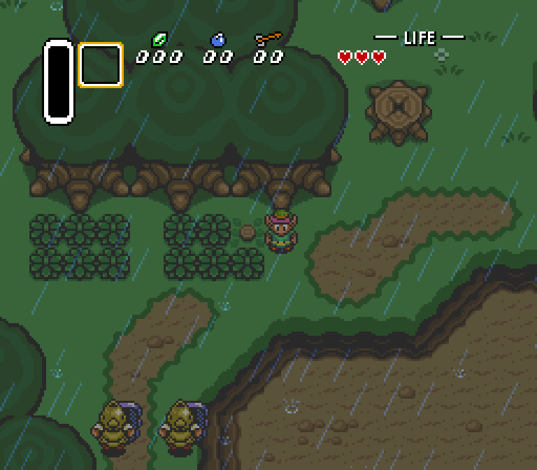

A Link to the Past is one of the three released [SNESRecomp](/hardware/super-nintendo) titles, maintained as a core project. Its standout feature is adaptive widescreen: make the window wider and you simply see more of Hyrule.

## Playable status

The early game, yes. The project describes it as playable through the early dungeon: boot, the attract demo, file select, the overworld, and dungeon sword combat are hand-verified, and music and sound effects play throughout. Later content, from Hyrule Castle's interior onward, is not yet verified.

Windows and Linux builds are on the GitHub releases page. It is built from a dump you provide: on first launch the game asks for your A Link to the Past (USA) ROM and verifies it by checksum.

## What the recomp adds

Adaptive widescreen follows your window or fullscreen aspect ratio, so resizing wider reveals more of the overworld or dungeon instead of stretching the image. At 16:9 the view is about 398 pixels wide, against the original 256.

The other headline is MSU-1 audio: CD-quality streaming music from a pack you supply, while you still load your stock ROM. Without a pack the game plays its normal soundtrack, and sound effects always stay on the original sound engine.

Save states, turbo, fullscreen, and auto-detected controllers come as standard.

## Sources

- [ZeldaAlttPSNESRecomp README (GitHub)](https://github.com/mstan/ZeldaAlttPSNESRecomp)
