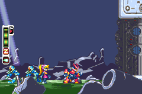

Mega Man Zero is famously hard, and part of that difficulty is the screen: on the GBA's small 3:2 display, threats arrive with very little warning. This core [GBARecomp](/hardware/game-boy-advance) project rebuilds the game as a native Windows app and lets you widen the view, so you can see what is coming and react to it.

## Playable status

Yes, as an in-development preview. Windows builds are on the GitHub releases page. The game runs from dumps you provide: select your own USA ROM and GBA BIOS when prompted, and the runtime hash-checks the ROM before running it.

It boots through the real BIOS into gameplay with working controls, audio, and persistent saves. The tested routes through the opening mission are fully covered; the rest of the game has not been exhaustively proven yet.

## What the recomp adds

Widescreen is opt-in, with two policies. You can set a fixed logical width from 240 up to 480 pixels, with tile-aligned 288x160 as the recommended setting, or an adaptive width that follows the shape of the window as you resize it.

During gameplay the HUD anchors to the left content edge and the boss gauge to the right, while menus keep the faithful 240x160 presentation. The wider modes are experimental: entity spawning keeps its original rules, so pop-in can appear on untested routes, and 384 and 480 widths are validation targets rather than supported modes.

Save states use Shift+F1 through F9 to save and F1 through F9 to load, and holding Tab fast-forwards.

One known limitation: loading a save state while widescreen is active can leave the extended view temporarily out of sync. A normal room reload, including dying and choosing Retry, rebuilds it. Cartridge saves are unaffected.

## Sources

- [MegaManZeroRecomp README (GitHub)](https://github.com/mstan/MegaManZeroRecomp)
- [Building & Enhancing Recomps: Ecosystem Updates (1379.tech)](https://1379.tech/building-enhancing-recomps-ecosystem-updates/)
