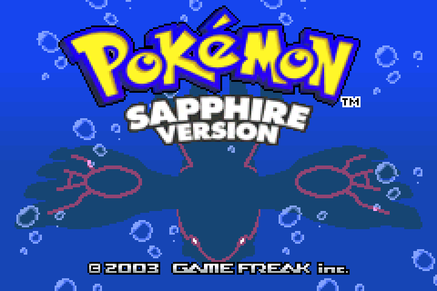

Pokemon Ruby and Sapphire opened Gen 3, and this [GBARecomp](/hardware/game-boy-advance) project turns both into native PC games.

These are very early alpha builds. Their main job today is proving the recompiler, runtime, save model, and cartridge clock path on real games.

The project uses symbol metadata from the [pret/pokeruby](https://github.com/pret/pokeruby) decompilation as a map for names and function boundaries. That helps guide discovery, but the recomp does not ship pret's C source, build output, or toolchain.

## Playable status

Yes, as very early Windows alpha previews. RubyRecomp and SapphireRecomp packages are on the GitHub releases page. Run the game you want and point it at a dump you provide: the USA rev1 ROM for that version.

Both games boot through the BIOS intro to the title screen and into gameplay. They are still ecosystem proof points, not polished enhanced releases.

## What the recomp adds

- Ruby and Sapphire each build as their own native program.
- The cartridge real-time clock syncs to the host system.
- Flash saves are part of the hardware model, not a separate patch.
- Enhancements are limited right now; community contributions are welcome.

## Sources

- [RubySapphireRecomp README](https://github.com/mstan/RubySapphireRecomp)
- [RubySapphireRecomp releases](https://github.com/mstan/RubySapphireRecomp/releases)
- [pret/pokeruby](https://github.com/pret/pokeruby)
- [gbarecomp framework](https://github.com/mstan/gbarecomp)
- [Recomp + AI: 5 Months Later (1379.tech)](https://1379.tech/recomp-ai-5-months-later/)
