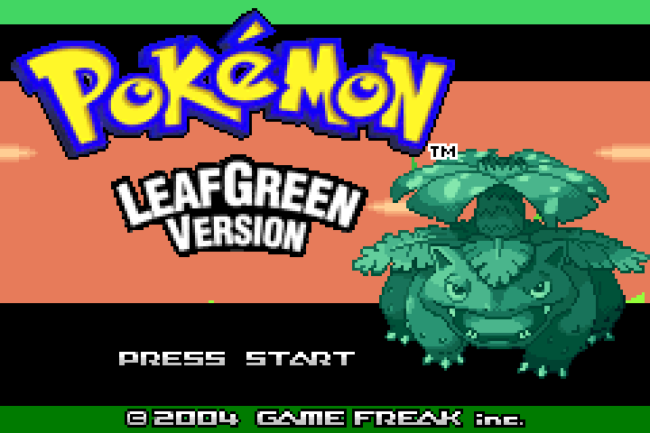

Pokemon FireRed and LeafGreen, the Kanto remakes, run as native PC games through [GBARecomp](/hardware/game-boy-advance).

These are very early alpha builds. Their main job today is proving that the recompiler and runtime can handle paired games from the same source tree.

The project uses symbol metadata from the [pret/pokefirered](https://github.com/pret/pokefirered) decompilation as a map for names and function boundaries. That helps guide discovery, but the recomp does not ship pret's C source, build output, or toolchain.

## Playable status

Yes, as very early Windows alpha previews. FireRedRecomp and LeafGreenRecomp packages are on the GitHub releases page. Run the game you want and point it at a dump you provide: the USA v1.0 ROM for that version.

Both games boot through the BIOS intro to the title screen and into gameplay. They are still ecosystem proof points, not polished enhanced releases.

## What the recomp adds

- FireRed and LeafGreen each build as their own native program.
- The runtime handles the cartridge save hardware expected by the games.
- The pair shares one project, which keeps fixes and framework work moving together.
- Enhancements are limited right now; community contributions are welcome.

## Sources

- [FireRedLeafGreenRecomp README](https://github.com/mstan/FireRedLeafGreenRecomp)
- [FireRedLeafGreenRecomp releases](https://github.com/mstan/FireRedLeafGreenRecomp/releases)
- [pret/pokefirered](https://github.com/pret/pokefirered)
- [gbarecomp framework](https://github.com/mstan/gbarecomp)
- [Recomp + AI: 5 Months Later (1379.tech)](https://1379.tech/recomp-ai-5-months-later/)
