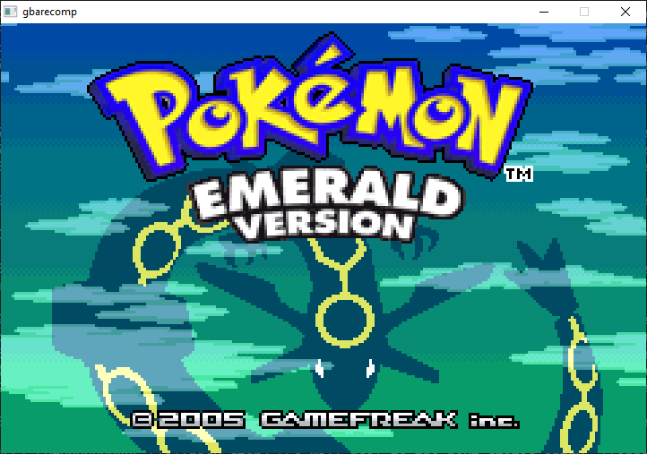

Pokemon Emerald joins the Gen 3 [GBARecomp](/hardware/game-boy-advance) work alongside [Ruby & Sapphire](/games/pokemon-ruby-sapphire) and [FireRed & LeafGreen](/games/pokemon-firered-leafgreen).

This is a very early alpha build. Its main job today is proving the recompiler, runtime, save model, and cartridge clock path on a larger Gen 3 target.

The project uses symbol metadata from the [pret/pokeemerald](https://github.com/pret/pokeemerald) decompilation as a map for names and function boundaries. That helps guide discovery, but the recomp does not ship pret's C source, build output, or toolchain.

## Playable status

Yes, as a very early Windows alpha preview. An EmeraldRecomp package is on the GitHub releases page. Run it and point it at a dump you provide: the USA ROM.

The game boots through the BIOS intro to the title screen and into gameplay. It is still an ecosystem proof point, not a polished enhanced release.

Emerald's real-time clock, battle engine, and contest systems make it a larger target than the other Gen 3 pages here.

## What the recomp adds

- Emerald builds as its own native program.
- The cartridge real-time clock syncs to the host system.
- Flash saves are part of the hardware model, not a separate patch.
- Enhancements are limited right now; community contributions are welcome.

## Sources

- [EmeraldRecomp README](https://github.com/mstan/EmeraldRecomp)
- [EmeraldRecomp releases](https://github.com/mstan/EmeraldRecomp/releases)
- [pret/pokeemerald](https://github.com/pret/pokeemerald)
- [gbarecomp framework](https://github.com/mstan/gbarecomp)
- [Recomp + AI: 5 Months Later (1379.tech)](https://1379.tech/recomp-ai-5-months-later/)
