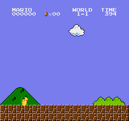
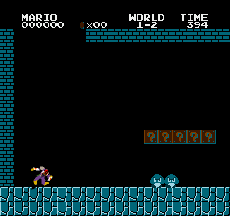
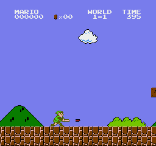
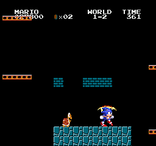

Super Mario Bros. runs here as a native PC program, rebuilt from the original game by [NESRecomp](/hardware/nes).

It is one of the framework's biggest showcases because the enhancements go outside the original game engine. You can play the stock game, or experiment with character replacements, widescreen, and a 3D view.

## Playable status

Yes. Windows builds are available on [GitHub Releases](https://github.com/mstan/SuperMarioBrosNESRecomp/releases), with an experimental Linux AppImage alongside. The download contains no game data: it is built from a dump you provide, selected on first launch.

All worlds and levels are believed completable, though not every path has been exhaustively tested.

## What the recomp adds

Character replacements are the headline: five experimental swaps, enabled one at a time from the launcher's Mods screen. Each swap pulls its character from a separate dump you supply, and the launcher verifies it and derives the sprites, animations, and sounds into a local cache, so nothing from those games ships in the download.

Pikachu comes with his Smash 64 moveset.

So does Captain Falcon.

Samus keeps her beams, missiles, and Morph Ball bombs.

Link jumps and stabs the way he does in Zelda II.

Sonic gets a spindash that carries momentum through brick rows.

Two display modes push further. An experimental widescreen mode fills a 16:9 frame with real level content beyond the original narrow viewport, no stretching involved. An experimental first-person Voxel 3D mode turns the flat level upright and puts the camera at Mario's eye level, with tank controls and a live numpad camera rig; Numpad 0 toggles it. The two modes are mutually exclusive.

The stock 4:3 game remains available alongside the experimental modes.

## Sources

- [SuperMarioBrosNESRecomp README and releases (GitHub)](https://github.com/mstan/SuperMarioBrosNESRecomp)
- [NESRecomp framework README (GitHub)](https://github.com/mstan/nesrecomp)
- [NESRecomp progress article (1379.tech)](https://1379.tech/nesrecomp-achieves-10-commercial-titles/)
