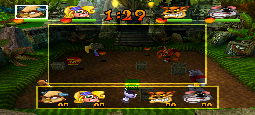

Crash Bash is a work-in-progress community [PSXRecomp](/hardware/playstation) build by TechnicallyComputers.

The game can run, but known bugs make it uncomfortable to recommend right now.

## Playable status

Partial. The in-game pause menu loads no menu items, so you cannot exit or change levels from it. That can leave the game stuck in a soft lock.

Builds were published for Windows, macOS, and Linux when the project was public. It builds from a disc dump you provide. OpenBIOS boots it unless you supply a retail BIOS.

## Sources

- The Crash-Bash-Recomp repository is no longer publicly available on GitHub, checked 2026-08-24. This page describes the project as it stood when the repository was public.
