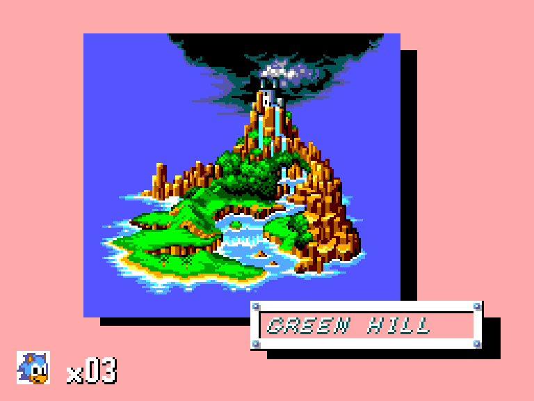

This is the 8-bit Sonic the Hedgehog for Master System, not the Genesis game with the same name.

It is a very early [Master System / Game Gear](/hardware/master-system-game-gear) tech demo. It proves the framework can boot a real commercial game, but it is not a full port.

## Playable status

Tech demo. An early Windows build is on the releases page. There is no launcher: you run it from a command line and hand it the path to a ROM dump you provide.

The checked path is narrow. The game boots and plays Green Hill Zone, but it has not been played end to end. Coverage past that is unverified, and more code paths will surface during real play.

## Sources

- [Project README and releases (GitHub)](https://github.com/mstan/SonicTheHedgehogSMSRecomp)
- [smsggrecomp framework (GitHub)](https://github.com/mstan/smsggrecomp)
