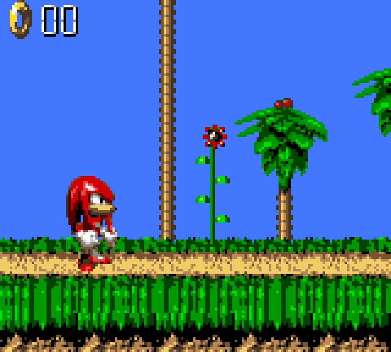

Sonic Blast, the 1996 Game Gear game, is the other half of the first pair brought up on smsggrecomp, released the same day as [the 8-bit Sonic the Hedgehog](/games/sonic-the-hedgehog-sms). Sharing a framework is the point. The Game Gear is close kin to the Master System, so one runtime models both and layers the Game Gear's own palette, viewport and stereo sound over the shared parts, which is why the [Master System and Game Gear lineup](/hardware/master-system-game-gear) is a single project rather than two.

## Can I play it?

Only as a tech demo. v0.0.2 (2026-06-23) is an early pre-release with a Windows x64 zip on the releases page. There is no launcher: you run it from a command line, point it at a ROM dump you provide, and keep `SDL2.dll` beside the executable.

```
SonicBlastGGRecomp.exe path\to\sonicblast.gg --window 4
```

It expects the GG export ROM, CRC32 `0x031B9DA9`, 1 MB.

The verified path is narrow and the project states its boundary exactly. Across about 60 seconds of the title screen and attract demo, the build ran entirely as recompiled native code with no interpreter fallback hit on that path, and its palette and system RAM matched the reference interpreter byte for byte. The v0.0.1 notes are blunter still: it boots through the intro to the SONIC BLAST title screen, and gameplay beyond that is largely unexercised. Expect bugs.



## What the recomp adds

Nothing on top of the game yet. What this repository contributes is the per game side of the port: `game.toml` with the ROM's identity, mapper, RAM layout, discovery seeds and jump tables, the build script, and a pre-built release.

Controls are the minimum. Arrow keys are the d-pad, Z jumps, X is button 2, Enter is start, Esc quits, and `--window` sets the scale factor.

## Technical details

The Z80 machine code is translated ahead of time into C and compiled to a native binary rather than being decoded as it runs. The rest of the Game Gear, the VDP with its own palette and viewport, the SN76489 in stereo, the controller and system ports and the Sega mapper, is modeled by the smsggrecomp runtime. Computed jumps that static analysis cannot resolve fall back to a bundled Z80 interpreter working over the live bus, which is what picks up paths that have not been walked yet.

Correctness is measured against a reference rather than by eye: the superzazu Z80 interpreter acts as an oracle, and the release claims that palette (CRAM) and system RAM come out byte identical along the path that was exercised.

The generated C stays out of the repository, since it is a derivative of your ROM. `build.ps1` regenerates it locally from the dump you supply and then builds the windowed executable. The repository's own code is original, and no license has been declared for it yet.

## Sources

- [Project README and releases (GitHub)](https://github.com/mstan/SonicBlastGGRecomp)
- [smsggrecomp framework (GitHub)](https://github.com/mstan/smsggrecomp)
