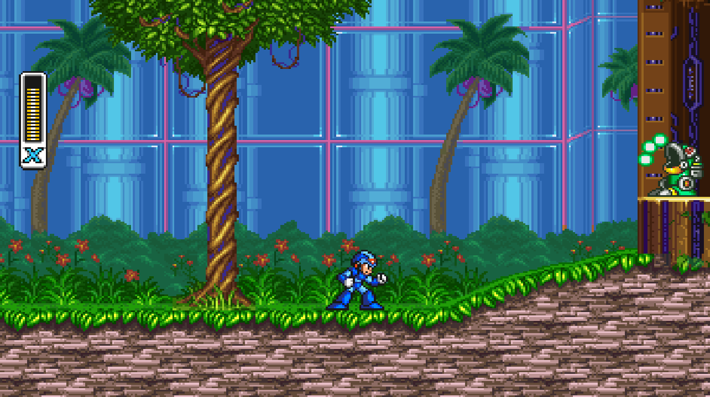

Mega Man X2 is a [SNESRecomp](/hardware/super-nintendo) project for the second SNES Mega Man X game.

It matters because Mega Man X2 uses Capcom's Cx4 chip. That chip handles special math and wireframe effects the base SNES could not do alone.

SNESRecomp supports that path without asking the player for a separate firmware file.

## Playable status

Yes, for the stock game. Mega Man X2 can be played from start to finish without enhancements.

You provide your own Mega Man X2 ROM.

Enhancements are a separate question. Experimental widescreen work exists, but widescreen and other changes still need their own verification.
