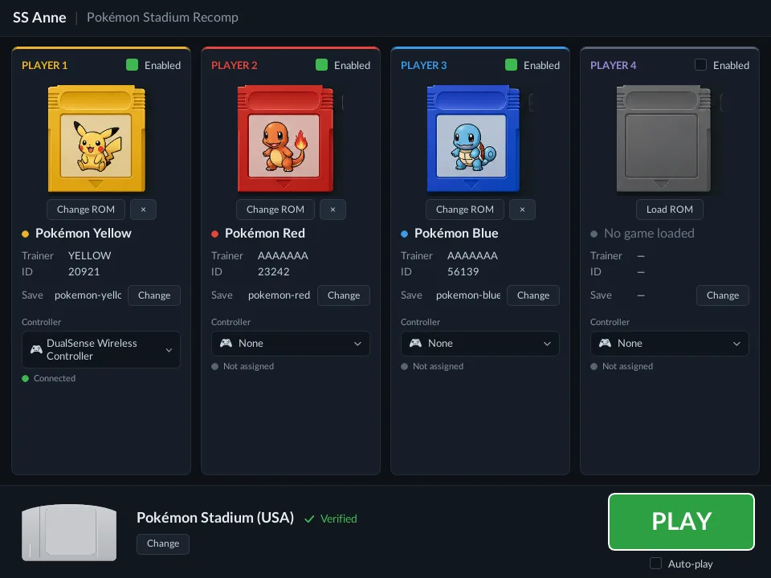

Pokémon Stadium, the international release, recompiled to a native PC program under the project name SS Anne. It sits apart from the rest of the toolkit in one way that matters: the [Nintendo 64](/hardware/nintendo-64) work is built on a fork of N64Recomp, a recompiler the core team did not create, rather than on a framework written from the ground up. In August 2026 the author stopped maintaining it, and said so at the top of the README.

## Can I play it?

Yes, and it is finished being worked on. The repository stays up, the releases stay downloadable, and the source stays buildable, but there will be no further bugfixes or releases. The reason given is the foundation rather than the game: after months working inside N64Recomp the author concluded its architecture is structurally unsound in ways a fork cannot fix, and put his time back into the frameworks he wrote himself, NESRecomp, SNESRecomp, PSXRecomp, and NDSRecomp.

What you get is v0.4.7-beta (2026-08-15), a Windows package on the releases page. It is built from a dump you provide, and it is specific about it: Pokémon Stadium (US, v1.0), 32 MB, in native big-endian `.z64` form. Rev A will not work, because the disassembly the project builds on targets v1.0 and its address tables do not line up with the later revision.

Tested and working, per the project's own list: boot, the title and attract sequence, the menus, the launcher, the Kid's Club mini-games, GB Tower, the Transfer Pak, and entering and leaving a battle. Not verified end to end: a full Stadium cup, and a Gym Leader Castle run. Expect occasional audio crackle and some menu-level visual glitches.

## What the recomp adds

GB Tower works, which is the strange part. Stadium has a Game Boy player built into it, and this build runs it: Pokémon Red, Blue, and Yellow play through to live gameplay, your cartridge's save is read and written back, and the Game Boy sound comes out of your speakers. Those Game Boy games run in an emulator, the way they always did on an N64, but that emulator is part of Pokémon Stadium, so it gets turned into native PC code along with everything else.

The Transfer Pak is modelled at the hardware level, so the in-game Game Pak Check menu sees the ROM and save you configured as if a cartridge were plugged into the accessory. Red, Blue, Yellow, Gold, Silver, and Crystal are supported, across four player slots, and the save is written back to disk as you play. Pokémon you register are remembered between sessions.

Before the game boots there is a setup screen that the original did not have.

From the launcher you assign a cartridge and a controller to each of the four slots, confirm the Stadium ROM, and press Play. Cartridge art, trainer name, and ID are read from the ROM and save you point it at. An optional five-second auto-play countdown is off by default, for anyone who would rather not touch a keyboard.

The picture is cleaned up too. Anti-aliasing is on by default at 4x MSAA so the models' polygon edges are not jagged, and the renderer can supersample, drawing above the window resolution and filtering down, for the thin far-away geometry that anti-aliasing alone cannot fix. The 2D menus and HUD stay crisp at any internal resolution.

## Technical details

The game's MIPS code is statically recompiled through a fork of N64Recomp, with two companion forks alongside it: N64ModernRuntime, which stands in for the N64's operating system, and rt64, the renderer. The recompiler consumes the ELF that pret's Pokémon Stadium disassembly builds, which already carries every section's load address, symbols, and relocations, so there is no per-fragment slicing step.

Stadium uses a flat 8 MB address space with 77 DMA-loaded fragments at mostly unique addresses. That is unlike NES-style bank switching, where every bank shares one window, and it is why the disassembly's ELF is enough on its own for both the recompiler and Ghidra.

Rendering is RT64 backed. D3D12 is the default and the renderer falls back to Vulkan automatically when the graphics device cannot be created, which is the usual cause of a build that closes on launch. Divergence checking against the ares emulator was done by manual side-by-side runs; an automated oracle bridge was planned and never written. The project is GPL-3.0.

## Sources

- [PokemonStadiumRecomp README and releases (GitHub)](https://github.com/mstan/PokemonStadiumRecomp)
- [pret/pokestadium, the disassembly it builds on](https://github.com/pret/pokestadium)
