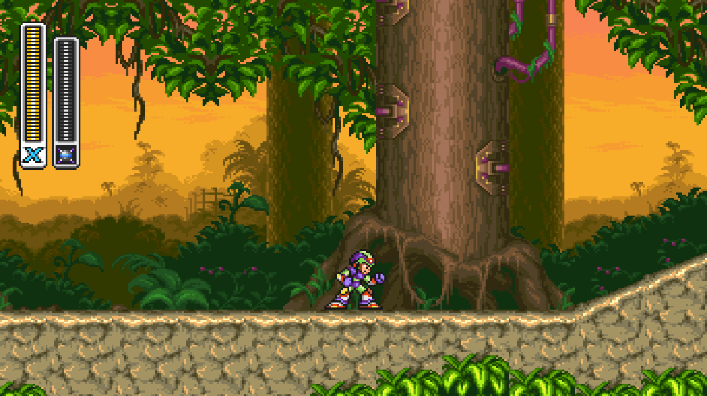

Mega Man X3 is a [SNESRecomp](/hardware/super-nintendo) project for the third SNES Mega Man X game.

Like Mega Man X2, it uses Capcom's Cx4 chip. SNESRecomp supports that path without asking the player for a separate firmware file.

## Playable status

Yes, for the stock game. Mega Man X3 can be played from start to finish without enhancements.

You provide your own Mega Man X3 ROM.

Enhancements are a separate question. Experimental widescreen work exists, but widescreen and other changes still need their own verification.
