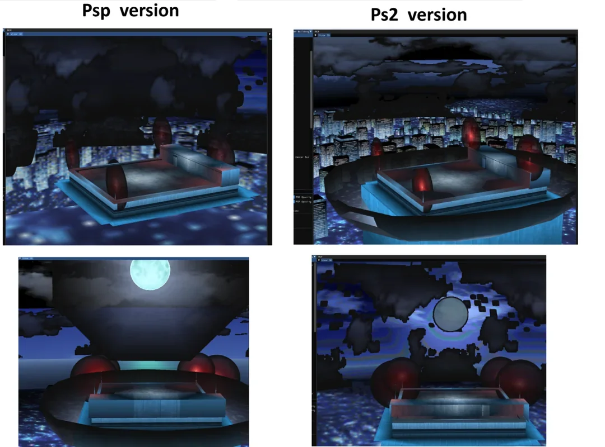
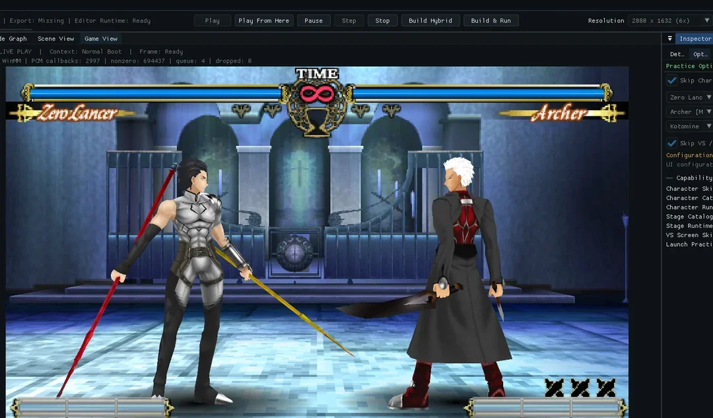

Hybrid native Fate/unlimited codes project: PSP static-recompilation/gameplay base with PS2 assets and controls in development.

I’m looking to create a definitive version of the game that uses the best elements from both the PSP version, which serves as the base, and the PS2 version.

As you probably know, the PSP assets are a cut-down version of the PS2 assets.

I'm also creating an editor to make using mods easier in the future.

