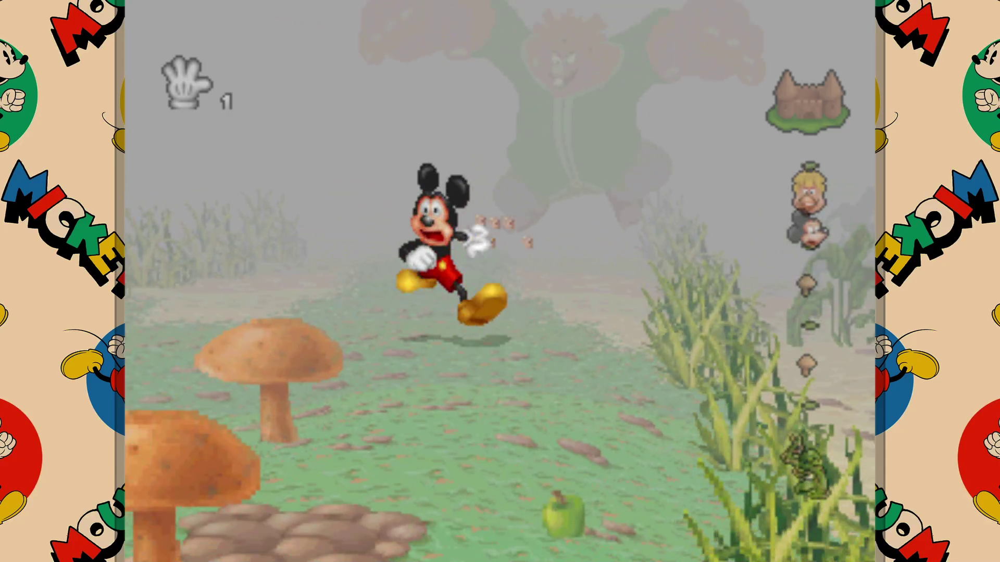

🐭 MICKEY'S WILD ADVENTURE — RECOMPILED It all started with a mouse... Mickey's Wild Adventure Recompiled is a native PC recompilation of the original PlayStation release of Mickey's Wild Adventure, powered by [PSXRecomp](/hardware/playstation). This is NOT an emulator and NOT a remake. The original PS1 game code is statically recompiled into native code, with additional modern features built around the original game. ✨ FEATURES • Native Windows & Linux builds • Custom frontend and main menu • Story profiles & Cont

## Project

Native recompilation of Mickey's Wild Adventure \(PlayStation\) for modern PCs, powered by [PSXRecomp](/hardware/playstation).

This project aims to preserve the original game while making it easier and more enjoyable to play on modern hardware with quality-of-life improvements, a custom frontend, modern display options and extra features.

- Native Windows and Linux builds
- Powered by [PSXRecomp](/hardware/playstation)
- Custom frontend and startup flow
- Custom main menu
- Story profiles and continue system
- Improved save handling

The project includes several modern display options:

- multiple resolutions
- windowed mode
- borderless fullscreen
- exclusive fullscreen
- CRT filter presets
