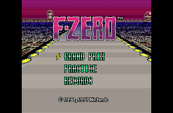
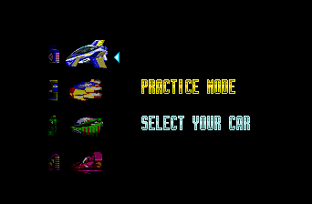
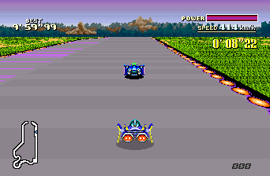

A community game project. See the source repository for details and current progress.

## Project

You bring your own legally dumped F-Zero \(USA\) ROM. No ROM is included.

- Play F-Zero as a native app.
- Widescreen modes: 16:9, 21:9, 32:9, and Fit.
- Optional HD Mode 7: 2x through 10x track rendering, independent of widescreen and presentation FPS.
- High refresh presentation: 60, 90, 120, 144, 165, 240, or 360 FPS.
- Display shaders: CRT Soft, LCD Grid, Sharp, Warm Composite, or your own GLSL shader.
- Save states with a slot browser and thumbnails, opened with F7 or Select + R.
