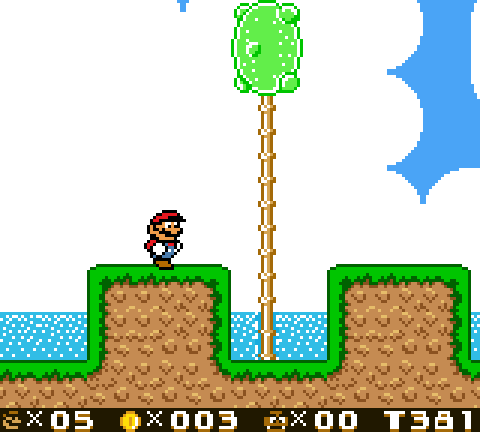
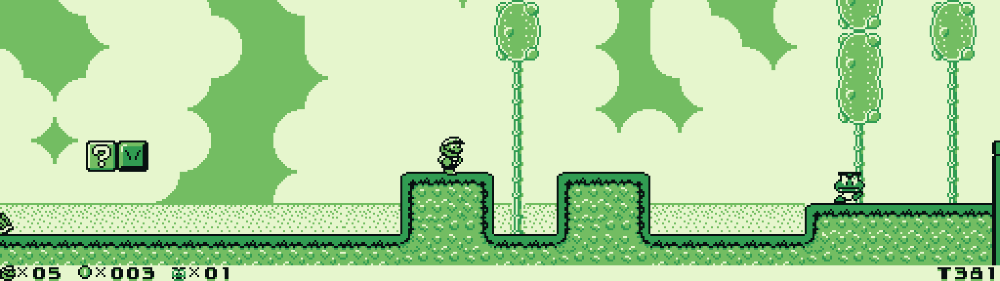
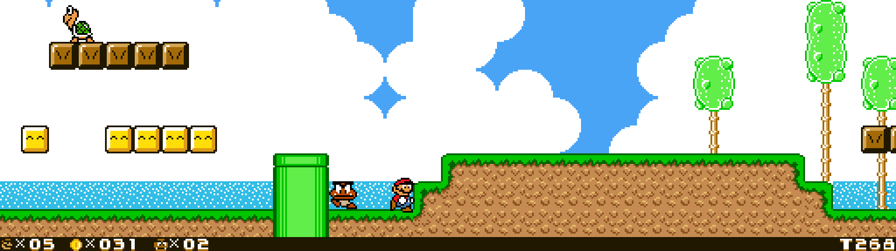

Super Mario Land 2: 6 Golden Coins \(Game Boy\) static recompilation with adaptive widescreen and DX mods

## Project

Static recompilation of the Game Boy title Super Mario Land 2 - 6 Golden Coins \(UE\) \(V1.0\) \(CRC32 D5EC24E4\) to native code via gbrecompiled, with the shared recomp-ui launcher.

One executable, two recompiled bodies of that one cart: the faithful V1.0 build, and Super Mario Land 2 DX v1.8.1 derived from the same ROM in memory at boot. The launcher's Mods page picks between them — see DX.md.
