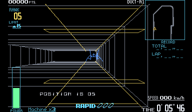

Zero Racers Virtual Boy native recompilation with recomp-ui and independent cosimulation

## Project

A recompilation of Zero Racers for Virtual Boy, playable on Windows. Built with [VBRecomp](/hardware/virtual-boy) and recomp-ui.

Screenshots show the optional color mod. Original red graphics are the default.
