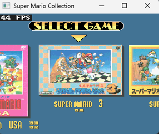

A recompilation of the Japanese version of Super Mario All-Stars made using [SNESRecomp](/hardware/super-nintendo).

All 4 games included are fully playable with no major bugs,
and a Nintendo Wii version will be available very soon.
