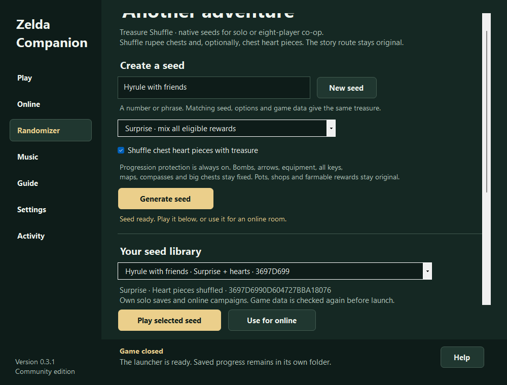

A native Windows port of A Link to the Past built on snesrev/zelda3, with a modern portable launcher, smooth 1080p filtering, widescreen, controller/keybind setup, MSU-1 music import and progression-protected Treasure Shuffle. Experimental online co-op supports up to 8 players with names, tunic colors and optional shared gear/progress. Shared combat is limited. Requires your own original USA ROM; no game data or music is included. Demo: https://streamable.com/c6fu71

## Project

A native A Link to the Past port for Windows, with smooth 1080p rendering, controller setup, MSU-1 music, protected Treasure Shuffle seeds and experimental eight-player Internet co-op.

Built on snesrev/zelda3, a native C reimplementation. The game runs locally through the native engine, with a portable WinForms launcher for setup, controls, music and online rooms. The original RadzPrower launcher was the starting point for this project; Companion is the new launcher.

Treasure Shuffle v1 moves only rupee rewards in 46 ordinary chests. The optional heart-piece setting adds six chest locations, for 52 eligible chests. Both styles preserve the original reward totals.

Required equipment, all small/big keys, maps, compasses, every big chest, bomb/arrow chest supplies, pots, shops, farmable rewards, entrances and story events stay original. These protections cannot be disabled. No required item is relocated behind a dependency for that item.

Generate a seed on Randomizer, then Play selected seed. Export its small .z3seed.json recipe for friends to import using their own USA data. Select it on Online; mismatched asset hashes are rejected. Every seed has separate solo saves and online campaigns. The normal Play page continues your original adventure.

Actual v0.3.1 launcher capture after a short native seed-launch test. Existing original saves were kept separate. It does not establish a full playthrough.

The established ALttPR generator produces patched SNES ROMs and has a much larger item/logic feature set. Its patches and seed codes do not run in this native engine. Treasure Shuffle is an independent, smaller generator. Rules, saves and verification.
