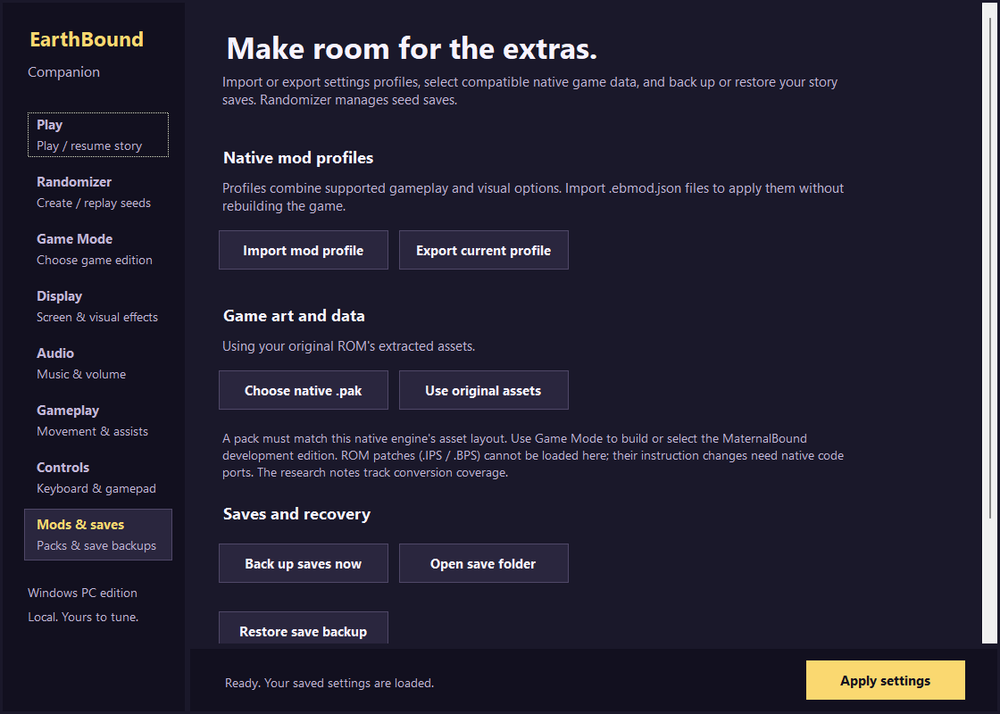
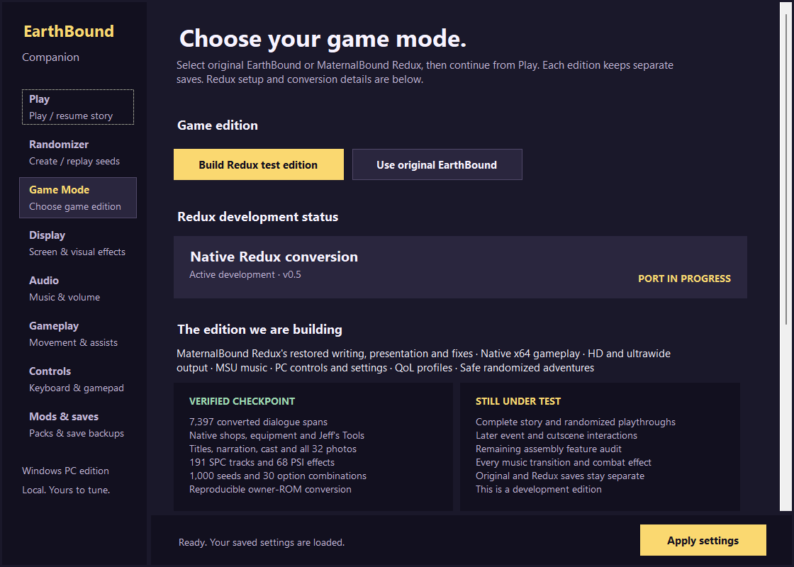

Experimental native Windows EarthBound built on BrianPugh/earthbound and Herringway's work. Portable launcher, 1080p-4K output, widescreen/ultrawide, MSU music setup, controller bindings, sprint, fast-forward, quick saves and Story Shuffle v3. Play original EarthBound or the native MaternalBound Redux development edition. Redux conversion is incomplete; full story/randomized playthroughs need testing. Requires your own clean USA ROM; no ROM or music included. Demo: https://streamable.com/0wgg64

## Project

EarthBound for Windows, with a native MaternalBound Redux adaptation, widescreen and ultrawide scenery, 1080p–4K output, MSU music, PC controls, save recovery and Story Shuffle v3.

The target is one polished PC edition: MaternalBound Redux's restored writing, art, fixes, and presentation running through the native engine alongside Companion's display, audio, input, save, QoL, mod, and randomizer features. Story Shuffle v3 binds every seed to the exact selected game version, asset hash, progression policy, and save namespace. Both the original and the pinned Redux packs have content-specific protection policies; unknown packs cannot be randomized.

The twelfth development build fixes Bubble Monkey leaving before Jeff's rope cave. The expanded view could load the departure NPC before the puzzle; her event now waits for the rope milestone in both game modes. Older saves with this specific impossible state recover the monkey automatically while retaining the unfinished puzzle. Cold quick-save loads also bind the item/action tables before Bubble Gum or overworld PSI can use them. Native menu replays verify gum, the rope animation, climbing, and the intended later departure. Cause and verification.

HD means high-resolution output and enhanced presentation. Converted pixel artwork is used; a replacement hand-drawn HD art pack is not included. Widescreen expands the native world view within the renderer's limits, rather than merely stretching the original picture. Physical controller play and every display/DPI combination have not been fully verified. Mod profiles tune supported native options; arbitrary ROM patches require explicit native adaptations.
