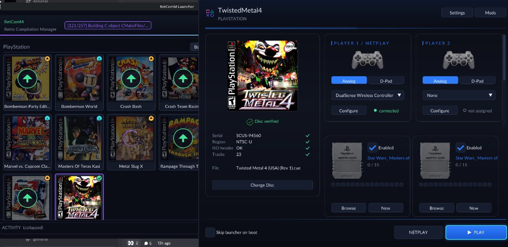
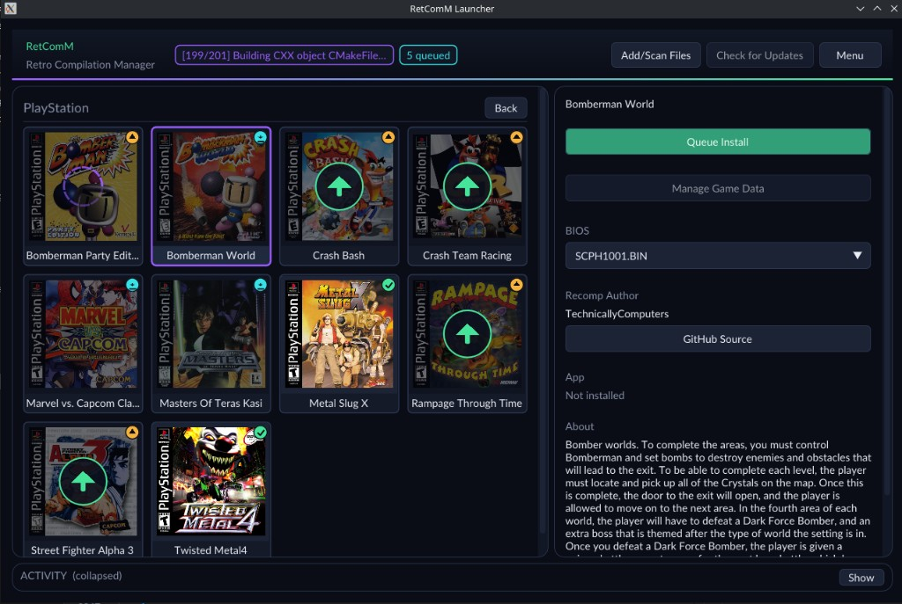

a static recompilation of PaRappa the Rapper made with [PSXRecomp](/hardware/playstation)

## Project

Static recompilation of PaRappaTheRapper built on [PSXRecomp](/hardware/playstation) and recomp-ui.

Includes an optional Rhythm Timing Assist mod with configurable latency compensation and early/late tolerance for controller and keyboard play. The default internal-resolution preset is 1080p. The experimental Widescreen mod starts enabled at 21:9 and expands the 3D gameplay view using the native wide renderer. In Mods \> Widescreen, choose 21:9, 16:9, Fit to window, or original 4:3. Movies and 2D menus keep their original proportions; disabling the mod restores the 4:3 default. Existing graphics settings take precedence over the new resolution default; select 1080p in the launcher when upgradi

Scaffolded with the New Project Layout. See [PSXRecomp](/hardware/playstation)/docs/GAMEPROJECTSETUP.md for the full flow.
