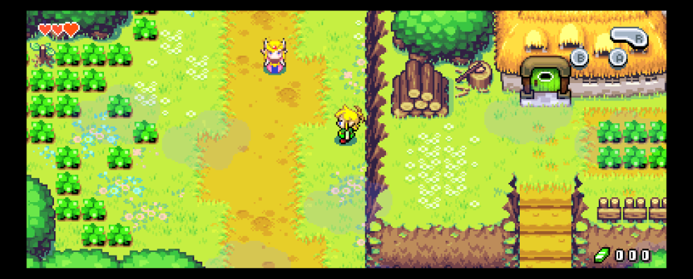
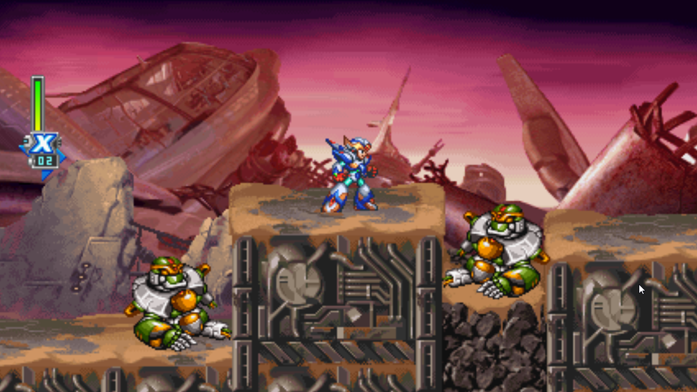
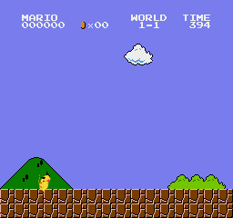

# Retro Porting Toolkit

### Bring classic console games to modern hardware.

An open ecosystem of static recompilers, runtimes, game projects, and shared tools. Turn code from original console games into native apps, then build beyond the original hardware: widescreen, modern controls, translations, modding, or something entirely new.

**[See it in action](https://retroportingtoolkit.com) · [Get started](https://retroportingtoolkit.com/docs/start) · [Join Discord](https://discord.gg/Jn6ZgtC85u)**

## Preserve it. Expand it. Reinvent it.

Recompilation translates game machine code ahead of time into code that can be compiled for a modern computer. A runtime supplies the console services that code expects. Each game still needs integration, testing, and work on the features you want to change.

Features and readiness vary by game. Here are three examples from the wider ecosystem:

### The Minish Cap: more world on screen

Adaptive widescreen reveals more of the world instead of stretching the original picture. This is an in-development preview, not a fully verified playthrough.

[Project details](https://retroportingtoolkit.com/games/minish-cap) · [Source](https://github.com/mstan/MinishCapRecomp)

### Mega Man X6: make the game your own

An adaptation of the community's X6 Tweaks, included with permission, offers more than 200 individual options. Experimental widescreen goes beyond the original viewport.

[Project details](https://retroportingtoolkit.com/games/mega-man-x6) · [Source](https://github.com/mstan/MegaManX6Recomp)

### Super Mario Bros.: a different kind of playthrough

Experimental character mods bring Pikachu, Samus, Link, Sonic, and Captain Falcon into the game with their own moves. Recompilation can be a starting point for new ideas, not just a way to reproduce the original.

[Project details](https://retroportingtoolkit.com/games/super-mario-bros) · [Source](https://github.com/mstan/SuperMarioBrosNESRecomp)

**[Explore the games](https://retroportingtoolkit.com/games) · [Explore the platforms](https://retroportingtoolkit.com/hardware)**

## Shared tools, less repeated work

Game projects and console frameworks live across contributors' repositories. This organization brings together tools they can share:

| Project | What it does |
| --- | --- |
| [Retro-Launcher](https://github.com/RetroPortingToolKit/Retro-Launcher) | Discover, build, update, and launch supported recomp projects. |
| [Retro-Studio](https://github.com/RetroPortingToolKit/Retro-Studio) | Scaffold and manage PlayStation and SNES title projects. |
| [recomp-ui](https://github.com/RetroPortingToolKit/recomp-ui) | Shared launcher and in-game settings UI. |
| [recomp-net](https://github.com/RetroPortingToolKit/recomp-net) | Delay-based input synchronization and transport for netplay. |
| [Retro-Catalog](https://github.com/RetroPortingToolKit/Retro-Catalog) | Catalog data for discovering supported titles. |
| [RetroPorting-Toolchains](https://github.com/RetroPortingToolKit/RetroPorting-Toolchains) | Shared, fetch-on-demand build toolchains. |

## Play, build, or contribute

Start with a [game's project page](https://retroportingtoolkit.com/games) for its current status, requirements, and available builds. You provide your own game files; the toolkit does not distribute ROMs or disc images. Features, operating-system support, and completeness vary by project.

Want to help? Test a build, report a reproducible bug, improve the docs, or work on a port or mod. Read the [getting-started docs](https://retroportingtoolkit.com/docs/start), open an issue in the relevant repository, or meet the developers on [Discord](https://discord.gg/Jn6ZgtC85u).

[News and development stories](https://retroportingtoolkit.com/blog) · [Website source](https://github.com/RetroPortingToolKit/RetroPortingToolkit.com)
